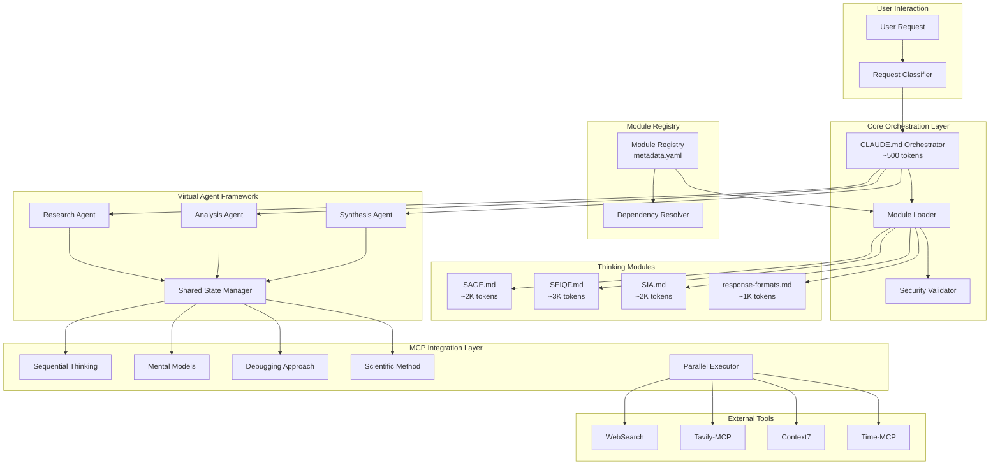
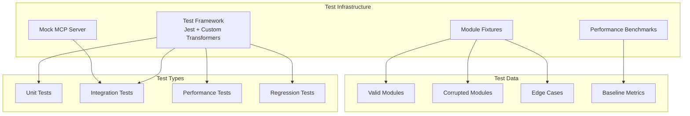
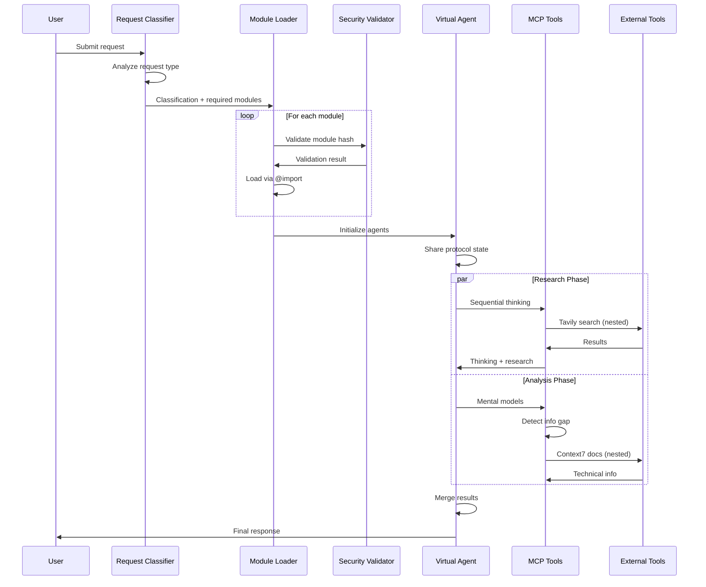
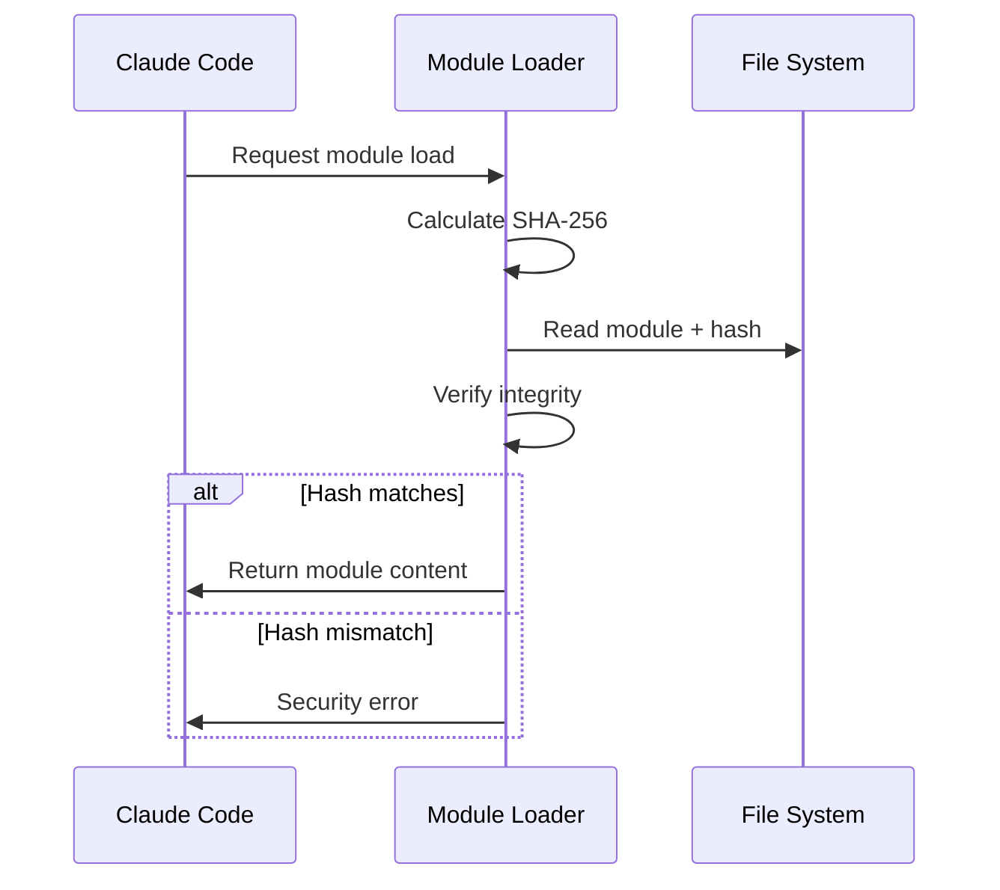
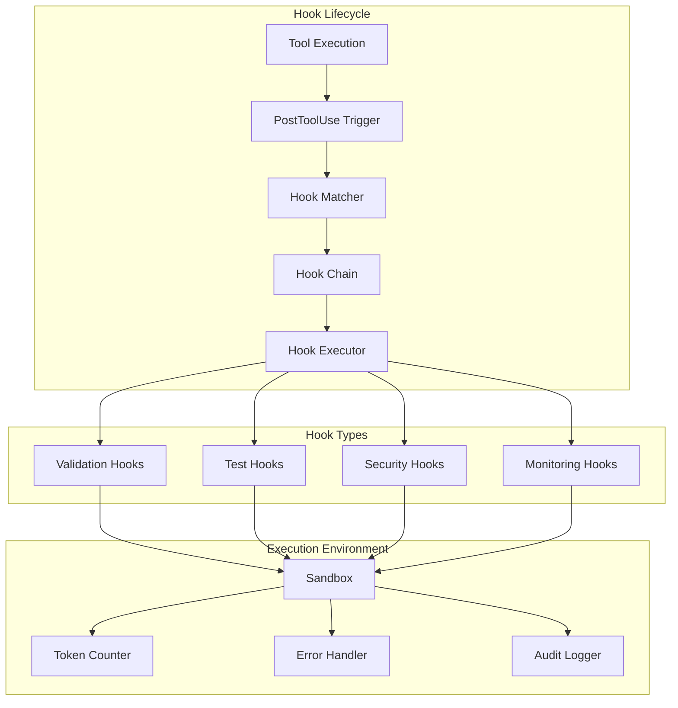
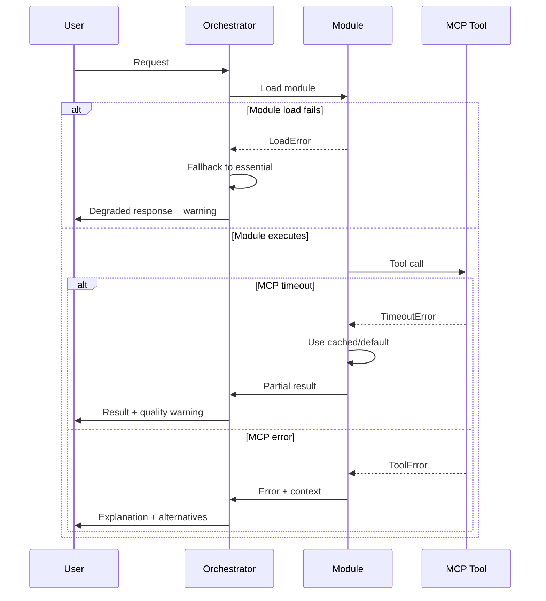

# universal-claude-thinking Fullstack Architecture Document

## Introduction

This document outlines the complete fullstack architecture for universal-claude-thinking, including backend systems, frontend implementation, and their integration. It serves as the single source of truth for AI-driven development, ensuring consistency across the entire technology stack.

This unified approach combines what would traditionally be separate backend and frontend architecture documents, streamlining the development process for modern fullstack applications where these concerns are increasingly intertwined.

### Starter Template or Existing Project

**Existing Project:** CLAUDE-v3.md monolithic prompt system (38,221 tokens)
- Pre-existing thinking protocols: SAGE, SEIQF, SIA
- Current integration with Claude Code context system
- Established patterns for bias detection and information quality
- Migration required to preserve all functionality while reducing context usage

### Change Log

| Date | Version | Description | Author |
|------|---------|-------------|--------|
| 2025-07-12 | 1.0.0 | Initial architecture for modular thinking system | Winston (Architect) |
| 2025-07-12 | 1.1.0 | Added test infrastructure, security details, MCP mock service, resource management | Winston (Architect) |
| 2025-07-12 | 1.2.0 | Integrated Claude Code Hooks architecture for automated validation | Winston (Architect) |

## High Level Architecture

### Technical Summary

The universal-claude-thinking system implements a modular context optimization architecture for Claude Code, transitioning from a monolithic 38K token prompt to a dynamic module loading system targeting 2-5K tokens per request. The architecture leverages Claude Code's native @import functionality for secure module loading, integrates seamlessly with clear-thought MCP for thinking mechanisms, and implements a virtual agent framework that maintains shared protocol state across thinking phases. The system achieves dramatic context reduction through intelligent request classification, lazy module loading, and efficient state management while preserving 100% feature parity with the existing CLAUDE-v3.md system.

### Platform and Infrastructure Choice

**Platform:** Claude Code Context System
**Key Services:** 
- Claude Code @import mechanism
- Clear-thought MCP server
- Local file system for module storage
- Git for version control
**Deployment Host and Regions:** Local .claude/ directory structure

### Repository Structure

**Structure:** Monorepo
**Monorepo Tool:** Git with directory-based organization
**Package Organization:** 
- Core orchestration in CLAUDE.md
- Thinking modules in .claude/thinking-modules/
- Cognitive tools in .claude/cognitive-tools/
- Shared utilities in .claude/shared/

### High Level Architecture Diagram


```mermaid
graph TB
    subgraph "User Interaction"
        U[User Request] --> RC[Request Classifier]
    end
    
    subgraph "Core Orchestration Layer"
        RC --> CO[CLAUDE.md Orchestrator <br/>~500 tokens]
        CO --> ML[Module Loader]
        ML --> SV[Security Validator]
    end
    
    subgraph "Module Registry"
        MR[Module Registry<br/>metadata.yaml] --> ML
        MR --> DR[Dependency Resolver]
    end
    
    subgraph "Thinking Modules"
        TM1[SAGE.md<br/>~2K tokens]
        TM2[SEIQF.md<br/>~3K tokens]
        TM3[SIA.md<br/>~2K tokens]
        TM4[response-formats.md<br/>~1K tokens]
    end
    
    subgraph "Virtual Agent Framework"
        VA1[Research Agent]
        VA2[Analysis Agent]
        VA3[Synthesis Agent]
        SS[Shared State Manager]
        VA1 --> SS
        VA2 --> SS
        VA3 --> SS
    end
    
    subgraph "MCP Integration Layer"
        MCP1[Sequential Thinking]
        MCP2[Mental Models]
        MCP3[Debugging Approach]
        MCP4[Scientific Method]
        PE[Parallel Executor]
    end
    
    subgraph "External Tools"
        ET1[WebSearch]
        ET2[Tavily-MCP]
        ET3[Context7]
        ET4[Time-MCP]
    end
    
    ML --> TM1
    ML --> TM2
    ML --> TM3
    ML --> TM4
    
    SS --> MCP1
    SS --> MCP2
    SS --> MCP3
    SS --> MCP4
    
    PE --> ET1
    PE --> ET2
    PE --> ET3
    PE --> ET4
    
    CO --> VA1
    CO --> VA2
    CO --> VA3
```

### Architectural Patterns

- **Dynamic Module Loading:** Load only required thinking modules based on request classification - _Rationale:_ Reduces context window usage from 38K to 2-5K tokens
- **Virtual Agent Architecture:** Phase-based agents with shared protocol state - _Rationale:_ Preserves integrated design of SAGE, SEIQF, SIA while enabling scalability
- **Parallel MCP Execution:** Concurrent tool invocation with dependency analysis - _Rationale:_ Reduces response time by 50-75% for multi-tool operations
- **Universal Dynamic Information Gathering:** Thinking tools can invoke other MCP tools mid-execution - _Rationale:_ Enables adaptive reasoning without pre-planned tool selection
- **Security-First Module Loading:** Cryptographic validation of all modules - _Rationale:_ Prevents code injection while maintaining dynamic loading flexibility
- **Event-Driven State Management:** Shared state synchronization across protocols - _Rationale:_ Maintains protocol integration while supporting modular architecture

## Tech Stack

| Category | Technology | Version | Purpose | Rationale |
|----------|------------|---------|---------|-----------|
| Context Language | Markdown | N/A | Module definition | Human-readable, Claude Code compatible |
| Configuration | YAML | 1.2 | Module metadata and routing | Standard for configuration management |
| Module Loading | Claude Code @import | Native | Dynamic module inclusion | Built-in security and caching |
| Integration Protocol | JSON-RPC | 2.0 | MCP communication | Industry standard for tool calls |
| Thinking Framework | Clear-thought MCP | Latest | Thinking tools | Avoids duplication of logic |
| State Management | JSON | N/A | Protocol state sharing | Simple, efficient serialization |
| Security | SHA-256 | N/A | Module validation | Cryptographic integrity |
| Version Control | Git | 2.x | Module versioning | Standard VCS |
| Logging | Structured Text | N/A | Thinking visibility | Human-readable with emojis |

## Data Models

### ModuleMetadata
**Purpose:** Defines metadata for each thinking module

**Key Attributes:**
- id: string - Unique module identifier
- version: string - Semantic version
- tokenCount: number - Estimated token usage
- dependencies: string[] - Required module IDs
- triggers: string[] - Auto-activation keywords
- protocols: string[] - Supported protocols (SAGE, SEIQF, SIA)

**TypeScript Interface:**
```typescript
interface ModuleMetadata {
  id: string;
  version: string;
  tokenCount: number;
  dependencies: string[];
  triggers: string[];
  protocols: ('SAGE' | 'SEIQF' | 'SIA')[];
  securityHash: string;
  lastModified: Date;
}
```

**Relationships:**
- Referenced by ModuleRegistry
- Dependencies point to other ModuleMetadata

### RequestClassification
**Purpose:** Classification result for incoming requests

**Key Attributes:**
- category: string - Request type (A/B/C/D/E)
- confidence: number - Classification confidence (0-1)
- requiredModules: string[] - Module IDs to load
- suggestedAgents: string[] - Virtual agent IDs

**TypeScript Interface:**
```typescript
interface RequestClassification {
  category: 'simple' | 'complex' | 'search' | 'code' | 'meta';
  confidence: number;
  requiredModules: string[];
  suggestedAgents: string[];
  mcpTools: string[];
  estimatedTokens: number;
}
```

**Relationships:**
- Triggers ModuleLoader
- Informs VirtualAgent selection

### ProtocolState
**Purpose:** Shared state across protocols and agents

**Key Attributes:**
- sageStatus: object - SAGE bias detection state
- seiqfQuality: object - Information quality metrics
- siaIntent: object - Semantic intent analysis
- activeAlerts: Alert[] - Current warnings/errors

**TypeScript Interface:**
```typescript
interface ProtocolState {
  sageStatus: {
    biasLevel: 'none' | 'low' | 'medium' | 'high' | 'critical';
    detectedBiases: string[];
    mitigationApplied: boolean;
  };
  seiqfQuality: {
    overallScore: number;
    sourcesEvaluated: number;
    credibilityFlags: string[];
  };
  siaIntent: {
    primaryIntent: string;
    confidence: number;
    expansions: string[];
  };
  activeAlerts: Alert[];
  thinkingLog: ThinkingEntry[];
}
```

**Relationships:**
- Shared across all VirtualAgents
- Updated by thinking protocols

## API Specification

### Module Loading API

```typescript
// Module Loader Interface
interface ModuleLoader {
  // Load modules based on classification
  loadModules(classification: RequestClassification): Promise<LoadedModules>;
  
  // Validate module security
  validateModule(modulePath: string): Promise<boolean>;
  
  // Resolve dependencies
  resolveDependencies(moduleIds: string[]): string[];
  
  // Import with security checks
  secureImport(modulePath: string): Promise<string>;
}

// Virtual Agent Interface
interface VirtualAgent {
  id: string;
  name: string;
  
  // Execute agent with shared state
  execute(
    input: string,
    sharedState: ProtocolState,
    availableTools: MCPTool[]
  ): Promise<AgentResult>;
  
  // Update shared state
  updateState(updates: Partial<ProtocolState>): void;
}

// MCP Integration Interface
interface MCPIntegration {
  // Execute single tool
  executeTool(
    toolName: string,
    params: any,
    context?: ToolContext
  ): Promise<ToolResult>;
  
  // Execute multiple tools in parallel
  executeParallel(
    operations: ToolOperation[]
  ): Promise<ToolResult[]>;
  
  // Dynamic tool invocation during thinking
  invokeNested(
    parentTool: string,
    childTool: string,
    params: any,
    depth: number
  ): Promise<ToolResult>;
}
```

## Components

### Request Classifier
**Responsibility:** Analyze incoming requests and determine required modules

**Key Interfaces:**
- classifyRequest(input: string): RequestClassification
- updateClassificationRules(rules: ClassificationRule[]): void

**Dependencies:** triggers.yaml, pattern matching engine

**Technology Stack:** TypeScript patterns, YAML configuration

### Module Loader & Security Validator
**Responsibility:** Securely load and validate thinking modules

**Key Interfaces:**
- loadModule(moduleId: string): Promise<Module>
- validateIntegrity(module: Module): boolean
- checkDependencies(moduleId: string): string[]

**Dependencies:** Module Registry, File System, Crypto

**Technology Stack:** Claude Code @import, SHA-256 hashing

### Virtual Agent Orchestrator
**Responsibility:** Manage agent execution with shared state

**Key Interfaces:**
- createAgentPipeline(agents: string[]): Pipeline
- executeWithState(pipeline: Pipeline, input: string): Result
- synchronizeState(updates: StateUpdate[]): void

**Dependencies:** Virtual Agents, Protocol State Manager

**Technology Stack:** Event-driven state management, JSON

### Parallel MCP Executor
**Responsibility:** Execute multiple MCP tools concurrently

**Key Interfaces:**
- analyzeDependencies(operations: Operation[]): DependencyGraph
- executeParallel(operations: Operation[]): Promise<Results[]>
- mergeResults(results: Results[], strategy: MergeStrategy): Result

**Dependencies:** Clear-thought MCP, External Tools

**Technology Stack:** Promise.all(), dependency analysis

### Universal Dynamic Information Gatherer
**Responsibility:** Enable nested tool invocations during thinking

**Key Interfaces:**
- detectInformationGap(context: ThinkingContext): Gap[]
- selectTool(gap: Gap): string
- invokeNested(tool: string, params: any, depth: number): Result

**Dependencies:** MCP Tools, SEIQF quality gates

**Technology Stack:** Recursive invocation with depth tracking

## Testing Infrastructure

### Test Framework Architecture
**Responsibility:** Comprehensive testing of modules, integration, and performance

**Key Components:**
- Jest with custom .md transformers
- Module fixture generator
- Performance benchmark suite
- Mock MCP server

**Architecture Diagram:**

```mermaid
graph TB
    subgraph "Test Infrastructure"
        TF[Test Framework<br/>Jest + Custom Transformers]
        MF[Module Fixtures]
        PB[Performance Benchmarks]
        MM[Mock MCP Server]
    end
    
    subgraph "Test Types"
        UT[Unit Tests]
        IT[Integration Tests]
        PT[Performance Tests]
        RT[Regression Tests]
    end
    
    subgraph "Test Data"
        VF[Valid Modules]
        CF[Corrupted Modules]
        EF[Edge Cases]
        BL[Baseline Metrics]
    end
    
    TF --> UT
    TF --> IT
    TF --> PT
    TF --> RT
    
    MF --> VF
    MF --> CF
    MF --> EF
    
    PB --> BL
    MM --> IT
```

### Module Test Fixtures
```typescript
interface TestFixture {
  id: string;
  type: 'valid' | 'corrupted' | 'edge-case';
  module: {
    content: string;
    metadata: ModuleMetadata;
    expectedTokens: number;
    expectedBehavior: TestExpectation;
  };
}

// Example fixture structure
const fixtures = {
  valid: {
    sage: {
      minimal: 'fixtures/valid/sage-minimal.md',
      full: 'fixtures/valid/sage-full.md',
      maxTokens: 'fixtures/valid/sage-max-tokens.md'
    }
  },
  corrupted: {
    invalidHash: 'fixtures/corrupted/invalid-hash.md',
    malformedYaml: 'fixtures/corrupted/bad-yaml.md',
    injectionAttempt: 'fixtures/corrupted/injection.md'
  },
  edgeCases: {
    emptyModule: 'fixtures/edge/empty.md',
    circularDeps: 'fixtures/edge/circular-deps.md',
    unicodeContent: 'fixtures/edge/unicode.md'
  }
};
```

### Performance Baseline Architecture
```typescript
interface PerformanceBaseline {
  monolithic: {
    tokenCount: 38221;
    avgResponseTime: number;
    p95ResponseTime: number;
    memoryUsage: number;
  };
  modular: {
    avgTokenCount: number;
    avgResponseTime: number;
    p95ResponseTime: number;
    memoryUsage: number;
    moduleLoadTime: number;
  };
  improvement: {
    tokenReduction: number; // Target: 85%+
    speedImprovement: number; // Target: 50%+
    memoryReduction: number;
  };
}
```

### Mock MCP Server Architecture
**Purpose:** Enable offline development and testing

**Implementation:**
```typescript
class MockMCPServer {
  private responses: Map<string, MockResponse>;
  private latency: SimulatedLatency;
  private circuitBreaker: CircuitBreaker;
  
  constructor(config: MockConfig) {
    this.responses = this.loadMockResponses(config.responsePath);
    this.latency = new SimulatedLatency(config.latencyProfile);
    this.circuitBreaker = new CircuitBreaker({
      threshold: 3,
      timeout: 60000,
      resetTimeout: 60000
    });
  }
  
  async handleRequest(tool: string, params: any): Promise<MockResponse> {
    // Simulate network conditions
    await this.latency.simulate();
    
    // Check circuit breaker
    if (this.circuitBreaker.isOpen()) {
      throw new Error('Circuit breaker open');
    }
    
    // Return mock response
    const response = this.responses.get(tool);
    if (!response) {
      throw new Error(`No mock for tool: ${tool}`);
    }
    
    return this.applyVariations(response, params);
  }
}
```

**Mock Response Structure:**
```json
{
  "sequentialthinking": {
    "responses": [
      {
        "scenario": "simple-analysis",
        "params": { "thought": "analyze data" },
        "response": {
          "thought": "Breaking down the data analysis...",
          "thoughtNumber": 1,
          "totalThoughts": 3,
          "nextThoughtNeeded": true
        }
      }
    ],
    "errorScenarios": [
      {
        "trigger": "timeout-test",
        "delay": 6000,
        "error": "Timeout"
      }
    ]
  }
}
```

## External APIs

### Clear-thought MCP API
- **Purpose:** Structured thinking operations
- **Documentation:** MCP protocol specification
- **Base URL(s):** Local MCP server
- **Authentication:** MCP session tokens
- **Rate Limits:** None (local server)

**Key Endpoints Used:**
- `sequentialthinking` - Step-by-step reasoning
- `mentalmodel` - Apply mental frameworks
- `debuggingapproach` - Systematic debugging
- `scientificmethod` - Hypothesis testing

**Integration Notes:** Support for nested invocations, state preservation across calls

### WebSearch/Tavily-MCP APIs
- **Purpose:** Current information retrieval
- **Documentation:** Tavily API docs
- **Base URL(s):** https://api.tavily.com
- **Authentication:** API key
- **Rate Limits:** Per account limits

**Key Endpoints Used:**
- `tavily-search` - Web search with parameters
- `tavily-extract` - Content extraction
- `tavily-crawl` - Site crawling

**Integration Notes:** SIA optimizes search parameters, SEIQF validates results

## Core Workflows


```mermaid
sequenceDiagram
    participant U as User
    participant RC as Request Classifier
    participant ML as Module Loader
    participant SV as Security Validator
    participant VA as Virtual Agent
    participant MCP as MCP Tools
    participant EXT as External Tools
    
    U->>RC: Submit request
    RC->>RC: Analyze request type
    RC->>ML: Classification + required modules
    
    loop For each module
        ML->>SV: Validate module hash
        SV->>ML: Validation result
        ML->>ML: Load via @import
    end
    
    ML->>VA: Initialize agents
    VA->>VA: Share protocol state
    
    par Research Phase
        VA->>MCP: Sequential thinking
        MCP->>EXT: Tavily search (nested)
        EXT->>MCP: Results
        MCP->>VA: Thinking + research
    and Analysis Phase
        VA->>MCP: Mental models
        MCP->>MCP: Detect info gap
        MCP->>EXT: Context7 docs (nested)
        EXT->>MCP: Technical info
    end
    
    VA->>VA: Merge results
    VA->>U: Final response
```

## Database Schema

### Module Registry (metadata.yaml)
```yaml
modules:
  sage-protocol:
    id: sage-protocol
    version: 1.0.0
    path: .claude/thinking-modules/SAGE.md
    tokenCount: 2000
    dependencies: []
    triggers:
      - "bias"
      - "fairness"
      - "inclusive"
    protocols: ["SAGE"]
    securityHash: "sha256:..."
    lastModified: "2025-07-12T10:00:00Z"
    
  seiqf-protocol:
    id: seiqf-protocol
    version: 1.0.0
    path: .claude/thinking-modules/SEIQF.md
    tokenCount: 3000
    dependencies: []
    triggers:
      - "search"
      - "research"
      - "credibility"
    protocols: ["SEIQF"]
    securityHash: "sha256:..."
    lastModified: "2025-07-12T10:00:00Z"
```

### Classification Rules (triggers.yaml)
```yaml
classifications:
  simple:
    patterns:
      - "what is"
      - "define"
      - "explain briefly"
    modules: ["response-formats"]
    confidence: 0.9
    
  complex:
    patterns:
      - "analyze"
      - "compare"
      - "evaluate"
    modules: ["sage-protocol", "cognitive-tools", "response-formats"]
    agents: ["analysis-agent"]
    confidence: 0.85
    
  search:
    patterns:
      - "find"
      - "search for"
      - "latest information"
    modules: ["sia-protocol", "seiqf-protocol", "response-formats"]
    agents: ["research-agent"]
    confidence: 0.9
```

## Frontend Architecture

*Note: This system has no traditional frontend - it operates within Claude Code's context*

### Context Interface Architecture

#### Module Display Format
```text
🎯 THINKING STATUS: Active
━━━━━━━━━━━━━━━━━━━━━━━━━━━━━━━━━━━━━━━
📦 Loaded Modules: SAGE (2K) + SEIQF (3K) + response-formats (1K)
🤖 Active Agents: Research → Analysis → Synthesis
🧠 MCP Tools: [sequential-thinking] → [tavily-search] ×3
⚡ Token Usage: 6,234 / 38,221 (84% reduction)
━━━━━━━━━━━━━━━━━━━━━━━━━━━━━━━━━━━━━━━
```

#### Thinking Visibility Logs
```text
[🔍 Research Phase]
├─ 🧠 Sequential thinking initiated
├─ 📊 Information gap detected: "latest ML research"
├─ 🔍 Invoking nested search...
│  └─ [🔍×3] Parallel searches: arxiv, papers, blogs
├─ ✅ Quality validation passed (SEIQF: 0.92)
└─ 📝 Research complete

[🎯 Analysis Phase]
├─ 🧠 Mental model: First Principles
├─ ⚠️ SAGE Alert: Potential bias in sources
├─ 🔄 Applying bias mitigation...
└─ ✅ Analysis validated
```

## Backend Architecture

### Service Architecture

#### Module Organization
```
.claude/
├── CLAUDE.md                    # Core orchestrator (~500 tokens)
├── thinking-modules/
│   ├── SAGE.md                  # Bias detection (~2K tokens)
│   ├── SEIQF.md                 # Info quality (~3K tokens)
│   ├── SIA.md                   # Intent analysis (~2K tokens)
│   └── response-formats.md      # Output templates (~1K tokens)
├── cognitive-tools/
│   ├── understanding.md         # Comprehension ops (~500 tokens)
│   ├── reasoning.md             # Analytical ops (~500 tokens)
│   └── verification.md          # Validation ops (~500 tokens)
├── config/
│   ├── metadata.yaml            # Module registry
│   ├── triggers.yaml            # Classification rules
│   └── agents.yaml              # Agent definitions
└── shared/
    └── protocol-state.json      # Runtime state
```

#### Orchestrator Template (CLAUDE.md)
```markdown
---
version: 1.0.0
tokens: 500
---

# Universal Thinking Orchestrator

## Classification Result
Category: {{category}}
Modules: {{required_modules}}

## Dynamic Imports
@import ".claude/thinking-modules/{{module1}}.md"
@import ".claude/thinking-modules/{{module2}}.md"

## Agent Pipeline
{{#each agents}}
- {{name}}: {{status}}
{{/each}}

## Protocol Status
- SAGE: {{sage_status}}
- SEIQF: {{seiqf_status}}
- SIA: {{sia_status}}
```

### Database Architecture

#### State Persistence
```json
{
  "session": {
    "id": "uuid",
    "timestamp": "2025-07-12T10:00:00Z",
    "classification": {
      "category": "complex",
      "confidence": 0.92
    }
  },
  "protocolState": {
    "sage": {
      "biasLevel": "low",
      "detectedBiases": ["confirmation"],
      "mitigationApplied": true
    },
    "seiqf": {
      "overallScore": 0.85,
      "sourcesEvaluated": 12
    },
    "sia": {
      "primaryIntent": "research",
      "expansions": ["ML papers", "recent advances"]
    }
  },
  "moduleMetrics": {
    "loadedModules": ["sage", "seiqf", "cognitive-tools"],
    "totalTokens": 5234,
    "loadTime": 87
  }
}
```

### Authentication and Authorization

*Note: Relies on Claude Code's existing security model*


```mermaid
sequenceDiagram
    participant CC as Claude Code
    participant ML as Module Loader
    participant FS as File System
    
    CC->>ML: Request module load
    ML->>ML: Calculate SHA-256
    ML->>FS: Read module + hash
    ML->>ML: Verify integrity
    alt Hash matches
        ML->>CC: Return module content
    else Hash mismatch
        ML->>CC: Security error
    end
```

## Unified Project Structure

```
universal-thinking-claude/
├── .github/                    # CI/CD workflows
│   └── workflows/
│       ├── test.yaml           # Module validation tests
│       └── security.yaml       # Security scanning
├── .claude/                    # Claude Code modules
│   ├── CLAUDE.md              # Core orchestrator
│   ├── thinking-modules/       # Protocol modules
│   │   ├── SAGE.md
│   │   ├── SEIQF.md
│   │   ├── SIA.md
│   │   └── response-formats.md
│   ├── cognitive-tools/        # Thinking operations
│   │   ├── understanding.md
│   │   ├── reasoning.md
│   │   └── verification.md
│   ├── config/                 # Configuration
│   │   ├── metadata.yaml
│   │   ├── triggers.yaml
│   │   └── agents.yaml
│   └── shared/                 # Shared state
│       └── protocol-state.json
├── scripts/                    # Utility scripts
│   ├── validate-modules.sh
│   ├── calculate-tokens.py
│   └── migrate-from-v3.sh
├── tests/                      # Test suites
│   ├── unit/
│   ├── integration/
│   └── performance/
├── docs/                       # Documentation
│   ├── prd.md
│   ├── architecture.md
│   └── migration-guide.md
├── .env.example               # Environment template
├── package.json               # Node.js config
└── README.md                  # Project overview
```

## Development Workflow

### Local Development Setup

#### Prerequisites
```bash
# Ensure Claude Code is installed
claude --version

# Install clear-thought MCP
npx @modelcontextprotocol/install-mcp clear-thought

# Clone repository
git clone <repo-url>
cd universal-thinking-claude
```

#### Initial Setup
```bash
# Install dependencies
npm install

# Validate module integrity
npm run validate-modules

# Calculate token usage
npm run token-report

# Run tests
npm test
```

#### Development Commands
```bash
# Start module validation watcher
npm run watch

# Test specific module
npm run test:module SAGE

# Run performance benchmarks
npm run benchmark

# Generate migration report
npm run migrate:analyze
```

#### Hook-Specific NPM Scripts
```json
{
  "scripts": {
    "hooks:install": "node scripts/install-hooks.js",
    "hooks:validate": "node scripts/validate-hook-config.js",
    "hooks:test": "jest --testPathPattern=__tests__/hooks",
    "hooks:security-scan": "node scripts/scan-hook-security.js",
    "modules:update-hash": "node scripts/update-module-hash.js",
    "modules:update-merkle": "node scripts/update-merkle-tree.js",
    "modules:count-tokens": "node scripts/count-tokens.js",
    "modules:check-quarantine": "node scripts/check-quarantine.js"
  }
}
```

### Environment Configuration

#### Required Environment Variables
```bash
# Development (.env.local)
CLAUDE_MODULE_PATH=./.claude
CLAUDE_DEBUG=true
CLAUDE_LOG_LEVEL=verbose

# Testing (.env.test)
CLAUDE_MODULE_PATH=./test-modules
CLAUDE_MOCK_MCP=true

# Production (.env)
CLAUDE_MODULE_PATH=./.claude
CLAUDE_SECURITY_STRICT=true
CLAUDE_LOG_LEVEL=error
```

## Deployment Architecture

### Deployment Strategy

**Module Deployment:**
- **Platform:** Local file system
- **Build Command:** `npm run build:modules`
- **Output Directory:** `.claude/`
- **Validation:** SHA-256 integrity checks

**Configuration Deployment:**
- **Platform:** Git version control
- **Build Command:** `npm run validate:config`
- **Deployment Method:** Git pull + module reload

### Enhanced CI/CD Pipeline
```yaml
name: Comprehensive Module Validation and Deployment

on:
  push:
    branches: [main, develop]
    paths:
      - '.claude/**'
      - 'tests/**'
      - 'src/**'
  pull_request:
    branches: [main]

jobs:
  test-infrastructure:
    runs-on: ubuntu-latest
    steps:
      - uses: actions/checkout@v3
      
      - name: Setup Node.js
        uses: actions/setup-node@v3
        with:
          node-version: '18'
          cache: 'npm'
      
      - name: Install Dependencies
        run: npm ci
        
      - name: Setup Test Fixtures
        run: |
          npm run generate-fixtures
          npm run validate-fixtures
      
      - name: Run Unit Tests
        run: npm run test:unit -- --coverage
        
      - name: Run Integration Tests
        run: npm run test:integration
        
      - name: Run Hook Tests
        run: |
          npm run hooks:validate
          npm run hooks:test
          npm run hooks:security-scan
        
      - name: Upload Coverage
        uses: codecov/codecov-action@v3
        with:
          file: ./coverage/lcov.info
          fail_ci_if_error: true

  security-validation:
    runs-on: ubuntu-latest
    needs: test-infrastructure
    steps:
      - uses: actions/checkout@v3
      
      - name: Module Security Scan
        run: |
          npm run security:scan-modules
          npm run security:validate-hashes
          npm run security:check-quarantine
          
      - name: Dependency Audit
        run: npm audit --audit-level=high
        
      - name: SAST Security Scan
        uses: github/super-linter@v4
        env:
          DEFAULT_BRANCH: main
          VALIDATE_TYPESCRIPT_ES: true
          VALIDATE_MARKDOWN: true
          
      - name: Generate Security Report
        run: npm run security:report
        
      - name: Upload Security Artifacts
        uses: actions/upload-artifact@v3
        with:
          name: security-report
          path: reports/security/

  performance-benchmarks:
    runs-on: ubuntu-latest
    needs: test-infrastructure
    steps:
      - uses: actions/checkout@v3
      
      - name: Setup Benchmark Environment
        run: |
          npm run benchmark:setup
          npm run benchmark:baseline
          
      - name: Run Token Usage Benchmarks
        run: npm run benchmark:tokens
        
      - name: Run Load Time Benchmarks
        run: npm run benchmark:load-time
        
      - name: Run Parallel Execution Benchmarks
        run: npm run benchmark:parallel
        
      - name: Compare Against Baseline
        run: |
          npm run benchmark:compare
          npm run benchmark:regression-check
          
      - name: Generate Performance Report
        run: npm run benchmark:report
        
      - name: Comment PR with Results
        if: github.event_name == 'pull_request'
        uses: actions/github-script@v6
        with:
          script: |
            const report = require('./reports/benchmark/summary.json');
            const comment = `## Performance Impact
            - Token Usage: ${report.tokenReduction}% reduction
            - Load Time: ${report.loadTimeChange}ms
            - Parallel Speedup: ${report.parallelSpeedup}x`;
            
            github.rest.issues.createComment({
              issue_number: context.issue.number,
              owner: context.repo.owner,
              repo: context.repo.repo,
              body: comment
            });

  module-deployment:
    runs-on: ubuntu-latest
    needs: [security-validation, performance-benchmarks]
    if: github.ref == 'refs/heads/main'
    steps:
      - uses: actions/checkout@v3
      
      - name: Validate Module Integrity
        run: npm run modules:validate-all
        
      - name: Generate Module Hashes
        run: npm run modules:generate-hashes
        
      - name: Update Merkle Tree
        run: npm run modules:update-merkle
        
      - name: Create Module Bundle
        run: npm run modules:bundle
        
      - name: Deploy to .claude Directory
        run: npm run deploy:modules
        
      - name: Update CHANGELOG
        run: npm run changelog:generate
        
      - name: Commit Updates
        uses: EndBug/add-and-commit@v9
        with:
          add: |
            .claude/config/metadata.yaml
            .claude/config/merkle-tree.json
            CHANGELOG.md
          message: 'chore: Update module hashes and changelog [skip ci]'
          
      - name: Tag Release
        if: contains(github.event.head_commit.message, 'release')
        run: |
          VERSION=$(node -p "require('./package.json').version")
          git tag -a "v${VERSION}" -m "Release v${VERSION}"
          git push origin "v${VERSION}"

  rollback-preparation:
    runs-on: ubuntu-latest
    needs: module-deployment
    steps:
      - name: Create Rollback Point
        run: |
          npm run rollback:create-snapshot
          npm run rollback:validate-snapshot
          
      - name: Test Rollback Mechanism
        run: npm run rollback:dry-run
        
      - name: Upload Rollback Artifacts
        uses: actions/upload-artifact@v3
        with:
          name: rollback-snapshot
          path: .rollback/
```

### Branch Protection Rules
```yaml
# .github/branch-protection.yaml
protection_rules:
  main:
    required_status_checks:
      strict: true
      contexts:
        - test-infrastructure
        - security-validation
        - performance-benchmarks
    enforce_admins: true
    required_pull_request_reviews:
      required_approving_review_count: 2
      dismiss_stale_reviews: true
      require_code_owner_reviews: true
    restrictions:
      users: []
      teams: ["universal-thinking-team"]
```

### Environments

| Environment | Module Path | Config | Purpose |
|-------------|-------------|---------|---------|
| Development | ./.claude | dev config | Local development |
| Testing | ./test-modules | test mocks | Automated testing |
| Production | ./.claude | prod config | Live Claude Code usage |

## Resource Management Architecture

### Concurrency Control
**Purpose:** Prevent system overload from parallel MCP operations

**Implementation:**
```typescript
import pLimit from 'p-limit';

class ResourceManager {
  private mcpLimit: pLimit.Limit;
  private memoryMonitor: MemoryMonitor;
  private cpuThrottler: CPUThrottler;
  private priorityQueue: PriorityQueue<MCPOperation>;
  
  constructor(config: ResourceConfig) {
    // Configurable concurrency limit (default: 5)
    this.mcpLimit = pLimit(config.maxConcurrent || 5);
    
    // Memory monitoring
    this.memoryMonitor = new MemoryMonitor({
      maxMemory: 512 * 1024 * 1024, // 512MB
      checkInterval: 1000
    });
    
    // CPU throttling
    this.cpuThrottler = new CPUThrottler({
      maxCPU: 80,
      throttleDelay: 100
    });
    
    // Priority queue with 3 levels
    this.priorityQueue = new PriorityQueue({
      levels: ['high', 'medium', 'low'],
      defaultLevel: 'medium'
    });
  }
  
  async executeMCPOperation(
    operation: MCPOperation,
    priority: Priority = 'medium'
  ): Promise<MCPResult> {
    // Check memory before queuing
    if (this.memoryMonitor.isAboveThreshold()) {
      await this.memoryMonitor.waitForMemory();
    }
    
    // Add to priority queue
    const queuedOp = this.priorityQueue.enqueue(operation, priority);
    
    // Execute with concurrency limit
    return this.mcpLimit(async () => {
      // Check CPU before execution
      await this.cpuThrottler.throttleIfNeeded();
      
      // Execute operation
      const result = await this.executeSafely(queuedOp);
      
      // Update metrics
      this.updateResourceMetrics(result);
      
      return result;
    });
  }
}
```

### Priority Queue Architecture
```typescript
interface PriorityQueue<T> {
  enqueue(item: T, priority: Priority): QueuedItem<T>;
  dequeue(): QueuedItem<T> | null;
  peek(): QueuedItem<T> | null;
  size(): number;
  clear(): void;
}

class MCPPriorityQueue implements PriorityQueue<MCPOperation> {
  private queues: Map<Priority, Queue<MCPOperation>>;
  
  constructor() {
    this.queues = new Map([
      ['high', new Queue()],
      ['medium', new Queue()],
      ['low', new Queue()]
    ]);
  }
  
  dequeue(): QueuedItem<MCPOperation> | null {
    // Process in priority order
    for (const [priority, queue] of this.queues) {
      if (!queue.isEmpty()) {
        return {
          item: queue.dequeue(),
          priority,
          timestamp: Date.now()
        };
      }
    }
    return null;
  }
}
```

### Deadlock Detection
```typescript
class DeadlockDetector {
  private dependencies: Map<string, Set<string>>;
  private activeOperations: Map<string, OperationContext>;
  private detectionInterval: number = 5000;
  
  detectCycle(): DeadlockInfo | null {
    const visited = new Set<string>();
    const recursionStack = new Set<string>();
    
    for (const [opId, deps] of this.dependencies) {
      if (this.hasCycle(opId, visited, recursionStack)) {
        return {
          detected: true,
          cycle: Array.from(recursionStack),
          timestamp: Date.now()
        };
      }
    }
    
    return null;
  }
  
  async resolveDeadlock(info: DeadlockInfo): Promise<void> {
    // Cancel lowest priority operation in cycle
    const operations = info.cycle.map(id => this.activeOperations.get(id));
    const lowestPriority = this.findLowestPriority(operations);
    
    await this.cancelOperation(lowestPriority);
    this.logDeadlockResolution(info, lowestPriority);
  }
}
```

### Resource Monitoring Dashboard
```typescript
interface ResourceMetrics {
  mcp: {
    activeCalls: number;
    queuedCalls: number;
    avgExecutionTime: number;
    timeouts: number;
    errors: number;
  };
  memory: {
    used: number;
    available: number;
    mcpAllocation: number;
    moduleCache: number;
  };
  cpu: {
    usage: number;
    throttleEvents: number;
    avgThrottleDelay: number;
  };
  queue: {
    high: number;
    medium: number;
    low: number;
    avgWaitTime: number;
  };
}

class ResourceDashboard {
  getMetrics(): ResourceMetrics {
    return {
      mcp: this.mcpMetrics.current(),
      memory: this.memoryMonitor.current(),
      cpu: this.cpuThrottler.current(),
      queue: this.priorityQueue.metrics()
    };
  }
  
  formatForDisplay(): string {
    const metrics = this.getMetrics();
    return `
📊 RESOURCE USAGE
━━━━━━━━━━━━━━━━━━━━━━━━━━━━━━━━━━━━━━━
🔄 MCP: ${metrics.mcp.activeCalls}/${this.config.maxConcurrent} active
📦 Memory: ${this.formatBytes(metrics.memory.used)}/${this.formatBytes(metrics.memory.available)}
⚡ CPU: ${metrics.cpu.usage}% (${metrics.cpu.throttleEvents} throttles)
📋 Queue: H:${metrics.queue.high} M:${metrics.queue.medium} L:${metrics.queue.low}
━━━━━━━━━━━━━━━━━━━━━━━━━━━━━━━━━━━━━━━
    `;
  }
}
```

## Claude Code Hooks Architecture

### Purpose
Automated, deterministic execution of validation and testing tasks without relying on LLM decisions or manual processes.

### Hook System Architecture


```mermaid
graph TB
    subgraph "Hook Lifecycle"
        TE[Tool Execution] --> PT[PostToolUse Trigger]
        PT --> HM[Hook Matcher]
        HM --> HC[Hook Chain]
        HC --> HE[Hook Executor]
    end
    
    subgraph "Hook Types"
        VH[Validation Hooks]
        TH[Test Hooks]
        SH[Security Hooks]
        MH[Monitoring Hooks]
    end
    
    subgraph "Execution Environment"
        SB[Sandbox]
        TC[Token Counter]
        EH[Error Handler]
        AL[Audit Logger]
    end
    
    HE --> VH
    HE --> TH
    HE --> SH
    HE --> MH
    
    VH --> SB
    TH --> SB
    SH --> SB
    MH --> SB
    
    SB --> TC
    SB --> EH
    SB --> AL
```

### Hook Configuration

**settings.json Structure:**
```json
{
  "hooks": {
    "PostToolUse": [
      {
        "name": "module-validation",
        "matcher": "Write|Edit|MultiEdit",
        "pathPattern": "^\\.claude/(thinking-modules|cognitive-tools)/.*\\.md$",
        "hooks": [{
          "type": "command",
          "command": "${CLAUDE_HOME}/.claude/hooks/scripts/validate-module.sh",
          "timeout": 5000,
          "continueOnError": false
        }]
      },
      {
        "name": "token-validation",
        "matcher": "Write|Edit|MultiEdit",
        "pathPattern": "^\\.claude/.*\\.md$",
        "hooks": [{
          "type": "command",
          "command": "${CLAUDE_HOME}/.claude/hooks/scripts/check-tokens.sh",
          "timeout": 3000,
          "maxTokens": 5000
        }]
      }
    ],
    "PreToolUse": [
      {
        "name": "quarantine-check",
        "matcher": "Write|Edit|MultiEdit",
        "hooks": [{
          "type": "command",
          "command": "${CLAUDE_HOME}/.claude/hooks/scripts/check-quarantine.sh",
          "continueOnError": false
        }]
      }
    ]
  }
}
```

### Security Sandbox Implementation

```typescript
class HookSecuritySandbox {
  private allowedPaths: Set<string>;
  private blockedCommands: Set<string>;
  private resourceLimits: ResourceLimits;
  
  async executeInSandbox(
    command: string,
    env: HookEnvironment
  ): Promise<HookResult> {
    // Validate command
    if (!this.validateCommand(command)) {
      throw new SecurityError('Command contains blocked patterns');
    }
    
    // Validate paths
    const paths = this.extractPaths(command);
    for (const path of paths) {
      if (!this.validatePath(path)) {
        throw new SecurityError(`Path not allowed: ${path}`);
      }
    }
    
    // Execute with restrictions
    return this.executeWithLimits(command, {
      timeout: env.timeout || 5000,
      memory: 512 * 1024 * 1024, // 512MB
      cpu: 0.5, // 50% of one core
      fileSize: 10 * 1024 * 1024 // 10MB
    });
  }
}
```

### Hook Integration Points

**1. Module Validation Hooks:**
```bash
#!/bin/bash
# validate-module.sh - Complete implementation with security checks
set -euo pipefail

# Environment variables from Claude Code
MODULE_PATH="${CLAUDE_MODULE_PATH:-}"
OPERATION="${CLAUDE_OPERATION:-}"
MAX_TOKENS="${CLAUDE_MAX_TOKENS:-5000}"

# Security validation - prevent path traversal
if [[ -z "$MODULE_PATH" ]]; then
    echo "ERROR: MODULE_PATH not provided" >&2
    exit 2
fi

if [[ ! "$MODULE_PATH" =~ ^\.claude/(thinking-modules|cognitive-tools)/.*\.md$ ]]; then
    echo "ERROR: Invalid module path: $MODULE_PATH" >&2
    exit 2
fi

# Calculate comprehensive hash (content + metadata + timestamp)
calculate_hash() {
    local file="$1"
    local content=$(cat "$file")
    local timestamp=$(stat -f %m "$file" 2>/dev/null || stat -c %Y "$file")
    echo -n "${content}|${timestamp}" | sha256sum | cut -d' ' -f1
}

# Main validation
HASH=$(calculate_hash "$MODULE_PATH")
INTEGRITY_FILE="${CLAUDE_HOME}/.claude/config/integrity.json"

# Update integrity file with file locking to prevent race conditions
(
    flock -x 200
    if [[ -f "$INTEGRITY_FILE" ]]; then
        jq --arg path "$MODULE_PATH" \
           --arg hash "$HASH" \
           --arg time "$(date -u +%Y-%m-%dT%H:%M:%SZ)" \
           '.modules[$path] = {hash: $hash, lastValidated: $time}' \
           "$INTEGRITY_FILE" > "${INTEGRITY_FILE}.tmp"
        mv "${INTEGRITY_FILE}.tmp" "$INTEGRITY_FILE"
    fi
) 200>"${INTEGRITY_FILE}.lock"

# Update merkle tree
npm run --silent modules:update-merkle -- "$MODULE_PATH" "$HASH"

# Check token count
TOKENS=$(wc -m < "$MODULE_PATH" | awk '{print int($1/4)}')  # Approximate: 1 token ≈ 4 chars
if [ "$TOKENS" -gt "$MAX_TOKENS" ]; then
    echo "ERROR: Module exceeds token limit: $TOKENS > $MAX_TOKENS" >&2
    exit 1
fi

# Check if module is quarantined
QUARANTINE_LIST="${CLAUDE_HOME}/.claude/config/quarantine.txt"
if grep -q "^$MODULE_PATH$" "$QUARANTINE_LIST" 2>/dev/null; then
    echo "ERROR: Module is quarantined: $MODULE_PATH" >&2
    exit 2
fi

echo "Module validated: $MODULE_PATH (${TOKENS} tokens)"
exit 0
```

**2. Test Execution Hooks:**
```typescript
class TestHookExecutor {
  async runModuleTests(modulePath: string): Promise<TestResult> {
    const moduleName = path.basename(modulePath, '.md');
    const testPattern = `__tests__/modules/${moduleName}.test.*`;
    
    // Run only affected tests
    const result = await this.runJest({
      testPathPattern: testPattern,
      bail: true,
      silent: true
    });
    
    if (!result.success) {
      this.notifyTestFailure(moduleName, result);
    }
    
    return result;
  }
}
```

### Performance Optimization

**Asynchronous Hook Execution:**
```typescript
class HookScheduler {
  private queue: PriorityQueue<HookTask>;
  private cache: HookResultCache;
  
  async scheduleHook(hook: Hook, context: HookContext): Promise<void> {
    // Check cache first
    const cacheKey = this.getCacheKey(hook, context);
    const cached = await this.cache.get(cacheKey);
    
    if (cached && !this.isStale(cached)) {
      return cached.result;
    }
    
    // Queue for execution
    const task = {
      hook,
      context,
      priority: this.calculatePriority(hook),
      timestamp: Date.now()
    };
    
    return this.queue.enqueue(task);
  }
  
  private calculatePriority(hook: Hook): Priority {
    if (hook.name.includes('security') || hook.name.includes('quarantine')) {
      return 'critical';
    }
    if (hook.name.includes('validation')) {
      return 'high';
    }
    return 'normal';
  }
}
```

### Error Handling Strategy

```typescript
interface HookErrorStrategy {
  onSecurityError: 'block' | 'alert';
  onValidationError: 'warn' | 'block';
  onTestError: 'continue' | 'warn';
  onTimeout: 'retry' | 'skip';
}

class HookErrorHandler {
  private strategies: Map<string, HookErrorStrategy>;
  private retryPolicy: RetryPolicy;
  
  async handleError(
    hook: Hook,
    error: Error,
    context: HookContext
  ): Promise<ErrorResolution> {
    const strategy = this.strategies.get(hook.type) || this.defaultStrategy;
    
    if (error instanceof TimeoutError && strategy.onTimeout === 'retry') {
      return this.retryWithBackoff(hook, context);
    }
    
    if (error instanceof SecurityError) {
      await this.logSecurityIncident(hook, error, context);
      return { action: 'block', notify: true };
    }
    
    if (hook.continueOnError) {
      await this.logWarning(hook, error);
      return { action: 'continue', warning: error.message };
    }
    
    return { action: 'fail', error };
  }
}
```

### Monitoring and Metrics

```typescript
class HookMetricsCollector {
  private metrics: Map<string, HookMetric>;
  
  recordExecution(hook: Hook, duration: number, success: boolean): void {
    const metric = this.metrics.get(hook.name) || {
      executions: 0,
      successes: 0,
      totalDuration: 0,
      avgDuration: 0,
      lastExecution: null
    };
    
    metric.executions++;
    if (success) metric.successes++;
    metric.totalDuration += duration;
    metric.avgDuration = metric.totalDuration / metric.executions;
    metric.lastExecution = Date.now();
    
    this.metrics.set(hook.name, metric);
    
    // Alert on performance degradation
    if (metric.avgDuration > hook.timeout * 0.8) {
      this.alertSlowHook(hook, metric);
    }
  }
  
  getMetricsSummary(): HookMetricsSummary {
    return {
      totalHooks: this.metrics.size,
      totalExecutions: Array.from(this.metrics.values())
        .reduce((sum, m) => sum + m.executions, 0),
      successRate: this.calculateSuccessRate(),
      slowestHooks: this.getSlowHooks(5),
      failingHooks: this.getFailingHooks()
    };
  }
}
```

### Hook Directory Structure

```
.claude/
├── hooks/
│   ├── scripts/
│   │   ├── validate-module.sh
│   │   ├── check-tokens.sh
│   │   ├── run-tests.sh
│   │   ├── check-quarantine.sh
│   │   └── update-metrics.sh
│   ├── lib/
│   │   ├── common.sh
│   │   ├── security.sh
│   │   └── logging.sh
│   └── config/
│       ├── allowed-paths.txt
│       └── timeout-config.json
```

## Security and Performance

### Security Requirements

**Module Security:**
- SHA-256 Hash Validation: All modules validated before loading
- Path Traversal Prevention: Restricted to .claude/ directory
- Code Injection Protection: No eval() or dynamic execution
- Merkle Tree Validation: Efficient bulk validation
- Module Quarantine: Failed modules isolated
- Audit Trail: All security events logged

### Enhanced Security Validation Framework

**Implementation Architecture:**
```typescript
class SecurityValidator {
  private hashStore: HashStore;
  private merkleTree: MerkleTree;
  private quarantine: ModuleQuarantine;
  private auditLog: SecurityAuditLog;
  
  async validateModule(modulePath: string): Promise<ValidationResult> {
    // Calculate comprehensive hash
    const moduleHash = await this.calculateHash(modulePath);
    
    // Check against stored hash
    const storedHash = await this.hashStore.getHash(modulePath);
    
    if (!this.compareHashes(moduleHash, storedHash)) {
      // Quarantine failed module
      await this.quarantine.isolate(modulePath);
      
      // Log security event
      await this.auditLog.logValidationFailure({
        module: modulePath,
        expected: storedHash,
        actual: moduleHash,
        timestamp: Date.now()
      });
      
      return {
        valid: false,
        reason: 'Hash mismatch',
        quarantined: true
      };
    }
    
    // Verify in merkle tree for efficiency
    const merkleValid = this.merkleTree.verify(modulePath, moduleHash);
    
    return {
      valid: merkleValid,
      hash: moduleHash,
      timestamp: Date.now()
    };
  }
  
  private async calculateHash(modulePath: string): Promise<string> {
    const content = await this.readModule(modulePath);
    const metadata = await this.readMetadata(modulePath);
    const timestamp = await this.getLastModified(modulePath);
    
    // Comprehensive hash including all components
    const combined = `${content}|${JSON.stringify(metadata)}|${timestamp}`;
    
    return crypto.subtle.digest('SHA-256', combined);
  }
}
```

**Merkle Tree Implementation:**
```typescript
class ModuleMerkleTree {
  private tree: MerkleNode;
  private leaves: Map<string, LeafNode>;
  
  constructor() {
    this.leaves = new Map();
    this.tree = this.buildEmptyTree();
  }
  
  addModule(path: string, hash: string): void {
    const leaf = new LeafNode(path, hash);
    this.leaves.set(path, leaf);
    this.rebuildTree();
  }
  
  verify(path: string, hash: string): boolean {
    const leaf = this.leaves.get(path);
    if (!leaf || leaf.hash !== hash) return false;
    
    // Verify path to root
    return this.verifyPath(leaf, this.tree.root);
  }
  
  private rebuildTree(): void {
    // Efficient incremental updates
    const sortedLeaves = Array.from(this.leaves.values())
      .sort((a, b) => a.path.localeCompare(b.path));
    
    this.tree = this.buildTreeFromLeaves(sortedLeaves);
  }
}
```

**Module Quarantine System:**
```typescript
interface QuarantineEntry {
  modulePath: string;
  reason: string;
  timestamp: number;
  hash: string;
  attempts: number;
}

class ModuleQuarantine {
  private quarantinePath = '.claude/.quarantine';
  private entries: Map<string, QuarantineEntry>;
  private maxAttempts = 3;
  
  async isolate(modulePath: string, reason: string): Promise<void> {
    const entry: QuarantineEntry = {
      modulePath,
      reason,
      timestamp: Date.now(),
      hash: await this.hashModule(modulePath),
      attempts: 1
    };
    
    // Move to quarantine directory
    await this.moveToQuarantine(modulePath);
    
    // Record entry
    this.entries.set(modulePath, entry);
    
    // Notify administrators
    await this.notifyQuarantine(entry);
  }
  
  async attemptRecovery(modulePath: string): Promise<boolean> {
    const entry = this.entries.get(modulePath);
    if (!entry) return false;
    
    if (entry.attempts >= this.maxAttempts) {
      // Permanent quarantine
      await this.permanentIsolation(modulePath);
      return false;
    }
    
    // Attempt recovery
    const recovered = await this.validateAndRecover(modulePath);
    
    if (recovered) {
      this.entries.delete(modulePath);
      await this.moveFromQuarantine(modulePath);
      return true;
    }
    
    entry.attempts++;
    return false;
  }
}
```

**Security Audit Log:**
```typescript
interface SecurityEvent {
  type: 'validation_failure' | 'quarantine' | 'recovery' | 'override';
  module: string;
  details: any;
  timestamp: number;
  severity: 'low' | 'medium' | 'high' | 'critical';
}

class SecurityAuditLog {
  private logPath = '.claude/security.log';
  private events: SecurityEvent[] = [];
  private rotationSize = 1000; // FIFO after 1000 entries
  
  async logEvent(event: SecurityEvent): Promise<void> {
    // Add to in-memory log
    this.events.push(event);
    
    // Rotate if needed
    if (this.events.length > this.rotationSize) {
      this.events = this.events.slice(-this.rotationSize);
    }
    
    // Persist to file
    await this.persistLog(event);
    
    // Alert on critical events
    if (event.severity === 'critical') {
      await this.alertCritical(event);
    }
  }
  
  async getAuditTrail(modulePath: string): Promise<SecurityEvent[]> {
    return this.events.filter(e => e.module === modulePath);
  }
}
```

**Manual Override Mechanism:**
```typescript
interface OverrideRequest {
  module: string;
  reason: string;
  authorizer: string;
  duration: number; // temporary override in ms
}

class SecurityOverride {
  private overrides: Map<string, OverrideRequest>;
  private overrideLog: SecurityAuditLog;
  
  async requestOverride(request: OverrideRequest): Promise<boolean> {
    // Validate override request
    if (!this.validateOverrideRequest(request)) {
      return false;
    }
    
    // Log override with HIGH severity
    await this.overrideLog.logEvent({
      type: 'override',
      module: request.module,
      details: request,
      timestamp: Date.now(),
      severity: 'high'
    });
    
    // Set temporary override
    this.overrides.set(request.module, request);
    
    // Schedule override expiration
    setTimeout(() => {
      this.overrides.delete(request.module);
    }, request.duration);
    
    return true;
  }
  
  hasOverride(module: string): boolean {
    return this.overrides.has(module);
  }
}
```
  
**State Security:**
- Input Validation: All classifier inputs sanitized
- State Isolation: Protocol state scoped to session
- Audit Logging: All module loads tracked
  
**Integration Security:**
- MCP Authentication: Session-based tokens
- Tool Authorization: Whitelist of allowed tools
- Recursion Limits: Max depth 3 for nested calls

### Performance Optimization

**Context Optimization:**
- Token Budget Target: 2-5K per request
- Lazy Loading Strategy: Load only required modules
- Caching Strategy: Module content cached by Claude Code
  
**Execution Performance:**
- Classification Target: <100ms
- Module Load Target: <50ms per module
- Parallel Execution: 50-75% time reduction for multi-tool ops

### Performance Benchmarking Architecture

**Purpose:** Comprehensive performance testing to validate 85% token reduction

**Implementation:**
```typescript
class PerformanceBenchmark {
  private baseline: BaselineMetrics;
  private scenarios: BenchmarkScenario[];
  private reporter: BenchmarkReporter;
  
  async runCompleteBenchmark(): Promise<BenchmarkReport> {
    // Capture baseline from CLAUDE-v3.md
    this.baseline = await this.captureBaseline();
    
    // Run all scenarios
    const results = await Promise.all(
      this.scenarios.map(scenario => this.runScenario(scenario))
    );
    
    // Generate comprehensive report
    return this.reporter.generateReport({
      baseline: this.baseline,
      results,
      timestamp: Date.now()
    });
  }
  
  private async runScenario(scenario: BenchmarkScenario): Promise<ScenarioResult> {
    const iterations = 100;
    const metrics: MetricSample[] = [];
    
    for (let i = 0; i < iterations; i++) {
      const sample = await this.measureSingleRun(scenario);
      metrics.push(sample);
    }
    
    return {
      scenario,
      metrics: this.aggregateMetrics(metrics),
      samples: metrics
    };
  }
}
```

**Benchmark Scenarios:**
```typescript
const benchmarkScenarios: BenchmarkScenario[] = [
  {
    name: 'simple_query',
    description: 'Basic question without tool usage',
    request: 'What is the capital of France?',
    expectedModules: ['response-formats'],
    expectedTokens: 1000
  },
  {
    name: 'complex_analysis',
    description: 'Multi-step analysis with thinking tools',
    request: 'Analyze the pros and cons of microservices vs monoliths',
    expectedModules: ['sage', 'cognitive-tools', 'response-formats'],
    expectedTokens: 4000
  },
  {
    name: 'search_intensive',
    description: 'Research task with parallel searches',
    request: 'Find the latest research on quantum computing applications',
    expectedModules: ['sia', 'seiqf', 'response-formats'],
    expectedTokens: 5000,
    expectedMCPCalls: 3
  },
  {
    name: 'nested_thinking',
    description: 'Deep reasoning with nested tool calls',
    request: 'Debug this complex algorithm and suggest optimizations',
    expectedModules: ['sage', 'seiqf', 'sia', 'cognitive-tools'],
    expectedTokens: 5000,
    expectedNesting: 3
  }
];
```

**Metric Collection:**
```typescript
interface BenchmarkMetrics {
  tokenUsage: {
    total: number;
    byModule: Map<string, number>;
    reduction: number; // percentage vs baseline
  };
  performance: {
    totalTime: number;
    classificationTime: number;
    moduleLoadTime: number;
    mcpExecutionTime: number;
    p50: number;
    p95: number;
    p99: number;
  };
  accuracy: {
    classificationAccuracy: number;
    moduleSelectionAccuracy: number;
    responseQuality: number; // 0-1 score
  };
  resources: {
    memoryPeak: number;
    cpuPeak: number;
    mcpConcurrency: number;
  };
}
```

**Regression Detection:**
```typescript
class RegressionDetector {
  private thresholds: RegressionThresholds = {
    tokenIncrease: 0.05, // 5% increase triggers alert
    performanceDegrade: 0.10, // 10% slower triggers alert
    errorRateIncrease: 0.01 // 1% more errors triggers alert
  };
  
  detectRegressions(
    current: BenchmarkMetrics,
    previous: BenchmarkMetrics
  ): RegressionReport {
    const regressions: Regression[] = [];
    
    // Check token usage
    const tokenChange = (current.tokenUsage.total - previous.tokenUsage.total) 
      / previous.tokenUsage.total;
    
    if (tokenChange > this.thresholds.tokenIncrease) {
      regressions.push({
        type: 'token_usage',
        severity: 'high',
        change: tokenChange,
        message: `Token usage increased by ${(tokenChange * 100).toFixed(1)}%`
      });
    }
    
    // Check performance
    const perfChange = (current.performance.p95 - previous.performance.p95)
      / previous.performance.p95;
    
    if (perfChange > this.thresholds.performanceDegrade) {
      regressions.push({
        type: 'performance',
        severity: 'medium',
        change: perfChange,
        message: `P95 latency increased by ${(perfChange * 100).toFixed(1)}%`
      });
    }
    
    return {
      hasRegressions: regressions.length > 0,
      regressions,
      recommendation: this.generateRecommendation(regressions)
    };
  }
}
```

**Benchmark Dashboard:**
```typescript
class BenchmarkDashboard {
  formatReport(report: BenchmarkReport): string {
    return `
📊 PERFORMANCE BENCHMARK REPORT
━━━━━━━━━━━━━━━━━━━━━━━━━━━━━━━━━━━━━━━
📈 Token Usage Improvement: ${report.tokenReduction}%
   - Baseline: ${report.baseline.tokens} tokens
   - Current: ${report.current.avgTokens} tokens
   
⚡ Performance Metrics:
   - Classification: ${report.current.classificationTime}ms
   - Module Load: ${report.current.moduleLoadTime}ms  
   - Total P95: ${report.current.p95}ms
   
🎯 Accuracy Metrics:
   - Classification: ${report.accuracy.classification}%
   - Module Selection: ${report.accuracy.moduleSelection}%
   - Response Quality: ${report.accuracy.quality}/1.0
   
🔄 Parallel Execution:
   - Speedup: ${report.parallelSpeedup}x
   - Concurrent MCP: ${report.avgConcurrency}
   
⚠️ Regressions: ${report.regressions.length}
━━━━━━━━━━━━━━━━━━━━━━━━━━━━━━━━━━━━━━━
    `;
  }
}
```

## Testing Strategy

### Testing Pyramid
```
         Migration Tests
        /              \
    Integration Tests    
   /                  \
Module Tests    Performance Tests
```

### Test Organization

#### Module Tests
```
tests/
├── unit/
│   ├── classifier.test.ts
│   ├── module-loader.test.ts
│   └── state-manager.test.ts
├── modules/
│   ├── SAGE.test.md
│   ├── SEIQF.test.md
│   └── SIA.test.md
└── fixtures/
    └── test-requests.yaml
```

#### Integration Tests
```
tests/
└── integration/
    ├── mcp-integration.test.ts
    ├── agent-pipeline.test.ts
    └── nested-invocation.test.ts
```

#### Performance Tests
```
tests/
└── performance/
    ├── token-usage.bench.ts
    ├── classification.bench.ts
    └── parallel-execution.bench.ts
```

### Test Examples

#### Module Test
```typescript
describe('SAGE Module', () => {
  it('should detect confirmation bias', async () => {
    const result = await loadAndExecute('SAGE', {
      input: 'All swans are white because I\'ve only seen white swans',
      state: createMockState()
    });
    
    expect(result.biasLevel).toBe('medium');
    expect(result.detectedBiases).toContain('confirmation');
  });
});
```

#### Integration Test
```typescript
describe('Nested Tool Invocation', () => {
  it('should handle 3-level nested calls', async () => {
    const result = await orchestrator.execute({
      request: 'Analyze latest ML research on transformers',
      maxDepth: 3
    });
    
    expect(result.toolInvocations).toHaveLength(3);
    expect(result.recursionDepth).toBeLessThanOrEqual(3);
  });
});
```

#### Performance Test
```typescript
describe('Token Usage Benchmark', () => {
  it('should stay under 5K tokens for complex requests', async () => {
    const metrics = await benchmark.run('complex-analysis.yaml');
    
    expect(metrics.avgTokens).toBeLessThan(5000);
    expect(metrics.p95Tokens).toBeLessThan(7000);
  });
});
```

#### Hook Test
```typescript
describe('Module Validation Hook', () => {
  it('should prevent modules exceeding token limit', async () => {
    const largeModule = generateLargeModule(6000); // 6000 tokens
    
    const result = await hookExecutor.execute('module-validation', {
      path: '/test/large-module.md',
      content: largeModule
    });
    
    expect(result.success).toBe(false);
    expect(result.error).toContain('exceeds 5000 token limit');
  });
  
  it('should update merkle tree on valid module', async () => {
    const validModule = generateValidModule();
    const merkleTreeBefore = await getMerkleRoot();
    
    await hookExecutor.execute('module-validation', {
      path: '/test/valid-module.md',
      content: validModule
    });
    
    const merkleTreeAfter = await getMerkleRoot();
    expect(merkleTreeAfter).not.toBe(merkleTreeBefore);
  });
});
```

## Coding Standards

### Critical Fullstack Rules

- **Module Imports:** Always use @import with relative paths from .claude/
- **State Updates:** Never mutate protocol state directly - use state manager
- **Security Validation:** All modules must have SHA-256 hash in metadata.yaml
- **Token Limits:** Each module must declare and respect its token budget
- **Error Handling:** All MCP failures must gracefully degrade to basic operation
- **Thinking Logs:** Always include emoji indicators for visual parsing
- **Module Dependencies:** Declare all dependencies in module header
- **Classification Confidence:** Require >0.8 confidence or fallback to safe defaults
- **Hook Security:** All hook scripts must validate paths and sanitize inputs
- **Hook Performance:** Critical hooks (security/validation) must complete in <5s
- **Hook Failures:** Security hooks block operations, others warn and continue
- **Hook Testing:** Every hook must have corresponding test coverage

### Naming Conventions

| Element | Frontend | Backend | Example |
|---------|----------|---------|---------|
| Modules | kebab-case | - | `sage-protocol.md` |
| Config Files | kebab-case | - | `metadata.yaml` |
| State Keys | camelCase | - | `protocolState` |
| Agent IDs | kebab-case | - | `research-agent` |

## Error Handling Strategy

### Error Flow


```mermaid
sequenceDiagram
    participant U as User
    participant O as Orchestrator
    participant M as Module
    participant MCP as MCP Tool
    
    U->>O: Request
    O->>M: Load module
    alt Module load fails
        M-->>O: LoadError
        O->>O: Fallback to essential
        O->>U: Degraded response + warning
    else Module executes
        M->>MCP: Tool call
        alt MCP timeout
            MCP-->>M: TimeoutError
            M->>M: Use cached/default
            M->>O: Partial result
            O->>U: Result + quality warning
        else MCP error
            MCP-->>M: ToolError
            M->>O: Error + context
            O->>U: Explanation + alternatives
        end
    end
```

### Error Response Format
```typescript
interface ThinkingError {
  error: {
    code: 'MODULE_LOAD' | 'MCP_TIMEOUT' | 'RECURSION_LIMIT' | 'VALIDATION_FAIL';
    message: string;
    module?: string;
    fallback: 'essential' | 'cached' | 'degraded';
    userMessage: string;
    severity: 'low' | 'medium' | 'high' | 'critical';
  };
}
```

### Module Error Handling
```markdown
## Error Handling

When errors occur:
1. Log to thinking visibility
2. Apply fallback strategy
3. Continue with degraded functionality
4. Notify user of limitations

Example:
⚠️ SEIQF: Source validation timeout - using cached credibility scores
```

### Orchestrator Error Handling
```typescript
class ModuleOrchestrator {
  async loadWithFallback(moduleId: string): Promise<Module> {
    try {
      return await this.loader.load(moduleId);
    } catch (error) {
      this.log.warn(`Module ${moduleId} failed: ${error.message}`);
      
      if (this.isEssential(moduleId)) {
        return this.loadEssentialVersion(moduleId);
      }
      
      return this.createStub(moduleId);
    }
  }
}
```

## Monitoring and Observability

### Monitoring Stack

- **Module Monitoring:** Load times, token usage, activation frequency
- **Protocol Monitoring:** SAGE alerts, SEIQF scores, SIA confidence
- **Error Tracking:** Module failures, MCP timeouts, recursion limits
- **Performance Monitoring:** Classification latency, total tokens, cache hits

### Key Metrics

**Module Metrics:**
- Module activation rate by category
- Token usage per module per request
- Module load time percentiles
- Dependency resolution time

**Protocol Metrics:**
- SAGE bias detection frequency
- SEIQF average quality scores
- SIA intent classification accuracy
- Protocol state size over time

**System Metrics:**
- Total context reduction percentage
- Average response generation time
- MCP tool invocation patterns
- Nested invocation depth distribution

## Migration Strategy

### Enhanced Rollback System Architecture

**Purpose:** Safe rollback mechanism with A/B testing and health checks

**Implementation:**
```typescript
class RollbackSystem {
  private snapshotStore: SnapshotStore;
  private healthChecker: HealthChecker;
  private abTester: ABTestFramework;
  private auditLog: RollbackAuditLog;
  
  async createSnapshot(): Promise<SnapshotId> {
    const snapshot: ModuleSnapshot = {
      id: generateId(),
      timestamp: Date.now(),
      modules: await this.captureModules(),
      config: await this.captureConfig(),
      hashes: await this.captureHashes(),
      metrics: await this.captureMetrics()
    };
    
    await this.snapshotStore.save(snapshot);
    await this.validateSnapshot(snapshot);
    
    return snapshot.id;
  }
  
  async performHealthCheck(): Promise<HealthStatus> {
    const checks = [
      this.checkModuleLoading(),
      this.checkTokenUsage(),
      this.checkResponseTime(),
      this.checkErrorRate()
    ];
    
    const results = await Promise.all(checks);
    
    return {
      healthy: results.every(r => r.passed),
      checks: results,
      timestamp: Date.now()
    };
  }
  
  async rollback(snapshotId: SnapshotId): Promise<void> {
    // Load snapshot
    const snapshot = await this.snapshotStore.get(snapshotId);
    
    // Create backup of current state
    const currentSnapshot = await this.createSnapshot();
    
    try {
      // Restore modules
      await this.restoreModules(snapshot.modules);
      
      // Restore configuration
      await this.restoreConfig(snapshot.config);
      
      // Validate restoration
      const health = await this.performHealthCheck();
      
      if (!health.healthy) {
        throw new Error('Health check failed after rollback');
      }
      
      // Log successful rollback
      await this.auditLog.logRollback({
        from: currentSnapshot,
        to: snapshot,
        reason: 'Manual rollback',
        success: true
      });
      
    } catch (error) {
      // Restore from backup
      await this.restoreFromBackup(currentSnapshot);
      throw error;
    }
  }
}
```

**A/B Testing Framework:**
```typescript
class ABTestFramework {
  private trafficRouter: TrafficRouter;
  private metricCollector: MetricCollector;
  private featureFlags: FeatureFlags;
  
  async setupABTest(config: ABTestConfig): Promise<void> {
    // Configure traffic split
    this.trafficRouter.configure({
      control: { weight: config.controlWeight, version: 'CLAUDE-v3' },
      treatment: { weight: config.treatmentWeight, version: 'modular' }
    });
    
    // Setup metric collection
    this.metricCollector.configure({
      metrics: ['tokenUsage', 'responseTime', 'errorRate', 'satisfaction'],
      segmentation: ['requestType', 'moduleCount']
    });
    
    // Enable feature flags
    this.featureFlags.enable('ab_test_active');
  }
  
  async routeRequest(request: Request): Promise<RoutingDecision> {
    const bucket = await this.trafficRouter.getBucket(request);
    
    return {
      version: bucket.version,
      trackingId: generateTrackingId(),
      metadata: {
        testId: this.config.testId,
        bucket: bucket.name,
        timestamp: Date.now()
      }
    };
  }
  
  async analyzeResults(): Promise<ABTestResults> {
    const control = await this.metricCollector.getMetrics('control');
    const treatment = await this.metricCollector.getMetrics('treatment');
    
    return {
      tokenReduction: this.calculateImprovement(control.tokens, treatment.tokens),
      speedImprovement: this.calculateImprovement(control.speed, treatment.speed),
      errorRateChange: treatment.errors - control.errors,
      confidence: this.calculateStatisticalSignificance(control, treatment)
    };
  }
}
```

**Health Check Implementation:**
```typescript
interface HealthCheck {
  name: string;
  check: () => Promise<CheckResult>;
  threshold: Threshold;
  critical: boolean;
}

class SystemHealthChecker {
  private checks: HealthCheck[] = [
    {
      name: 'module_loading',
      check: async () => {
        const start = Date.now();
        await this.loadTestModule();
        const loadTime = Date.now() - start;
        
        return {
          passed: loadTime < 100,
          value: loadTime,
          unit: 'ms'
        };
      },
      threshold: { max: 100, unit: 'ms' },
      critical: true
    },
    {
      name: 'token_usage',
      check: async () => {
        const usage = await this.measureTokenUsage();
        return {
          passed: usage < 5000,
          value: usage,
          unit: 'tokens'
        };
      },
      threshold: { max: 5000, unit: 'tokens' },
      critical: true
    },
    {
      name: 'error_rate',
      check: async () => {
        const rate = await this.getErrorRate();
        return {
          passed: rate < 0.01,
          value: rate,
          unit: 'percentage'
        };
      },
      threshold: { max: 0.01, unit: 'percentage' },
      critical: true
    }
  ];
  
  async runHealthChecks(): Promise<HealthReport> {
    const results = await Promise.all(
      this.checks.map(async check => ({
        name: check.name,
        result: await check.check(),
        critical: check.critical
      }))
    );
    
    const criticalFailures = results.filter(
      r => r.critical && !r.result.passed
    );
    
    return {
      healthy: criticalFailures.length === 0,
      results,
      criticalFailures,
      timestamp: Date.now()
    };
  }
}
```

### Updated Migration Timeline (8.4 Weeks)

**Week 1: Foundation & Testing Infrastructure**
- Set up test infrastructure and CI/CD
- Create module fixtures and baselines
- Implement security framework

**Week 2: Core Infrastructure & Security**
- Build request classifier and module loader
- Implement security validation
- Create thinking visibility logger

**Week 3: Module Extraction**
- Extract SAGE, SEIQF, SIA protocols
- Generate comprehensive test data
- Define module interfaces

**Week 4: Module Completion & Cognitive Tools**
- Complete response formats and triggers
- Build cognitive tool templates
- Create thinking operation library

**Week 5: MCP Integration Core**
- Implement MCP integration layer
- Build mock MCP service for offline dev
- Create tool selection logic

**Week 6: Advanced Integration**
- Parallel execution framework
- Resource management system
- Virtual agent architecture

**Week 7: Monitoring & Performance**
- Usage analytics system
- Performance benchmark suite
- Monitoring dashboard

**Week 8: Final Testing & Rollout**
- Verification commands
- Rollback system implementation
- A/B testing framework
- Gradual migration strategy

**Week 8.4: Buffer & Contingency**
- Integration testing
- Performance validation
- Final adjustments

## Claude Code Hooks Integration Summary

### Key Benefits
1. **Automated Validation** - No manual steps required for security checks
2. **Deterministic Execution** - Hooks always run, not dependent on LLM decisions
3. **Performance Protection** - Token limits enforced before module acceptance
4. **Security Enforcement** - Quarantine checks prevent malicious modifications
5. **Continuous Testing** - Tests run immediately on module changes

### Integration Points
- **Story 1.6**: Test infrastructure provides test suites for hooks to execute
- **Story 1.7**: CI/CD pipeline includes hook validation and testing
- **Story 1.8**: Security framework leverages hooks for SHA-256 validation
- **Story 1.9**: Hook configuration implements all automated validations

### Security Considerations
- All hooks run in sandboxed environment with resource limits
- Path validation prevents directory traversal attacks
- Command injection prevented through input sanitization
- Audit logging tracks all hook executions
- Security hooks have veto power over operations

### Performance Impact
- Validation hooks add ~5s to write operations (acceptable trade-off)
- Caching reduces repeated validations to <100ms
- Asynchronous execution for non-critical hooks
- Priority queue ensures security checks run first

## Checklist Results Report

*Execute architect-checklist after document completion*