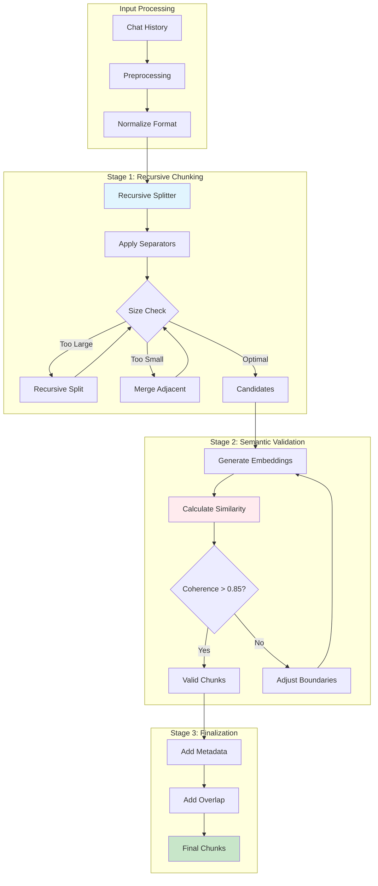

# Chunking Strategy Architecture for Universal Claude Thinking v2

*Last Updated: July 30, 2025*  
*Version: 1.0*  
*Status: Architecture Specification*

---

## Executive Summary

This document details the chunking strategy for the Universal Claude Thinking v2 RAG pipeline, specifically optimized for chat history storage and retrieval. After comprehensive analysis, we've adopted a **Hybrid Recursive-Semantic Chunking** approach that balances performance, context preservation, and retrieval accuracy.

---

## Table of Contents

1. [Understanding Chunking](#understanding-chunking)
2. [Chunking Methods Comparison](#chunking-methods-comparison)
3. [Selected Strategy: Hybrid Recursive-Semantic](#selected-strategy-hybrid-recursive-semantic)
4. [Chunk Size Analysis](#chunk-size-analysis)
5. [Technical Specifications](#technical-specifications)
6. [Integration Architecture](#integration-architecture)
7. [Performance Considerations](#performance-considerations)
8. [Implementation Guidelines](#implementation-guidelines)

---

## Understanding Chunking

### What is Chunking?

Chunking is the process of dividing large documents or text into smaller, manageable segments called "chunks" for efficient processing in RAG systems. In the context of chat history storage, chunking serves critical functions:

1. **Token Limit Management**: Ensures content fits within LLM constraints
2. **Retrieval Precision**: Enables finding specific conversations efficiently
3. **Context Preservation**: Maintains semantic coherence within chunks
4. **Performance Optimization**: Balances storage and retrieval speed
5. **Memory Efficiency**: Supports the 5-layer memory system architecture

### Why Chunking Matters for Chat History

Chat conversations have unique characteristics that make proper chunking essential:
- Natural turn-based structure (user/assistant exchanges)
- Contextual dependencies between messages
- Varying conversation lengths and complexity
- Need for temporal awareness
- Pattern recognition requirements

---

## Chunking Methods Comparison

### Comprehensive Analysis of Available Methods

| Method | Description | Pros | Cons | Best Use Case | Suitability for Chat History |
|--------|-------------|------|------|---------------|----------------------------|
| **Fixed-Size Chunking** | Splits text into uniform chunks based on character/token count | • Simple implementation<br>• Predictable sizes<br>• Fast processing<br>• Low overhead | • Cuts sentences mid-way<br>• Ignores semantic boundaries<br>• Can mix topics | Uniform content, prototyping | ⭐⭐ (Poor - breaks conversations) |
| **Recursive Chunking** | Hierarchically splits using separators (paragraphs→sentences→words) | • Preserves structure<br>• Respects boundaries<br>• More coherent chunks | • Complex implementation<br>• Higher overhead<br>• Variable chunk sizes | Well-structured documents | ⭐⭐⭐⭐ (Good - respects turns) |
| **Document-Based Chunking** | Splits based on document structure (headers, sections) | • Preserves organization<br>• Topic coherence<br>• Metadata-aware | • Requires structure<br>• Variable sizes<br>• Not for unstructured text | Technical docs, reports | ⭐⭐⭐ (Fair - needs adaptation) |
| **Semantic Chunking** | Groups text based on semantic similarity using embeddings | • Meaning preservation<br>• Adaptive boundaries<br>• High coherence | • Computationally expensive<br>• Requires embeddings<br>• Slower processing | Critical content | ⭐⭐⭐⭐⭐ (Excellent - preserves meaning) |
| **Agentic Chunking** | Uses LLMs to identify natural breakpoints | • Human-like segmentation<br>• Context-aware<br>• Highest quality | • Very expensive<br>• Slowest method<br>• Not production-ready | High-value content | ⭐⭐⭐ (Good but impractical) |

### Additional Considerations

**Sliding Window Chunking**: Creates overlapping chunks
- Pros: Context continuity, better retrieval
- Cons: Storage overhead, redundancy
- Use with any method above for overlap

---

## Selected Strategy: Hybrid Recursive-Semantic

### Why Hybrid Approach?

The Hybrid Recursive-Semantic strategy combines the best of both worlds:

1. **Recursive Foundation**: Respects conversation structure
2. **Semantic Validation**: Ensures chunk coherence
3. **Adaptive Boundaries**: Adjusts to content complexity
4. **Performance Balance**: Efficient yet accurate

### Implementation Overview

```python
class HybridChunkingStrategy:
    """
    Combines recursive structural chunking with semantic validation
    for optimal chat history segmentation.
    """
    
    def __init__(self):
        self.target_chunk_size = 1024    # Optimal for chat history
        self.min_chunk_size = 256        # Prevent tiny fragments
        self.max_chunk_size = 1536       # Handle edge cases
        self.overlap_ratio = 0.15        # 15% overlap for context
        self.semantic_threshold = 0.85   # Coherence validation
        
    def chunk_chat_history(self, chat_history: str) -> List[Chunk]:
        # Stage 1: Recursive chunking by conversation boundaries
        chunks = self.recursive_chunk(
            text=chat_history,
            separators=[
                "\n---\n",    # Conversation boundaries
                "\n\n",       # Topic changes
                "\n",         # Turn boundaries
                ". ",         # Sentence boundaries
                " "           # Word boundaries (fallback)
            ]
        )
        
        # Stage 2: Semantic validation and adjustment
        validated_chunks = self.semantic_validation(chunks)
        
        # Stage 3: Add metadata and overlap
        final_chunks = self.add_metadata_and_overlap(validated_chunks)
        
        return final_chunks
```

### Key Benefits

1. **Preserves Conversation Context**: Never splits Q&A pairs
2. **Semantic Coherence**: Validates meaning preservation
3. **Memory System Alignment**: Supports promotion pipeline
4. **Retrieval Optimization**: Balanced precision and recall

---

## Chunk Size Analysis

### Token Size Comparison

| Chunk Size | Pros | Cons | Use Case |
|------------|------|------|----------|
| **512 tokens** | • High precision<br>• Fast processing<br>• Efficient storage | • May split conversations<br>• Less context<br>• More chunks | Specific Q&A retrieval |
| **1024 tokens** ⭐ | • Perfect balance<br>• 2-3 turn coverage<br>• Optimal performance | • Occasional splits<br>• Moderate storage | **Recommended** |
| **2048 tokens** | • Complete threads<br>• Full context<br>• Fewer chunks | • Less precise<br>• Slower processing<br>• Higher memory | Complex discussions |

### Why 1024 Tokens is Optimal

1. **Conversation Coverage**: Typically captures 2-3 complete user/assistant exchanges
2. **Model Efficiency**: 25% of Qwen3's 4096 token limit
3. **Batch Processing**: Aligns with Mac M3 optimization (32 texts/batch)
4. **Memory Promotion**: Works with effectiveness scoring thresholds
5. **Overlap Benefits**: 154-token overlap maintains continuity

---

## Technical Specifications

### Core Configuration

```yaml
chunking_configuration:
  # Strategy selection
  strategy: "hybrid_recursive_semantic"
  
  # Size parameters
  chunk_size: 1024                    # Target tokens per chunk
  chunk_overlap: 154                  # 15% overlap (154 tokens)
  min_chunk_size: 256                 # Minimum viable chunk
  max_chunk_size: 1536                # Maximum allowed chunk
  
  # Recursive parameters
  separators_hierarchy:
    - "\n---\n"                       # Conversation delimiter
    - "\n\n"                          # Topic/section break
    - "\n"                            # Turn boundary
    - ". "                            # Sentence end
    - " "                             # Word boundary (fallback)
  
  # Semantic validation
  semantic_validation:
    enabled: true
    coherence_threshold: 0.85         # Minimum semantic similarity
    embedding_model: "Qwen3-Embedding-8B"
    validation_batch_size: 8          # Pairs per validation batch
  
  # Metadata enrichment
  metadata_fields:
    - timestamp                       # When conversation occurred
    - speaker                         # User or assistant
    - turn_number                     # Position in conversation
    - effectiveness_score             # For memory promotion
    - topic_tags                      # Extracted topics
    - conversation_id                 # Thread identifier
```

### Chunking Pipeline Architecture



---

## Integration Architecture

### Memory System Integration

The chunking strategy seamlessly integrates with the 5-layer memory system:

```yaml
memory_integration:
  short_term_memory:
    chunk_retention: "2 hours"
    promotion_threshold: 5.0
    
  working_memory:
    chunk_retention: "7 days"
    promotion_threshold: 8.0
    min_uses: 5
    
  long_term_memory:
    chunk_retention: "permanent"
    quality_requirement: "high effectiveness"
    
  swarm_sharing:
    anonymization: true
    pii_removal: true
    community_value_threshold: 0.9
```

### RAG Pipeline Integration

```python
class ChunkingRAGIntegration:
    """
    Integrates chunking with the two-stage RAG retrieval system
    """
    
    def process_for_retrieval(self, chunks: List[Chunk]) -> None:
        # Stage 1: Embedding generation
        for chunk in chunks:
            # Generate embedding with Qwen3-Embedding-8B
            embedding = self.embedding_model.encode(
                chunk.text,
                instruction="Represent this conversation for retrieval:"
            )
            
            # Store in vector database
            self.vector_db.insert({
                'id': chunk.id,
                'embedding': embedding,
                'metadata': chunk.metadata,
                'text': chunk.text
            })
        
        # Stage 2: Prepare for reranking
        self.index_for_cross_encoding(chunks)
```

### Storage Schema

```sql
-- SQLite schema for chunk storage
CREATE TABLE chunks (
    id TEXT PRIMARY KEY,
    conversation_id TEXT NOT NULL,
    chunk_index INTEGER NOT NULL,
    text TEXT NOT NULL,
    token_count INTEGER NOT NULL,
    embedding BLOB,  -- Stored as binary
    metadata JSON,
    created_at TIMESTAMP DEFAULT CURRENT_TIMESTAMP,
    last_accessed TIMESTAMP,
    effectiveness_score REAL DEFAULT 5.0,
    access_count INTEGER DEFAULT 0
);

-- Indexes for efficient retrieval
CREATE INDEX idx_conversation ON chunks(conversation_id);
CREATE INDEX idx_effectiveness ON chunks(effectiveness_score);
CREATE INDEX idx_timestamp ON chunks(created_at);
```

---

## Performance Considerations

### Mac M3 Optimization

```yaml
mac_m3_optimization:
  # Hardware utilization
  mps_gpu_config:
    embedding_batch_size: 32          # Texts per batch
    reranking_batch_size: 8           # Pairs per batch
    use_unified_memory: true
    
  # Memory allocation (128GB system)
  memory_allocation:
    model_cache: "35GB"               # Qwen3 models
    vector_index: "65GB"              # Chunk embeddings
    working_memory: "25GB"            # Processing
    system_reserved: "3GB"            # OS overhead
    
  # Performance metrics
  expected_performance:
    chunking_speed: "1000 chunks/minute"
    embedding_generation: "32 chunks/second"
    retrieval_latency: "< 100ms"
    reranking_latency: "< 200ms"
```

### Optimization Strategies

1. **Batch Processing**: Process chunks in batches of 32 for embedding generation
2. **Parallel Chunking**: Utilize multiple CPU cores for recursive splitting
3. **Caching**: Cache frequently accessed chunks in memory
4. **Index Optimization**: Use HNSW index for fast similarity search
5. **Lazy Loading**: Load chunk text only when needed

---

## Implementation Guidelines

### Best Practices

1. **Preprocessing**
   - Normalize conversation format before chunking
   - Clean HTML/markdown artifacts
   - Standardize timestamp formats

2. **Boundary Detection**
   - Prioritize conversation turn boundaries
   - Respect user/assistant role markers
   - Preserve code blocks intact

3. **Metadata Management**
   - Track conversation context
   - Maintain speaker attribution
   - Record temporal information

4. **Quality Assurance**
   - Validate chunk completeness
   - Test retrieval accuracy
   - Monitor effectiveness scores

### Example Implementation

```python
# Example: Processing a chat history
chat_history = """
User: How do I implement chunking for RAG?
Assistant: Chunking for RAG involves dividing text into smaller segments...

User: What's the optimal chunk size?
Assistant: The optimal chunk size depends on your use case...
"""

# Initialize chunker
chunker = HybridChunkingStrategy()

# Process chat history
chunks = chunker.chunk_chat_history(chat_history)

# Store in database
for chunk in chunks:
    db.store_chunk(
        text=chunk.text,
        metadata={
            'conversation_id': chunk.conversation_id,
            'timestamp': chunk.timestamp,
            'speakers': chunk.speakers,
            'effectiveness_score': 5.0  # Initial score
        }
    )
```

### Monitoring and Metrics

```yaml
monitoring_metrics:
  chunk_quality:
    - average_chunk_size
    - size_distribution
    - coherence_scores
    - boundary_accuracy
    
  retrieval_performance:
    - precision@k
    - recall@k
    - mean_reciprocal_rank
    - user_satisfaction
    
  system_health:
    - chunking_throughput
    - storage_efficiency
    - memory_utilization
    - error_rates
```

---

## Conclusion

The Hybrid Recursive-Semantic chunking strategy provides the optimal balance of performance, accuracy, and context preservation for the Universal Claude Thinking v2 chat history RAG system. With 1024-token chunks and 15% overlap, this approach ensures effective retrieval while maintaining conversation coherence and supporting the sophisticated memory promotion pipeline.

Key takeaways:
- **Strategy**: Hybrid Recursive-Semantic for best results
- **Chunk Size**: 1024 tokens for optimal balance
- **Overlap**: 15% (154 tokens) for context continuity
- **Integration**: Seamless with existing architecture
- **Performance**: Optimized for Mac M3 hardware

This chunking strategy forms a critical component of the overall RAG pipeline, enabling accurate and context-aware retrieval of relevant chat history for enhanced AI responses.