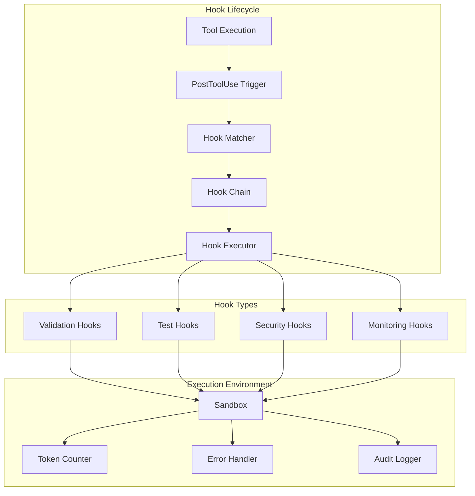

# Claude Code Hooks Architecture

## Purpose

Automated, deterministic execution of validation and testing tasks without relying on LLM decisions or manual processes.

## Hook System Architecture



## Hook Configuration

**settings.json Structure:**

```json
{
  "hooks": {
    "PostToolUse": [
      {
        "name": "module-validation",
        "matcher": "Write|Edit|MultiEdit",
        "pathPattern": "^\\.claude/(thinking-modules|cognitive-tools)/.*\\.md$",
        "hooks": [
          {
            "type": "command",
            "command": "${CLAUDE_HOME}/.claude/hooks/scripts/validate-module.sh",
            "timeout": 5000,
            "continueOnError": false
          }
        ]
      },
      {
        "name": "token-validation",
        "matcher": "Write|Edit|MultiEdit",
        "pathPattern": "^\\.claude/.*\\.md$",
        "hooks": [
          {
            "type": "command",
            "command": "${CLAUDE_HOME}/.claude/hooks/scripts/check-tokens.sh",
            "timeout": 3000,
            "maxTokens": 5000
          }
        ]
      }
    ],
    "PreToolUse": [
      {
        "name": "quarantine-check",
        "matcher": "Write|Edit|MultiEdit",
        "hooks": [
          {
            "type": "command",
            "command": "${CLAUDE_HOME}/.claude/hooks/scripts/check-quarantine.sh",
            "continueOnError": false
          }
        ]
      }
    ]
  }
}
```

## Security Sandbox Implementation

```typescript
class HookSecuritySandbox {
  private allowedPaths: Set<string>;
  private blockedCommands: Set<string>;
  private resourceLimits: ResourceLimits;

  async executeInSandbox(command: string, env: HookEnvironment): Promise<HookResult> {
    // Validate command
    if (!this.validateCommand(command)) {
      throw new SecurityError('Command contains blocked patterns');
    }

    // Validate paths
    const paths = this.extractPaths(command);
    for (const path of paths) {
      if (!this.validatePath(path)) {
        throw new SecurityError(`Path not allowed: ${path}`);
      }
    }

    // Execute with restrictions
    return this.executeWithLimits(command, {
      timeout: env.timeout || 5000,
      memory: 512 * 1024 * 1024, // 512MB
      cpu: 0.5, // 50% of one core
      fileSize: 10 * 1024 * 1024 // 10MB
    });
  }
}
```

## Hook Integration Points

**1. Module Validation Hooks:**

```bash
#!/bin/bash
```
