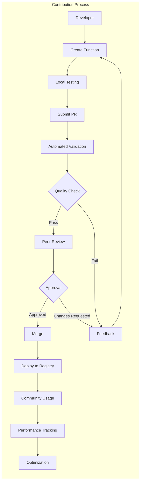

# Community Platform Architecture

## Function Marketplace Design

```python
class CommunityMarketplace:
    """
    Platform for sharing and discovering cognitive functions.
    Implements quality validation and collaborative development.
    """
    
    def __init__(self, github_client: GitHubClient):
        self.github = github_client
        self.validator = FunctionValidator()
        self.registry = CommunityRegistry()
        
    async def submit_function(
        self,
        function: CognitiveFunction,
        author: Author
    ) -> SubmissionResult:
        """Submit function for community review."""
        # Validate function quality
        validation = await self.validator.validate(function)
        if validation.score < 8.0:
            return SubmissionResult(
                accepted=False,
                reason="Quality score below threshold",
                suggestions=validation.improvements
            )
            
        # Create pull request
        pr = await self.github.create_pr(
            title=f"Add cognitive function: {function.name}",
            body=self._generate_pr_body(function, validation),
            branch=f"function/{function.name}",
            files={
                f"functions/{function.category}/{function.name}.py": 
                    function.to_source()
            }
        )
        
        return SubmissionResult(
            accepted=True,
            pr_url=pr.url,
            review_process="automated"
        )
```

## Quality Assurance Framework

```yaml
quality_framework:
  automated_validation:
    - syntax_check: "Python AST validation"
    - type_checking: "MyPy strict mode"
    - security_scan: "Bandit security analysis"
    - performance_test: "Execution benchmarks"
    - cognitive_test: "Reasoning effectiveness"
    
  peer_review:
    - required_approvals: 2
    - domain_expert_review: "For specialized functions"
    - community_testing: "Beta period before release"
    
  quality_metrics:
    - effectiveness_score: "Task completion rate"
    - efficiency_rating: "Token usage optimization"
    - generalization_score: "Cross-domain applicability"
    - user_satisfaction: "Community ratings"
```

## Contribution Workflows



---
