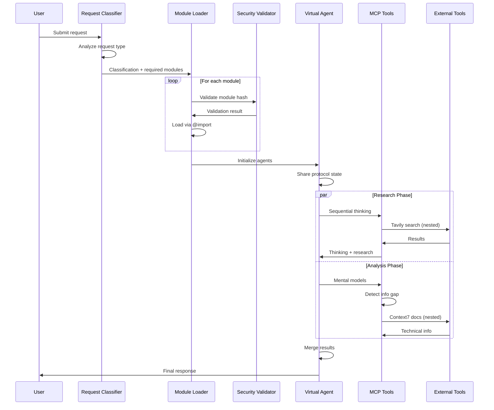

# Core Workflows

```mermaid
sequenceDiagram
    participant U as User
    participant RC as Request Classifier
    participant ML as Module Loader
    participant SV as Security Validator
    participant VA as Virtual Agent
    participant MCP as MCP Tools
    participant EXT as External Tools

    U->>RC: Submit request
    RC->>RC: Analyze request type
    RC->>ML: Classification + required modules

    loop For each module
        ML->>SV: Validate module hash
        SV->>ML: Validation result
        ML->>ML: Load via @import
    end

    ML->>VA: Initialize agents
    VA->>VA: Share protocol state

    par Research Phase
        VA->>MCP: Sequential thinking
        MCP->>EXT: Tavily search (nested)
        EXT->>MCP: Results
        MCP->>VA: Thinking + research
    and Analysis Phase
        VA->>MCP: Mental models
        MCP->>MCP: Detect info gap
        MCP->>EXT: Context7 docs (nested)
        EXT->>MCP: Technical info
    end

    VA->>VA: Merge results
    VA->>U: Final response
```
