# Core Workflows

This section provides a comprehensive view of the system's operational workflows, organized hierarchically from high-level system flows to detailed technical implementations. Each subsection focuses on a specific aspect of the architecture, with diagrams that build upon each other to create a complete picture.

## 1. Primary System Flows

These are the main operational workflows that define how the system processes requests from end to end.

### User Interaction Workflow
The primary entry point for all user interactions, showing how requests flow through the enhancement, processing, and response pipeline.


### Multi-Agent Coordination Workflow
Demonstrates how the orchestrator manages multiple sub-agents for complex tasks, including task classification, parallel execution, and result synthesis.


### Cognitive Function Contribution Workflow
Shows the complete lifecycle of community-contributed cognitive functions, from development through validation to deployment.


## 2. Delegation System

The delegation system intelligently routes user requests to the appropriate sub-agents using a hybrid approach that combines fast keyword matching with sophisticated semantic understanding.

### Hybrid Delegation Flow


### Agent Selection Logic
Combines agent capabilities, task mapping, and confidence scoring to determine the optimal agent for each request.


### Advanced Delegation Patterns
Demonstrates how the system handles edge cases with low-confidence inputs and coordinates multiple agents for complex multi-step tasks.


## 3. Memory System

The memory system provides intelligent context persistence across sessions, with a multi-tiered architecture that promotes valuable patterns while maintaining user privacy.

### Memory Persistence Workflow
Shows the primary memory flow from short-term storage through working memory to long-term persistence and optional community sharing.


### Memory Architecture & Session Lifecycle
Provides a comprehensive view of memory types, promotion criteria, and how sessions interact with the memory system.


### Memory Technical Implementation
Shows the promotion pipeline criteria and vector embedding process for semantic search capabilities.

```mermaid
flowchart TD
    subgraph "Promotion Pipeline"
        NEW[New Memory] --> SCORE{Quality Score}
        SCORE -->|< 5| EXPIRE1[Expire in 2h]
        SCORE -->|5-8| STM_WM[STM → WM<br/>7d retention]
        SCORE -->|> 8| CHECK_USES{Uses > 5?}
        CHECK_USES -->|No| EXPIRE2[Expire in 7d]
        CHECK_USES -->|Yes| WM_LTM[WM → LTM<br/>Permanent]
        
        WM_LTM --> COMMUNITY{Community<br/>Value?}
        COMMUNITY -->|No| PRIVATE[Keep Private]
        COMMUNITY -->|Yes| PII_CHECK{PII Free?}
        PII_CHECK -->|No| PRIVATE
        PII_CHECK -->|Yes| SWARM_SHARE[Share to SWARM]
    end
    
    subgraph "Vector Embedding Process"
        TEXT[Memory Text] --> INSTRUCT[Add Instruction<br/>Template]
        INSTRUCT --> QWEN[Qwen3-Embedding-8B]
        QWEN --> VEC4K[4096-dim Vector]
        VEC4K --> REDUCE[PCA Reduction]
        REDUCE --> VEC1K[1536-dim Vector]
        VEC1K --> NORM[L2 Normalize]
    end
    
    subgraph "Storage & Retrieval"
        NORM --> STORE{Store}
        STORE --> BLOB[SQLite Blob<br/>Binary Storage]
        STORE --> INDEX[sqlite-vec<br/>Vector Index]
        
        QUERY[Search Query] --> QEMBED[Query Embedding]
        QEMBED --> SEARCH[Similarity Search]
        INDEX --> SEARCH
        SEARCH --> TOPK[Top-K Results<br/>+ Scores]
    end
    
    style EXPIRE1 fill:#ffcdd2
    style EXPIRE2 fill:#ffcdd2
    style PRIVATE fill:#fff9c4
    style SWARM_SHARE fill:#c8e6c9
```



## 4. RAG Pipeline

The Retrieval-Augmented Generation (RAG) pipeline enables intelligent memory search using a two-stage approach: fast embedding retrieval followed by precise reranking.

### Complete RAG Pipeline
Illustrates the full retrieval process from query processing through embedding search, reranking, and final output generation.


### RAG Technical Architecture
Explains the difference between bi-encoder embeddings for fast retrieval and cross-encoder reranking for precision, plus the document chunking strategy.


### RAG Performance & Output
Shows how the system optimizes for Mac M3 hardware and displays results with memory references and feedback integration.


## 5. Chunking Strategy

The RAG pipeline implements a sophisticated chunking strategy optimized for chat history storage and retrieval. This strategy ensures optimal context preservation while maintaining efficient retrieval performance.

### Chosen Approach: Hybrid Recursive-Semantic Chunking

After comprehensive analysis of various chunking methods (fixed-size, recursive, document-based, semantic, and agentic), we've selected a **Hybrid Recursive-Semantic** approach that combines the structural awareness of recursive chunking with the meaning preservation of semantic validation.

**Key Configuration**:
```yaml
chunking_configuration:
  strategy: "hybrid_recursive_semantic"
  chunk_size: 1024  # tokens - optimal for chat history
  chunk_overlap: 154  # tokens (15% of chunk_size)
  min_chunk_size: 256  # tokens (prevent fragments)
  max_chunk_size: 1536  # tokens (handle edge cases)
  
  rationale:
    - "1024 tokens captures 2-3 complete conversation turns"
    - "Balances retrieval precision with context completeness"
    - "Optimal for Qwen3-Embedding-8B processing"
    - "Aligns with memory promotion thresholds"
    - "Enables effective pattern recognition"
```

**Why 1024 Tokens?**
- **Perfect Balance**: Captures complete conversation exchanges without overwhelming context
- **Model Efficiency**: 25% of Qwen3's 4096 token limit, leaving room for query expansion
- **Memory Alignment**: Works seamlessly with STM→WM→LTM promotion pipeline
- **Performance**: Optimal batch processing on Mac M3 (32 texts/batch)

**Implementation Features**:
- Preserves conversation boundaries (user/assistant turns)
- Maintains semantic coherence with 0.85 threshold validation
- Tracks metadata: timestamps, speakers, effectiveness scores
- Supports pattern detection across chat histories

> **Note**: For detailed chunking strategy documentation, see [Chunking Strategy Architecture](architecture/chunking-strategy.md).
