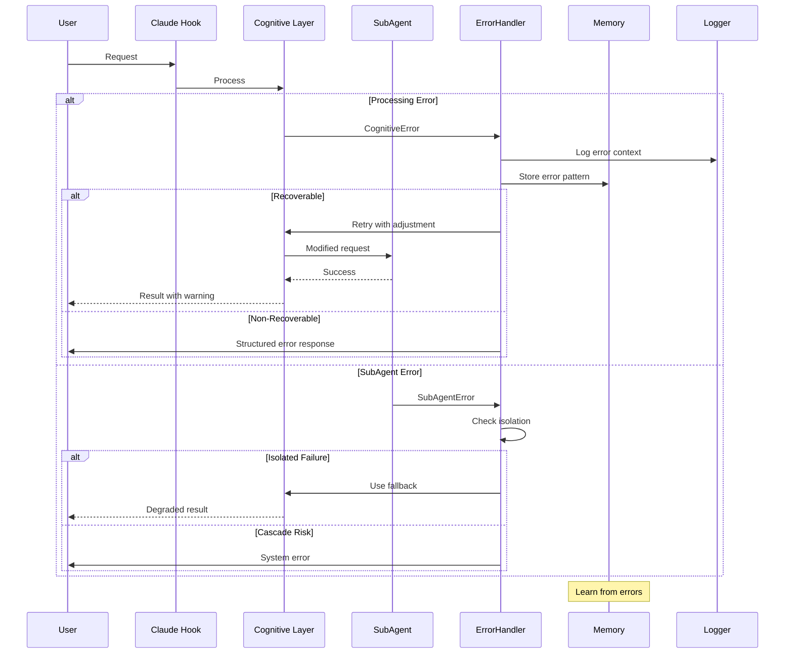

# Error Handling Strategy

## Error Flow Architecture



## Unified Error Response Format

```python
@dataclass
class CognitiveError(Exception):
    """Base error class for cognitive architecture."""
    
    error_code: str
    message: str
    layer: str
    details: Optional[Dict[str, Any]] = None
    recovery_suggestions: Optional[List[str]] = None
    correlation_id: Optional[str] = None
    
    def to_response(self) -> Dict[str, Any]:
        """Convert to standardized error response."""
        return {
            "error": {
                "code": self.error_code,
                "message": self.message,
                "layer": self.layer,
                "details": self.details or {},
                "recovery_suggestions": self.recovery_suggestions or [],
                "timestamp": datetime.utcnow().isoformat(),
                "correlation_id": self.correlation_id or str(uuid.uuid4())
            }
        }
