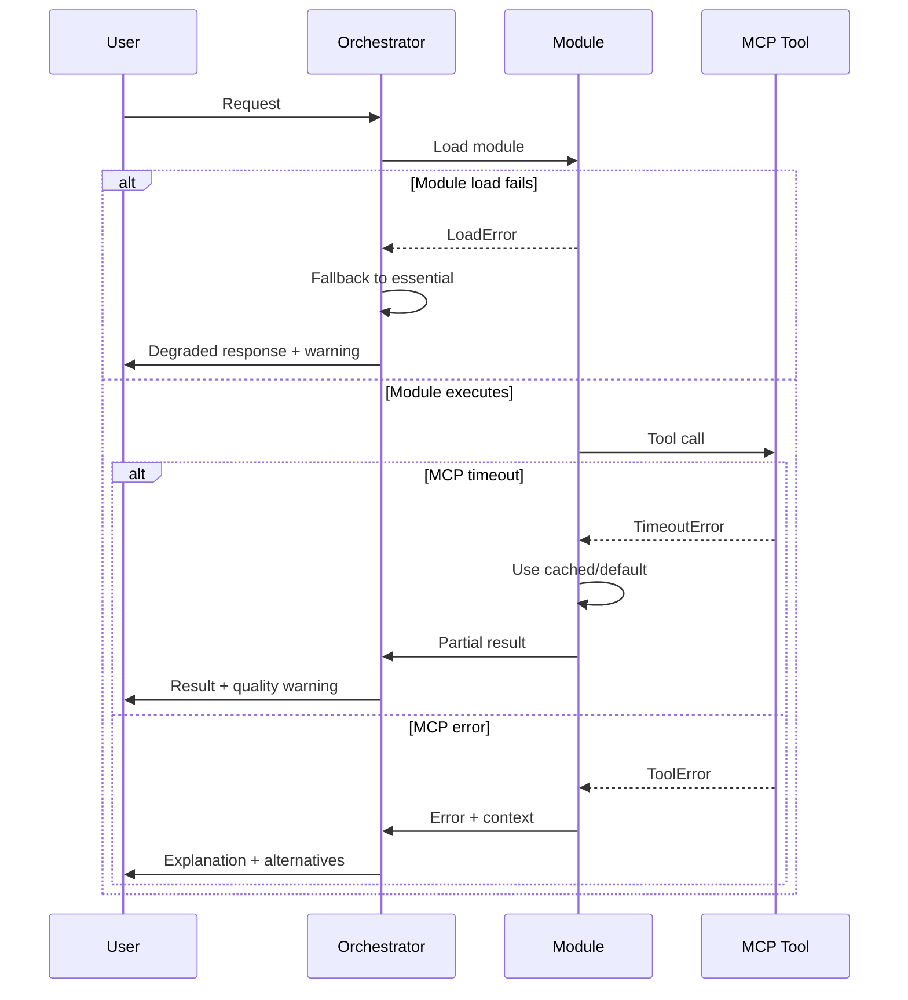

# Error Handling Strategy

## Error Flow


```mermaid
sequenceDiagram
    participant U as User
    participant O as Orchestrator
    participant M as Module
    participant MCP as MCP Tool
    
    U->>O: Request
    O->>M: Load module
    alt Module load fails
        M-->>O: LoadError
        O->>O: Fallback to essential
        O->>U: Degraded response + warning
    else Module executes
        M->>MCP: Tool call
        alt MCP timeout
            MCP-->>M: TimeoutError
            M->>M: Use cached/default
            M->>O: Partial result
            O->>U: Result + quality warning
        else MCP error
            MCP-->>M: ToolError
            M->>O: Error + context
            O->>U: Explanation + alternatives
        end
    end
```

## Error Response Format
```typescript
interface ThinkingError {
  error: {
    code: 'MODULE_LOAD' | 'MCP_TIMEOUT' | 'RECURSION_LIMIT' | 'VALIDATION_FAIL';
    message: string;
    module?: string;
    fallback: 'essential' | 'cached' | 'degraded';
    userMessage: string;
    severity: 'low' | 'medium' | 'high' | 'critical';
  };
}
```

## Module Error Handling
```markdown