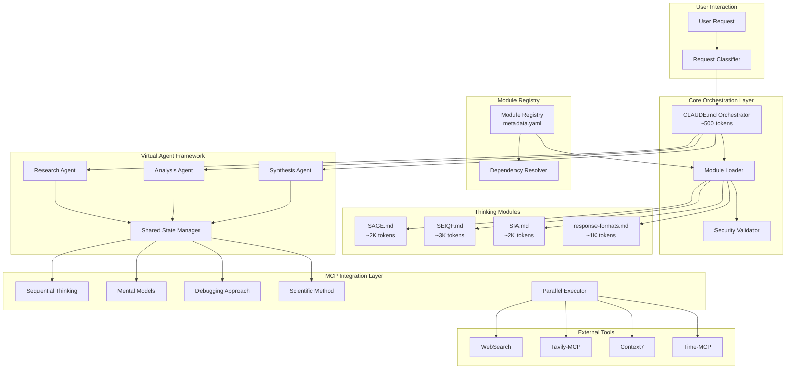

# High Level Architecture

## Technical Summary

The universal-claude-thinking system implements a modular context optimization architecture for Claude Code, transitioning from a monolithic 38K token prompt to a dynamic module loading system targeting 2-5K tokens per request. The architecture leverages Claude Code's native @import functionality for secure module loading, integrates seamlessly with clear-thought MCP for thinking mechanisms, and implements a virtual agent framework that maintains shared protocol state across thinking phases. The system achieves dramatic context reduction through intelligent request classification, lazy module loading, and efficient state management while preserving 100% feature parity with the existing CLAUDE-v3.md system.

## Platform and Infrastructure Choice

**Platform:** Claude Code Context System
**Key Services:**

- Claude Code @import mechanism
- Clear-thought MCP server
- Local file system for module storage
- Git for version control
  **Deployment Host and Regions:** Local .claude/ directory structure

## Repository Structure

**Structure:** Monorepo
**Monorepo Tool:** Git with directory-based organization
**Package Organization:**

- Core orchestration in CLAUDE.md
- Thinking modules in .claude/thinking-modules/
- Cognitive tools in .claude/cognitive-tools/
- Shared utilities in .claude/shared/

## High Level Architecture Diagram

## Architectural Patterns

- **Dynamic Module Loading:** Load only required thinking modules based on request classification - _Rationale:_ Reduces context window usage from 38K to 2-5K tokens
- **Virtual Agent Architecture:** Phase-based agents with shared protocol state - _Rationale:_ Preserves integrated design of SAGE, SEIQF, SIA while enabling scalability
- **Parallel MCP Execution:** Concurrent tool invocation with dependency analysis - _Rationale:_ Reduces response time by 50-75% for multi-tool operations
- **Universal Dynamic Information Gathering:** Thinking tools can invoke other MCP tools mid-execution - _Rationale:_ Enables adaptive reasoning without pre-planned tool selection
- **Security-First Module Loading:** Cryptographic validation of all modules - _Rationale:_ Prevents code injection while maintaining dynamic loading flexibility
- **Event-Driven State Management:** Shared state synchronization across protocols - _Rationale:_ Maintains protocol integration while supporting modular architecture
