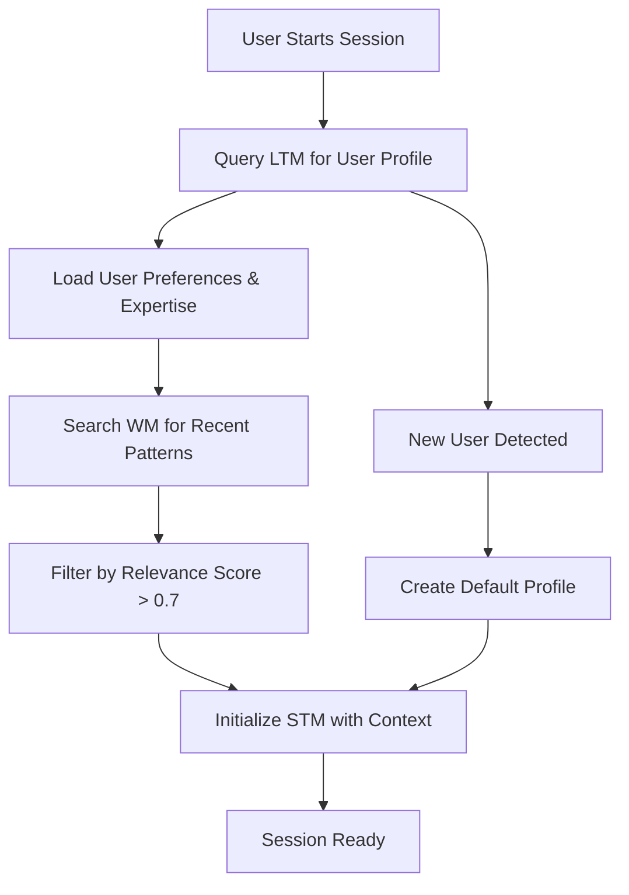

# Memory System Architecture

## Overview

The Universal Claude Thinking v2 memory system implements a sophisticated 5-layer architecture designed to provide persistent intelligence, cross-session continuity, and community learning capabilities. Each memory type serves a specific purpose with carefully designed Time-To-Live (TTL) policies and promotion mechanisms.

## Memory Types and Specifications

### 1. Short-Term Memory (STM) - Session Context
**TTL**: 2 hours  
**Purpose**: Captures immediate context within active sessions  
**Storage**: In-memory cache with SQLite backup

**Characteristics**:
- Stores current conversation context
- Active task tracking and temporary state
- User's immediate requests and responses
- Working calculations and intermediate results

**Example Content**:
```json
{
  "memory_id": "stm_2025_01_27_001",
  "user_id": "user_123",
  "session_id": "session_abc",
  "content": "User is debugging a Python async function",
  "context": {
    "current_file": "src/async_handler.py",
    "error_type": "RuntimeError",
    "attempted_solutions": ["await missing", "event loop check"]
  },
  "created_at": "2025-01-27T20:30:00Z",
  "expires_at": "2025-01-27T22:30:00Z"
}
```

### 2. Working Memory (WM) - Recent Patterns
**TTL**: 7 days  
**Purpose**: Bridges sessions with recently relevant patterns and insights  
**Storage**: Local SQLite with vector embeddings

**Characteristics**:
- Successful problem-solving patterns from recent sessions
- Discovered user preferences and workflows
- Temporary project-specific knowledge
- Recently accessed documentation patterns

**Key Differences from LTM**:
- **Volatility**: More temporary, subject to expiration
- **Quality Threshold**: Lower barrier for storage (effectiveness > 5.0)
- **Update Frequency**: Highly dynamic, frequently modified
- **Scope**: Recent context vs permanent knowledge

**Example Content**:
```json
{
  "memory_id": "wm_2025_01_20_042",
  "pattern_type": "debugging_preference",
  "content": "User prefers print debugging over debugger for async code",
  "confidence": 0.75,
  "usage_count": 4,
  "last_accessed": "2025-01-26T15:22:00Z",
  "effectiveness_score": 7.2,
  "expires_at": "2025-02-02T15:22:00Z"
}
```

### 3. Long-Term Memory (LTM) - Persistent Knowledge
**TTL**: Permanent (no expiration)  
**Purpose**: Core knowledge base of validated patterns and user profile  
**Storage**: SQLite with vector index + periodic backups

**Characteristics**:
- Validated and proven patterns (effectiveness > 8.0)
- User expertise profile and preferences
- Domain-specific knowledge accumulated over time
- High-confidence technical solutions

**Promotion Criteria from WM**:
- Effectiveness score > 8.0
- Used successfully > 5 times
- No negative feedback
- Passes consistency validation

**Example Content**:
```json
{
  "memory_id": "ltm_2024_10_15_789",
  "knowledge_type": "user_expertise",
  "content": "Expert Python developer, specializes in async/await patterns",
  "metadata": {
    "frameworks": ["FastAPI", "asyncio", "aiohttp"],
    "code_style": "type_hints_always",
    "testing_preference": "pytest_with_fixtures"
  },
  "confidence": 0.95,
  "validation_count": 23,
  "created_at": "2024-10-15T09:30:00Z"
}
```

### 4. SWARM Memory - Community Intelligence
**TTL**: Permanent (community shared)  
**Purpose**: Opt-in collaborative learning across users  
**Storage**: Anonymized patterns in shared vector database

**Privacy Requirements**:
- All PII stripped before sharing
- Patterns generalized to remove user-specific details
- Explicit opt-in required
- Local privacy engine validation

**Sharing Criteria**:
- Pattern used successfully by > 3 users
- Effectiveness score > 9.0
- Passes privacy validation
- General applicability confirmed

**Example Content**:
```json
{
  "swarm_id": "swarm_pattern_2025_001",
  "pattern": "FastAPI async endpoint optimization",
  "anonymous_content": "Use connection pooling with asyncpg for 10x performance",
  "category": "performance_optimization",
  "usage_stats": {
    "total_users": 47,
    "success_rate": 0.94,
    "avg_improvement": "10.2x"
  },
  "tags": ["fastapi", "async", "postgresql", "performance"]
}
```

### 5. Privacy Engine - Data Protection Layer
**Purpose**: Ensures all data sharing complies with privacy requirements  
**Function**: Anonymization, PII stripping, pattern generalization

**Core Functions**:
```python
class PrivacyEngine:
    def anonymize_memory(self, memory: Memory) -> AnonymizedMemory:
        # Strip all identifiable information
        # Generalize specific details
        # Validate no PII remains
        # Return safe-to-share pattern
        
    def validate_for_swarm(self, pattern: Pattern) -> bool:
        # Check for any remaining PII
        # Ensure pattern is sufficiently general
        # Verify opt-in status
        # Return sharing approval
```

## Memory Flow and Lifecycle

### New Session Initialization


### Session Memory Flow
1. **Session Start**: 
   - Load user profile from LTM
   - Retrieve relevant patterns from WM
   - Initialize STM with context

2. **During Session**:
   - STM accumulates all interactions
   - Patterns detected and scored
   - Successful patterns marked for promotion

3. **Session End**:
   - STM analyzed for valuable patterns
   - High-value patterns → WM
   - Exceptional patterns → LTM consideration
   - Privacy engine processes SWARM candidates

### Memory Promotion Pipeline
```
STM (2h) → WM (7d) → LTM (∞)
     ↓        ↓         ↓
   Score>5  Score>8  Community
              ↓         ↓
           Privacy → SWARM
```

## Vector Embedding Implementation

### Qwen3-Embedding-8B Configuration
```python
class MemoryEmbeddingSystem:
    def __init__(self):
        self.model = SentenceTransformer("Qwen/Qwen3-Embedding-8B")
        # Configure for Mac M3 optimization
        self.model.to('mps')  # Metal Performance Shaders
        
        # Dimension configuration
        self.embedding_dim = 1536  # Balance between quality and performance
        
    def encode_memory(self, memory_content: str) -> np.ndarray:
        # Add instruction for better performance
        instruction = "Encode this memory for semantic search:"
        full_text = f"{instruction} {memory_content}"
        
        # Generate embedding
        embedding = self.model.encode(full_text, 
                                    normalize_embeddings=True,
                                    convert_to_tensor=False)
        
        # Reduce dimension if needed
        if self.embedding_dim < 4096:
            embedding = self.reduce_dimension(embedding)
            
        return embedding
```

### Storage Schema
```sql
CREATE TABLE memories (
    id TEXT PRIMARY KEY,
    user_id TEXT NOT NULL,
    memory_type TEXT CHECK(memory_type IN ('stm', 'wm', 'ltm')),
    content TEXT NOT NULL,
    embedding BLOB,  -- Vector stored as binary
    metadata JSON,
    effectiveness_score REAL DEFAULT 5.0,
    created_at TIMESTAMP DEFAULT CURRENT_TIMESTAMP,
    last_accessed TIMESTAMP DEFAULT CURRENT_TIMESTAMP,
    expires_at TIMESTAMP,
    INDEX idx_user_type (user_id, memory_type),
    INDEX idx_effectiveness (effectiveness_score),
    INDEX idx_expiration (expires_at)
);

-- Vector similarity search with sqlite-vec
CREATE VIRTUAL TABLE memory_vectors USING vec0(
    id TEXT PRIMARY KEY,
    embedding FLOAT[1536]
);
```

## Memory Retrieval and Reference Display

### Retrieval Process
```python
async def retrieve_relevant_memories(
    self, 
    query: str, 
    user_id: str,
    include_refs: bool = True
) -> MemorySearchResult:
    # 1. Encode query
    query_embedding = self.encode_memory(query)
    
    # 2. Search across memory types
    memories = []
    
    # Search LTM first (highest quality)
    ltm_results = await self.vector_search(
        query_embedding, 
        memory_type='ltm',
        limit=5
    )
    memories.extend(ltm_results)
    
    # Search WM for recent patterns
    wm_results = await self.vector_search(
        query_embedding,
        memory_type='wm', 
        limit=5
    )
    memories.extend(wm_results)
    
    # Include STM for current session
    stm_results = await self.get_session_context(user_id)
    memories.extend(stm_results)
    
    # 3. Format with references
    if include_refs:
        return self.format_with_references(memories)
    
    return memories
```

### Reference Display Format
```python
class MemoryReference:
    def format_for_display(self) -> str:
        return f"""
Retrieved Memory Context ({len(self.memories)} items):

{self._format_memories()}

---
Memory Usage Statistics:
- LTM: {self.ltm_count} permanent memories
- WM: {self.wm_count} recent patterns  
- STM: {self.stm_count} session memories
- Relevance Range: {self.min_score:.2f} - {self.max_score:.2f}
"""

    def _format_memories(self) -> str:
        formatted = []
        for idx, mem in enumerate(self.memories, 1):
            formatted.append(
                f"{idx}. [{mem.type.upper()} - {mem.age}] "
                f'"{mem.content}" '
                f"(relevance: {mem.relevance:.2f}, "
                f"effectiveness: {mem.effectiveness:.1f}/10)"
            )
        return "\n".join(formatted)
```

### User Feedback Integration
```python
async def process_memory_feedback(
    self,
    memory_id: str,
    feedback: str,
    rating: int
) -> None:
    # Update effectiveness score
    if rating > 7:
        await self.boost_effectiveness(memory_id, increment=0.5)
    elif rating < 4:
        await self.reduce_effectiveness(memory_id, decrement=0.5)
    
    # Store feedback for learning
    await self.store_feedback({
        'memory_id': memory_id,
        'feedback': feedback,
        'rating': rating,
        'timestamp': datetime.now()
    })
```

## Performance Optimization

### Mac M3 Specific Optimizations
```python
# Environment configuration
import os
os.environ['PYTORCH_ENABLE_MPS_FALLBACK'] = '1'
os.environ['PYTORCH_MPS_HIGH_WATERMARK_RATIO'] = '0.0'

# Batch processing for efficiency
class BatchMemoryProcessor:
    def __init__(self, batch_size=32):
        self.batch_size = batch_size
        self.device = 'mps' if torch.backends.mps.is_available() else 'cpu'
        
    async def batch_encode(self, memories: List[str]) -> np.ndarray:
        # Process in batches to optimize M3 GPU usage
        embeddings = []
        for i in range(0, len(memories), self.batch_size):
            batch = memories[i:i + self.batch_size]
            batch_embeddings = self.model.encode(
                batch,
                device=self.device,
                show_progress_bar=False
            )
            embeddings.extend(batch_embeddings)
        return np.array(embeddings)
```

### Memory Consolidation Schedule
```python
# Automated memory maintenance
class MemoryConsolidator:
    async def consolidate(self):
        # 1. Expire old STM
        await self.expire_stm(older_than_hours=2)
        
        # 2. Promote valuable STM → WM
        await self.promote_to_wm(min_score=5.0)
        
        # 3. Promote proven WM → LTM
        await self.promote_to_ltm(min_score=8.0, min_uses=5)
        
        # 4. Process SWARM candidates
        await self.process_swarm_candidates()
        
        # 5. Optimize vector indices
        await self.optimize_indices()
```

## Summary

The 5-layer memory system provides:
- **Immediate Context** (STM) for current tasks
- **Recent Patterns** (WM) for cross-session continuity
- **Permanent Knowledge** (LTM) for long-term learning
- **Community Intelligence** (SWARM) for collaborative improvement
- **Privacy Protection** throughout the entire pipeline

This architecture ensures that Universal Claude Thinking v2 maintains context, learns from interactions, and continuously improves while respecting user privacy and providing transparent memory usage.