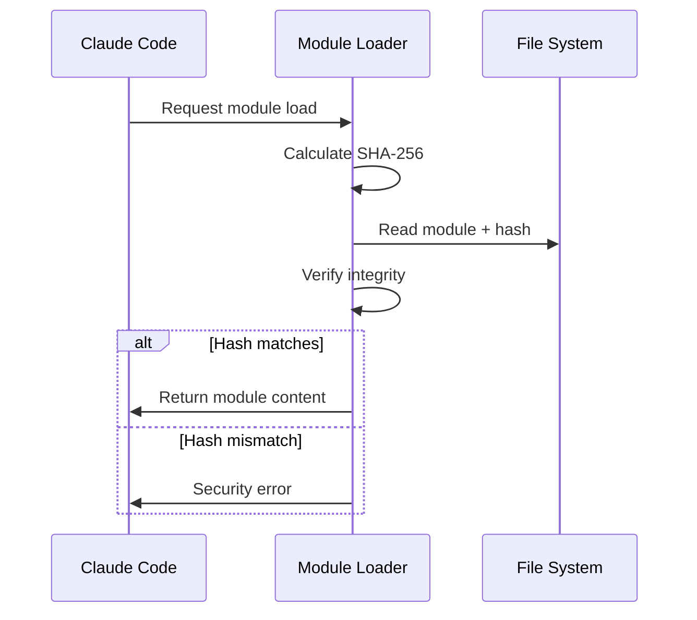

# Protocol Status

- SAGE: {{sage_status}}
- SEIQF: {{seiqf_status}}
- SIA: {{sia_status}}

````

## Database Architecture

### State Persistence
```json
{
  "session": {
    "id": "uuid",
    "timestamp": "2025-07-12T10:00:00Z",
    "classification": {
      "category": "complex",
      "confidence": 0.92
    }
  },
  "protocolState": {
    "sage": {
      "biasLevel": "low",
      "detectedBiases": ["confirmation"],
      "mitigationApplied": true
    },
    "seiqf": {
      "overallScore": 0.85,
      "sourcesEvaluated": 12
    },
    "sia": {
      "primaryIntent": "research",
      "expansions": ["ML papers", "recent advances"]
    }
  },
  "moduleMetrics": {
    "loadedModules": ["sage", "seiqf", "cognitive-tools"],
    "totalTokens": 5234,
    "loadTime": 87
  }
}
````

## Authentication and Authorization

_Note: Relies on Claude Code's existing security model_


