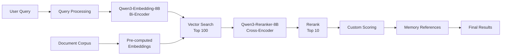

# RAG Pipeline Architecture with Qwen3 Models

## Overview

The Universal Claude Thinking v2 implements an advanced Hybrid RAG (Retrieval-Augmented Generation) pipeline that combines the speed of embedding-based retrieval with the accuracy of cross-encoder reranking. This architecture leverages the complementary strengths of Qwen3-Embedding-8B and Qwen3-Reranker-8B to deliver optimal retrieval performance.

## Understanding Embeddings vs Rerankers

### Fundamental Differences

#### Embedding Models (Bi-Encoders)
**Architecture**: Encode queries and documents independently
```python
query_vector = embed(query)          # Encoded once
doc_vector = embed(document)         # Can be pre-computed
similarity = cosine(query_vector, doc_vector)
```

**Characteristics**:
- ✅ Very fast (single encoding per document)
- ✅ Scalable (pre-compute document embeddings)
- ✅ Efficient for large-scale retrieval
- ❌ Limited contextual understanding
- ❌ Cannot capture query-document interactions

#### Reranking Models (Cross-Encoders)
**Architecture**: Process query-document pairs jointly
```python
score = reranker([query, document])  # Processed together
# Sees full interaction between query and document
```

**Characteristics**:
- ✅ Superior accuracy and relevance assessment
- ✅ Captures nuanced semantic relationships
- ✅ Understands context and intent better
- ❌ Computationally expensive
- ❌ Cannot pre-compute (must run at query time)

### Why We Need Both

| Stage | Model Type | Purpose | Scale |
|-------|------------|---------|-------|
| **Retrieval** | Embedding (Bi-Encoder) | Find relevant candidates quickly | 100k+ documents → 100 candidates |
| **Reranking** | Reranker (Cross-Encoder) | Accurately order top results | 100 candidates → 10 results |
| **Scoring** | Custom Formula | Apply project-specific weights | 10 results → Final ranking |

## Hybrid RAG Architecture

### Sequential Pipeline Design


### Implementation Details

#### Stage 1: Embedding-Based Retrieval
```python
class EmbeddingRetrieval:
    def __init__(self):
        self.model = SentenceTransformer("Qwen/Qwen3-Embedding-8B")
        self.model.to('mps')  # Mac M3 optimization
        
    async def retrieve_candidates(
        self, 
        query: str,
        user_id: str,
        top_k: int = 100
    ) -> List[Document]:
        # Add instruction for better retrieval
        instruction = "Represent this query for retrieving relevant passages:"
        enhanced_query = f"{instruction} {query}"
        
        # Generate query embedding
        query_embedding = self.model.encode(
            enhanced_query,
            normalize_embeddings=True,
            show_progress_bar=False
        )
        
        # Search across memory types
        results = []
        
        # Vector similarity search
        async with self.vector_db as db:
            candidates = await db.similarity_search(
                query_embedding,
                filter={
                    "user_id": user_id,
                    "effectiveness_score": {"$gte": 5.0}
                },
                top_k=top_k
            )
        
        return candidates
```

#### Stage 2: Cross-Encoder Reranking
```python
class CrossEncoderReranking:
    def __init__(self):
        self.tokenizer = AutoTokenizer.from_pretrained(
            "Qwen/Qwen3-Reranker-8B",
            padding_side='left'
        )
        self.model = AutoModelForCausalLM.from_pretrained(
            "Qwen/Qwen3-Reranker-8B",
            torch_dtype=torch.float16,
            device_map="mps"  # Mac M3
        ).eval()
        
    async def rerank_candidates(
        self,
        query: str,
        candidates: List[Document],
        top_k: int = 10
    ) -> List[RankedDocument]:
        # Prepare query-document pairs
        pairs = []
        for doc in candidates:
            # Qwen3 reranker format
            pair = f"Query: {query}\nDocument: {doc.content}\nRelevance:"
            pairs.append(pair)
        
        # Batch processing for efficiency
        with torch.no_grad():
            inputs = self.tokenizer(
                pairs,
                padding=True,
                truncation=True,
                max_length=8192,
                return_tensors="pt"
            ).to('mps')
            
            # Get relevance scores
            outputs = self.model(**inputs)
            scores = outputs.logits[:, -1, :].softmax(dim=-1)
            
            # Extract relevance probability
            relevance_scores = scores[:, self.relevance_token_id].cpu().numpy()
        
        # Rank by scores
        ranked_indices = np.argsort(relevance_scores)[::-1][:top_k]
        
        return [
            RankedDocument(
                document=candidates[idx],
                rerank_score=float(relevance_scores[idx]),
                rank=rank
            )
            for rank, idx in enumerate(ranked_indices)
        ]
```

#### Stage 3: Custom Scoring Layer
```python
class HybridScoring:
    def __init__(self):
        self.bm25 = BM25Okapi()  # Keyword scoring
        
    async def apply_custom_scoring(
        self,
        query: str,
        reranked_docs: List[RankedDocument]
    ) -> List[FinalResult]:
        results = []
        
        for doc in reranked_docs:
            # Calculate component scores
            semantic_score = doc.rerank_score  # From Qwen3-Reranker
            keyword_score = self._calculate_bm25(query, doc.content)
            recency_score = self._calculate_recency(doc.timestamp)
            effectiveness = doc.effectiveness_score / 10.0
            
            # Weighted combination
            final_score = (
                0.5 * semantic_score +      # Reranker score (highest weight)
                0.2 * keyword_score +       # BM25 keyword relevance
                0.15 * recency_score +      # Time decay factor
                0.15 * effectiveness        # Historical performance
            )
            
            results.append(FinalResult(
                document=doc,
                scores={
                    'semantic': semantic_score,
                    'keyword': keyword_score,
                    'recency': recency_score,
                    'effectiveness': effectiveness,
                    'final': final_score
                }
            ))
        
        # Sort by final score
        results.sort(key=lambda x: x.scores['final'], reverse=True)
        return results
```

## Advanced Chunking Strategy

### Semantic Chunking with Context Preservation
```python
class SemanticChunker:
    def __init__(self):
        self.splitter = RecursiveCharacterTextSplitter(
            chunk_size=1024,
            chunk_overlap=128,  # 12.5% overlap
            separators=["\n\n", "\n", ". ", " ", ""],
            length_function=self.token_length
        )
        
    def chunk_document(self, document: str, metadata: dict) -> List[Chunk]:
        # Primary: Try semantic boundaries
        chunks = self._semantic_split(document)
        
        # Secondary: Recursive character splitting for long chunks
        final_chunks = []
        for chunk in chunks:
            if self.token_length(chunk.content) > 1024:
                sub_chunks = self.splitter.split_text(chunk.content)
                final_chunks.extend(sub_chunks)
            else:
                final_chunks.append(chunk)
        
        # Add metadata and overlap context
        return self._add_context_and_metadata(final_chunks, metadata)
    
    def _semantic_split(self, text: str) -> List[Chunk]:
        # Split by paragraphs, sections, or natural boundaries
        sections = text.split('\n\n')
        chunks = []
        
        current_chunk = ""
        for section in sections:
            if self.token_length(current_chunk + section) < 1024:
                current_chunk += section + "\n\n"
            else:
                if current_chunk:
                    chunks.append(Chunk(content=current_chunk.strip()))
                current_chunk = section + "\n\n"
        
        if current_chunk:
            chunks.append(Chunk(content=current_chunk.strip()))
            
        return chunks
```

### Chunk Metadata for Reference Tracking
```python
@dataclass
class ChunkMetadata:
    document_id: str
    chunk_index: int
    total_chunks: int
    source_file: str
    section_title: Optional[str]
    timestamp: datetime
    char_start: int
    char_end: int
    
    def to_reference(self) -> str:
        return (
            f"Source: {self.source_file}"
            f"{f' - {self.section_title}' if self.section_title else ''} "
            f"(chunk {self.chunk_index + 1}/{self.total_chunks})"
        )
```

## Memory Reference Display System

### Transparent Reference Formatting
```python
class MemoryReferenceDisplay:
    def format_retrieval_results(
        self,
        results: List[FinalResult],
        include_scores: bool = True
    ) -> str:
        output = ["## Retrieved Context\n"]
        
        for idx, result in enumerate(results, 1):
            doc = result.document
            scores = result.scores
            
            # Memory type indicator
            memory_icon = {
                'stm': '⚡',  # Short-term
                'wm': '🔄',   # Working
                'ltm': '💎',  # Long-term
                'swarm': '🌐' # Community
            }.get(doc.memory_type, '📄')
            
            # Format reference
            output.append(
                f"{idx}. {memory_icon} **[{doc.memory_type.upper()}]** "
                f"{self._truncate(doc.content, 100)}\n"
            )
            
            # Metadata
            output.append(
                f"   - Source: {doc.metadata.to_reference()}\n"
                f"   - Created: {doc.created_at} | "
                f"Last used: {doc.last_accessed}\n"
            )
            
            # Scores (if requested)
            if include_scores:
                output.append(
                    f"   - Relevance scores: "
                    f"Semantic: {scores['semantic']:.2f} | "
                    f"Keyword: {scores['keyword']:.2f} | "
                    f"Overall: {scores['final']:.2f}\n"
                )
            
            output.append("")
        
        # Summary statistics
        output.append("\n### Retrieval Statistics")
        output.append(f"- Total candidates searched: 100")
        output.append(f"- Reranked to top: 10")
        output.append(f"- Memory types used: {self._get_memory_type_counts(results)}")
        output.append(f"- Average relevance: {self._calculate_avg_relevance(results):.2f}")
        
        return "\n".join(output)
```

### User Feedback Integration
```python
class FeedbackProcessor:
    async def collect_retrieval_feedback(
        self,
        query: str,
        results: List[FinalResult],
        user_feedback: Dict[str, Any]
    ) -> None:
        # Process overall satisfaction
        if user_feedback.get('helpful'):
            # Boost effectiveness of used memories
            for result in results[:3]:  # Top 3 most relevant
                await self.memory_store.boost_effectiveness(
                    result.document.id,
                    increment=0.3
                )
        
        # Process specific memory feedback
        for memory_id, feedback in user_feedback.get('memory_feedback', {}).items():
            if feedback['relevant']:
                await self.memory_store.boost_effectiveness(memory_id, 0.5)
            else:
                await self.memory_store.reduce_effectiveness(memory_id, 0.3)
        
        # Learn from the interaction
        await self.learning_engine.process_interaction({
            'query': query,
            'results': results,
            'feedback': user_feedback,
            'timestamp': datetime.now()
        })
```

## Performance Optimization

### Mac M3 Specific Configuration
```python
# requirements.txt for Mac M3
torch>=2.3.0  # MPS backend support
transformers>=4.44.0
sentence-transformers>=3.1.0
accelerate>=0.30.0  # Hugging Face acceleration
faiss-cpu>=1.8.0  # CPU version works well on M3
sqlite-vec>=0.1.1
rank-bm25>=0.2.2

# Environment setup
export PYTORCH_ENABLE_MPS_FALLBACK=1
export TOKENIZERS_PARALLELISM=false
```

### Batch Processing for Efficiency
```python
class BatchProcessor:
    def __init__(self, batch_size: int = 8):  # Optimized for M3 Max 128GB
        self.batch_size = batch_size
        self.device = 'mps'
        
    async def batch_rerank(
        self,
        query: str,
        documents: List[Document],
        reranker: CrossEncoderReranking
    ) -> List[float]:
        scores = []
        
        # Process in optimized batches
        for i in range(0, len(documents), self.batch_size):
            batch = documents[i:i + self.batch_size]
            batch_scores = await reranker.score_batch(query, batch)
            scores.extend(batch_scores)
            
        return scores
```

## Complete RAG Pipeline Flow

```python
class HybridRAGPipeline:
    def __init__(self):
        self.embedder = EmbeddingRetrieval()
        self.reranker = CrossEncoderReranking()
        self.scorer = HybridScoring()
        self.display = MemoryReferenceDisplay()
        
    async def search(
        self,
        query: str,
        user_id: str,
        return_references: bool = True
    ) -> SearchResult:
        # 1. Embedding-based retrieval (fast, broad)
        start_time = time.time()
        candidates = await self.embedder.retrieve_candidates(
            query, user_id, top_k=100
        )
        retrieval_time = time.time() - start_time
        
        # 2. Cross-encoder reranking (accurate, focused)
        rerank_start = time.time()
        reranked = await self.reranker.rerank_candidates(
            query, candidates, top_k=10
        )
        rerank_time = time.time() - rerank_start
        
        # 3. Custom scoring (project-specific)
        final_results = await self.scorer.apply_custom_scoring(
            query, reranked
        )
        
        # 4. Format response with references
        response = SearchResult(
            results=final_results,
            references=self.display.format_retrieval_results(
                final_results
            ) if return_references else None,
            metrics={
                'retrieval_time': retrieval_time,
                'rerank_time': rerank_time,
                'total_time': time.time() - start_time,
                'candidates_searched': len(candidates),
                'results_returned': len(final_results)
            }
        )
        
        return response
```

## Summary

The Hybrid RAG Pipeline combines:
1. **Fast Retrieval** with Qwen3-Embedding-8B (bi-encoder)
2. **Accurate Reranking** with Qwen3-Reranker-8B (cross-encoder)
3. **Custom Scoring** for project-specific requirements
4. **Transparent References** for user trust and feedback
5. **Mac M3 Optimization** for maximum performance

This architecture provides the optimal balance between speed, accuracy, and transparency while leveraging the complementary strengths of embedding and reranking models.