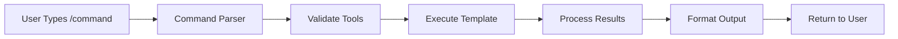

# Recommendations
{{#each optimization_recommendations}}
- **{{category}}**: {{recommendation}}
{{/each}}
```

## Command Integration Patterns

### **Command Execution Flow**


### **Cross-Category Integration**
Commands can trigger other commands for comprehensive workflows:

```markdown