# System Architecture Overview

## High-Level Component Architecture

```mermaid
graph TB
    subgraph "User Interface Layer"
        CLI[Claude Code CLI]
        HOOKS[Event Hooks System]
        LOCAL[Local File System]
    end
    
    subgraph "Hybrid Delegation Engine"
        DELEGATE[3-Stage Delegation]
        KEYWORD[Keyword Matcher]
        SEMANTIC[Semantic Matcher]
        FALLBACK[PE Enhancement]
    end
    
    subgraph "Context Engineering Core"
        ATOMIC[Atomic Foundation Layer + CoVe]
        MOLECULAR[Molecular Enhancement Layer]
        CELLULAR[Cellular Memory Layer]
        ORGAN[Organ Orchestration Layer + ReAct]
        COGNITIVE[Cognitive Tools Layer]
        PROGRAMMING[Prompt Programming Layer]
        SUBAGENT[Sub-Agent Management Layer]
    end
    
    subgraph "Enhanced Sub-Agent Architecture"
        PROMPT_ENHANCER[PE 🔧 Prompt-Enhancer]
        RESEARCHER[R1 🔍 Researcher]
        REASONER[A1 🧠 Reasoner]
        EVALUATOR[E1 📊 Evaluator]
        TOOL_USER[T1 🛠️ Tool-User]
        WRITER[W1 🖋️ Writer]
        INTERFACE[I1 🗣️ Interface]
    end
    
    subgraph "5-Layer Memory System"
        STM[Short-Term Memory 2h]
        WM[Working Memory 7d]
        LTM[Long-Term Memory ∞]
        SWARM[(SWARM Community)]
        PRIVACY[Privacy Engine]
    end
    
    subgraph "Hybrid RAG Pipeline"
        EMBEDDER[Qwen3-Embedding-8B]
        RERANKER[Qwen3-Reranker-8B]
        SCORER[Custom Scorer]
    end
    
    subgraph "Storage Systems"
        SQLITE[(SQLite + sqlite-vec)]
        CACHE[Prompt Cache]
        VECTOR[Local Vectors]
    end
    
    subgraph "External Integrations"
        MCP[MCP Ecosystem]
        GITHUB[GitHub Integration]
        COMMUNITY[Community Platform]
    end
    
    CLI --> DELEGATE
    HOOKS --> DELEGATE
    
    DELEGATE --> KEYWORD
    DELEGATE --> SEMANTIC
    DELEGATE --> FALLBACK
    
    KEYWORD --> ATOMIC
    SEMANTIC --> ATOMIC
    FALLBACK --> PROMPT_ENHANCER
    
    ATOMIC --> MOLECULAR
    MOLECULAR --> CELLULAR
    CELLULAR --> ORGAN
    ORGAN --> COGNITIVE
    COGNITIVE --> PROGRAMMING
    PROGRAMMING --> SUBAGENT
    
    SUBAGENT --> PROMPT_ENHANCER
    SUBAGENT --> RESEARCHER
    SUBAGENT --> REASONER
    SUBAGENT --> EVALUATOR
    SUBAGENT --> TOOL_USER
    SUBAGENT --> WRITER
    SUBAGENT --> INTERFACE
    
    CELLULAR --> STM
    STM --> WM
    WM --> LTM
    LTM --> PRIVACY
    PRIVACY --> SWARM
    
    MOLECULAR --> EMBEDDER
    EMBEDDER --> RERANKER
    RERANKER --> SCORER
    
    STM --> SQLITE
    WM --> SQLITE
    LTM --> SQLITE
    EMBEDDER --> VECTOR
    ATOMIC --> CACHE
    
    RESEARCHER --> MCP
    TOOL_USER --> MCP
    PROGRAMMING --> GITHUB
    SWARM --> COMMUNITY
```



## Repository Structure

**Structure**: Monorepo  
**Monorepo Tool**: Python workspaces with shared dependencies  
**Package Organization**: Domain-driven design with clear module boundaries

```yaml
repository_configuration:
  structure: "monorepo"
  rationale: |
    - Single source of truth for all cognitive architecture components
    - Simplified dependency management across layers
    - Atomic commits for coordinated changes
    - Unified CI/CD pipeline for entire system
  
  package_strategy:
    core: "Context Engineering layers as separate packages"
    agents: "Sub-agent implementations as plugins"
    memory: "5-layer memory system with promotion pipeline"
    rag: "Hybrid RAG pipeline with Qwen3 models"
    delegation: "3-stage hybrid delegation engine"
    shared: "Common utilities and types in shared package"
    cognitive: "Cognitive functions as versioned packages"
    
  new_components:
    - "src/delegation/": "Hybrid delegation engine implementation"
    - "src/rag/": "RAG pipeline with embedding and reranking"
    - "src/memory/layers/": "5-layer memory architecture"
    - "data/vectors/": "Local vector storage (sqlite-vec)"
    - "scripts/memory/": "Memory consolidation and maintenance"
```

## Architectural Patterns

The following architectural patterns guide the implementation of the cognitive intelligence platform:

- **Plugin Architecture**: Sub-agents implemented as pluggable components - *Rationale*: Enables independent development and testing of specialist capabilities
- **Event-Driven Coordination**: Hook-based system for cognitive processing - *Rationale*: Decouples processing stages and enables extensibility
- **Observer Pattern**: Memory systems observe and learn from interactions - *Rationale*: Enables passive learning without disrupting core workflows
- **Strategy Pattern**: Cognitive tools selected dynamically based on task - *Rationale*: Optimizes reasoning approach for different problem types
- **Repository Pattern**: Abstract data access for memory and patterns - *Rationale*: Enables switching between storage backends without code changes
- **Pipeline Pattern**: Sequential processing through cognitive layers - *Rationale*: Clear data flow and transformation at each stage
- **Factory Pattern**: Dynamic creation of cognitive functions - *Rationale*: Supports meta-programming and runtime function generation
- **Singleton Pattern**: Shared memory orchestrator across system - *Rationale*: Ensures consistent memory state and prevents duplication

## Technology Stack

### Core Technologies
- **Primary Language**: Python 3.12+ with full type annotations (Python 3.12.11)
- **Package Management**: uv for fast, reliable dependency resolution
- **Async Framework**: asyncio for concurrent operations
- **Type System**: Pydantic v2 for data validation

### Comprehensive Library Dependencies (Optimized for Mac M3 - Updated July 2025)

| Category | Library | Version | Purpose | Mac M3 Notes |
|----------|---------|---------|---------|--------------|  
| **Core Runtime & Package Management** |
| Python | 3.12.11 | Runtime environment | Latest stable with full Apple Silicon support |
| uv | 0.8.4 | Fast package manager | 10-100x faster than pip, Rust-based |
| pip | 24.3.1 | Fallback package manager | For packages not in uv |
| setuptools | 80.9.0 | Package building | Modern PEP 517 support |
| wheel | 0.45.1 | Wheel package support | Universal2 wheels for M3 |
| **ML/AI Frameworks** |
| torch | 2.7.1 | Deep learning framework | MPS backend for M3 GPU acceleration |
| torchvision | 0.22.1 | Computer vision models | Optimized for Apple Silicon |
| torchaudio | 2.7.1 | Audio processing | Metal Performance Shaders support |
| transformers | 4.54.0 | NLP models & tokenizers | Qwen3 model support included |
| sentence-transformers | 5.0.0 | Sentence embeddings | For Qwen3-Embedding-8B |
| accelerate | 1.9.0 | Training acceleration | Automatic MPS device placement |
| tokenizers | 0.21.2 | Fast tokenization | Rust-based, M3 optimized |
| mlx | 0.27.1 | Apple ML framework | Native M3 optimization, GPU acceleration |
| **Embeddings & Vector Operations** |
| faiss-cpu | 1.11.0.post1 | Vector similarity search | CPU version recommended for M3 |
| chromadb | 1.0.15 | Vector database | Alternative with Mac support |
| sqlite-vec | 0.1.6 | SQLite vector extension | Lightweight vector operations |
| hnswlib | 0.8.0 | Graph-based ANN | FAISS alternative for Mac |
| pgvector | 0.3.6 | PostgreSQL vectors | For production deployments |
| **Scientific Computing** |
| numpy | 1.26.4 | Numerical computing | Universal2 binary, M3 optimized |
| scipy | 1.14.1 | Scientific algorithms | Optimized BLAS/LAPACK for M3 |
| scikit-learn | 1.5.2 | Machine learning | Native Apple Silicon build |
| pandas | 2.2.3 | Data manipulation | M3 optimized operations |
| **RAG & Search Frameworks** |
| langchain | 0.3.27 | LLM framework | Comprehensive RAG support |
| langchain-community | 0.3.27 | Community integrations | Extended functionality |
| langchain-core | 0.3.28 | Core abstractions | Pydantic v2 based |
| llama-index | 0.12.52 | Data framework for LLMs | Alternative RAG solution |
| llama-index-core | 0.12.52 | Core indexing | Modular architecture |
| tiktoken | 0.8.0 | OpenAI tokenizer | For token counting |
| rank-bm25 | 0.2.2 | BM25 ranking | Keyword search scoring |
| **Database & Storage** |
| SQLAlchemy | 2.0.36 | ORM and SQL toolkit | Full async support |
| psycopg[binary] | 3.2.3 | PostgreSQL adapter | Native async, M3 optimized |
| asyncpg | 0.30.0 | Async PostgreSQL | High-performance driver |
| aiosqlite | 0.20.0 | Async SQLite | For local development |
| redis | 5.2.1 | In-memory cache | With hiredis C extension |
| sqlite-utils | 3.38 | SQLite utilities | CLI and Python API |
| alembic | 1.14.0 | Database migrations | SQLAlchemy integration |
| **Web & API** |
| fastapi | 0.115.6 | Modern web API | High performance async |
| uvicorn[standard] | 0.34.0 | ASGI server | With uvloop for M3 |
| pydantic | 2.10.4 | Data validation | V2 with Rust core |
| pydantic-settings | 2.7.0 | Settings management | Environment config |
| httpx | 0.28.1 | Async HTTP client | HTTP/2 support |
| starlette | 0.41.3 | ASGI framework | FastAPI foundation |
| **Development & Testing** |
| pytest | 8.3.4 | Testing framework | Modern Python testing |
| pytest-asyncio | 0.25.0 | Async test support | For async fixtures |
| pytest-cov | 6.0.0 | Coverage reporting | With coverage.py 7.6+ |
| pytest-xdist | 3.6.1 | Parallel test execution | Utilize M3 cores |
| pytest-mock | 3.14.0 | Mock fixtures | Simplified mocking |
| black | 24.10.0 | Code formatter | Consistent style |
| ruff | 0.8.4 | Linter & formatter | Rust-based, very fast |
| mypy | 1.14.0 | Type checker | Static type analysis |
| pre-commit | 4.0.1 | Git hook framework | Automated checks |
| **Monitoring & Utilities** |
| structlog | 24.4.0 | Structured logging | JSON formatting |
| rich | 13.9.4 | Terminal formatting | Beautiful CLI output |
| typer | 0.15.1 | CLI framework | Type hints based |
| python-dotenv | 1.0.1 | Environment variables | .env file support |
| tenacity | 9.0.0 | Retry logic | Resilient operations |
| tqdm | 4.67.1 | Progress bars | Terminal progress |
| psutil | 6.1.1 | System monitoring | CPU/memory metrics |
| prometheus-client | 0.21.1 | Metrics collection | Monitoring integration |
| opentelemetry-api | 1.29.0 | Distributed tracing | Observability |
| pyyaml | 6.0.2 | YAML parsing | Config files |
| orjson | 3.10.12 | Fastest JSON | Rust-based |
| msgpack | 1.1.0 | Binary serialization | Efficient storage |
| **Mac M3 Specific Libraries** |
| pyobjc-core | 10.3.2 | Python-ObjC bridge | macOS integration |
| pyobjc-framework-Metal | 10.3.2 | Metal framework | GPU access |
| pyobjc-framework-MetalPerformanceShaders | 10.3.2 | MPS framework | ML acceleration |

### Mac M3 Optimization Notes (Updated for Streamlined Stack)

1. **MPS (Metal Performance Shaders) Configuration**:
   ```bash
   export PYTORCH_ENABLE_MPS_FALLBACK=1
   export PYTORCH_MPS_HIGH_WATERMARK_RATIO=0.0
   export PYTORCH_MPS_ALLOCATOR_POLICY=garbage_collection
   export METAL_DEVICE_WRAPPER_TYPE=1
   export METAL_DEBUG_ERROR_MODE=0
   ```

2. **Optimal Batch Sizes** (for 128GB RAM):
   - Embedding generation: 32 texts/batch
   - Reranking operations: 8 pairs/batch  
   - Vector search: 1000 vectors/batch

3. **Memory Allocation** (128GB system - Optimized):
   - Model cache: ~35GB (increased from 20GB)
   - Vector index: ~65GB (increased from 50GB)
   - Working memory: ~25GB (optimized from 30GB)
   - System reserved: ~3GB (reduced from 28GB)

4. **Performance Benefits of Optimized Stack**:
   - Removed 10 unnecessary libraries reducing overhead
   - Native M3 GPU acceleration with mlx framework
   - Streamlined dependency tree with faster imports
   - Better memory utilization with fewer competing processes

### Sub-Agent Infrastructure
- **Management**: Native Claude Code CLI `/agents` command
- **Context Isolation**: Individual context windows per sub-agent
- **Communication**: asyncio message passing with structured schemas
- **Orchestration**: Event-driven coordination patterns

### Storage Technologies (Privacy-First Local Architecture)
- **Local Development**: SQLite with FTS5 for full-text search (completely local)
- **Production Database**: PostgreSQL 15+ with pgvector extension (local installation)
- **Caching Layer**: Redis 7+ for session and coordination cache (local-only)
- **Vector Store**: Embedded pgvector for semantic similarity (zero external dependencies)

**Privacy-First Design Principles**:
- **Complete Local Operation**: All vector operations happen on user's machine
- **Zero External Dependencies**: No cloud vector services or external APIs required
- **Offline Capability**: Full functionality without internet connection
- **User Data Sovereignty**: Users maintain complete control over their cognitive data

### Claude Code Integration
- **Claude CLI**: Direct integration through native commands
- **MCP Protocol**: Native integration with Anthropic's MCP ecosystem
- **Event System**: Claude Code Hooks with custom event handlers
- **Sub-Agent Management**: Native `/agents` command utilization

### Development & Testing
- **Testing Framework**: pytest with custom cognitive test fixtures
- **Quality Assurance**: Automated cognitive function validation
- **Documentation**: Sphinx with custom Context Engineering extensions
- **CI/CD**: GitHub Actions with matrix testing

## Deployment Architecture

### 3-Tier Installation Methods

Universal Claude Thinking v2 supports three distinct installation approaches, each optimized for different user needs and technical requirements:

**Method 1: Direct Installation (Simplest)**
```bash