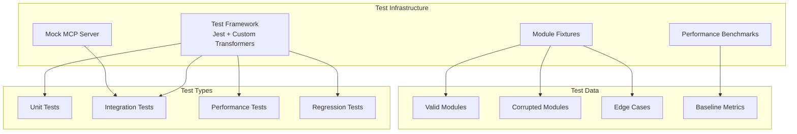

# Testing Infrastructure

## Test Framework Architecture
**Responsibility:** Comprehensive testing of modules, integration, and performance

**Key Components:**
- Jest with custom .md transformers
- Module fixture generator
- Performance benchmark suite
- Mock MCP server

**Architecture Diagram:**


## Module Test Fixtures
```typescript
interface TestFixture {
  id: string;
  type: 'valid' | 'corrupted' | 'edge-case';
  module: {
    content: string;
    metadata: ModuleMetadata;
    expectedTokens: number;
    expectedBehavior: TestExpectation;
  };
}

// Example fixture structure
const fixtures = {
  valid: {
    sage: {
      minimal: 'fixtures/valid/sage-minimal.md',
      full: 'fixtures/valid/sage-full.md',
      maxTokens: 'fixtures/valid/sage-max-tokens.md'
    }
  },
  corrupted: {
    invalidHash: 'fixtures/corrupted/invalid-hash.md',
    malformedYaml: 'fixtures/corrupted/bad-yaml.md',
    injectionAttempt: 'fixtures/corrupted/injection.md'
  },
  edgeCases: {
    emptyModule: 'fixtures/edge/empty.md',
    circularDeps: 'fixtures/edge/circular-deps.md',
    unicodeContent: 'fixtures/edge/unicode.md'
  }
};
```

## Performance Baseline Architecture
```typescript
interface PerformanceBaseline {
  monolithic: {
    tokenCount: 38221;
    avgResponseTime: number;
    p95ResponseTime: number;
    memoryUsage: number;
  };
  modular: {
    avgTokenCount: number;
    avgResponseTime: number;
    p95ResponseTime: number;
    memoryUsage: number;
    moduleLoadTime: number;
  };
  improvement: {
    tokenReduction: number; // Target: 85%+
    speedImprovement: number; // Target: 50%+
    memoryReduction: number;
  };
}
```

## Mock MCP Server Architecture
**Purpose:** Enable offline development and testing

**Implementation:**
```typescript
class MockMCPServer {
  private responses: Map<string, MockResponse>;
  private latency: SimulatedLatency;
  private circuitBreaker: CircuitBreaker;
  
  constructor(config: MockConfig) {
    this.responses = this.loadMockResponses(config.responsePath);
    this.latency = new SimulatedLatency(config.latencyProfile);
    this.circuitBreaker = new CircuitBreaker({
      threshold: 3,
      timeout: 60000,
      resetTimeout: 60000
    });
  }
  
  async handleRequest(tool: string, params: any): Promise<MockResponse> {
    // Simulate network conditions
    await this.latency.simulate();
    
    // Check circuit breaker
    if (this.circuitBreaker.isOpen()) {
      throw new Error('Circuit breaker open');
    }
    
    // Return mock response
    const response = this.responses.get(tool);
    if (!response) {
      throw new Error(`No mock for tool: ${tool}`);
    }
    
    return this.applyVariations(response, params);
  }
}
```

**Mock Response Structure:**
```json
{
  "sequentialthinking": {
    "responses": [
      {
        "scenario": "simple-analysis",
        "params": { "thought": "analyze data" },
        "response": {
          "thought": "Breaking down the data analysis...",
          "thoughtNumber": 1,
          "totalThoughts": 3,
          "nextThoughtNeeded": true
        }
      }
    ],
    "errorScenarios": [
      {
        "trigger": "timeout-test",
        "delay": 6000,
        "error": "Timeout"
      }
    ]
  }
}
```
