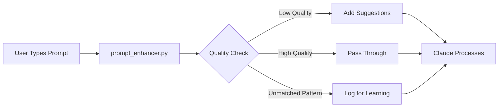
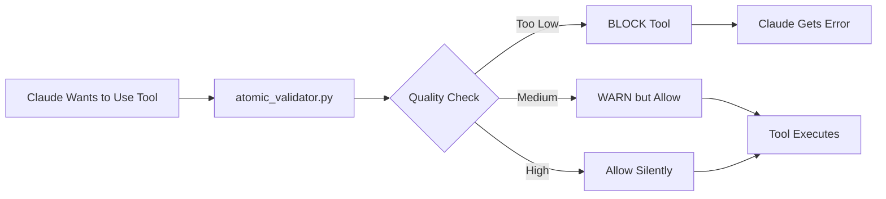

# Understanding Hooks: prompt_enhancer.py vs atomic_validator.py

## Overview of Claude Code Hooks

Claude Code hooks are event-driven scripts that run at specific points during Claude's execution. They allow you to intercept, modify, and control Claude's behavior.

## The Two Hooks Explained

### 1. prompt_enhancer.py (UserPromptSubmit Hook)

**When it runs**: IMMEDIATELY when user submits a prompt, BEFORE Claude processes it

**Purpose**: 
- Analyze prompt quality when user first types something
- Provide enhancement suggestions
- Track pattern learning opportunities
- Add context to help Claude understand better

**Think of it as**: A "pre-processor" or "input filter" that helps improve what the user asks



**Key Features**:
- Runs on EVERY user prompt
- Cannot block prompts (always continues)
- Adds context that Claude sees
- Tracks patterns for learning

**Example Flow**:
```
User: "fix bug"
↓
prompt_enhancer.py:
  - Quality: 3.2/10 (too vague)
  - Adds context: "Low quality - needs specifics"
  - Logs: Unmatched pattern for learning
↓
Claude sees: "fix bug" + context about quality
```

### 2. atomic_validator.py (PreToolUse Hook)

**When it runs**: BEFORE Claude uses a tool (Write, Edit, Task, etc.)

**Purpose**:
- Validate quality of tool parameters
- Block dangerous/low-quality tool operations
- Ensure tool usage meets quality standards
- Prevent errors before they happen

**Think of it as**: A "safety gate" or "quality guard" that protects tool execution



**Key Features**:
- Runs ONLY when Claude tries to use specific tools
- CAN BLOCK tool execution
- Different thresholds per tool type
- Protects against poor tool usage

**Example Flow**:
```
Claude wants to: Write(content="fix")
↓
atomic_validator.py:
  - Tool: Write
  - Content quality: 2.1/10
  - Decision: DENY (too vague for file write)
↓
Tool blocked, Claude must try again
```

## Key Differences

| Aspect | prompt_enhancer.py | atomic_validator.py |
|--------|-------------------|---------------------|
| **Event** | UserPromptSubmit | PreToolUse |
| **When** | User submits prompt | Claude uses tool |
| **Can Block?** | No (advisory only) | Yes (can deny) |
| **Purpose** | Enhance & learn | Validate & protect |
| **Scope** | ALL prompts | Specific tools only |
| **Output** | Context & suggestions | Permission decision |
| **Threshold** | Informational | Enforced limits |

## Working Together

The hooks work in sequence to improve quality at different stages:

```
COMPLETE FLOW:
=============

1. User types: "write code to fix database"
   ↓
2. prompt_enhancer.py runs:
   - Analyzes: Quality 4.5/10
   - Adds context: "Missing specifics about database issue"
   - Tracks: Pattern for learning
   ↓
3. Claude processes with context
   ↓
4. Claude decides to use Write tool
   ↓
5. atomic_validator.py runs:
   - Checks Write parameters
   - If content quality < 3.5: BLOCKS
   - If 3.5-6.5: Warns but allows
   - If > 6.5: Allows silently
   ↓
6. Tool executes (if allowed)
```

## Adaptive Thresholds

atomic_validator.py uses different quality requirements per tool:

```python
ADAPTIVE_THRESHOLDS = {
    "default": {"block": 4.0, "warn": 7.0},
    "Task": {"block": 5.0, "warn": 8.0},    # Higher for sub-agents
    "Agent": {"block": 5.0, "warn": 8.0},   # Higher for sub-agents
    "Write": {"block": 3.5, "warn": 6.5},   # Lower for file ops
    "Edit": {"block": 3.5, "warn": 6.5},    # Lower for file ops
}
```

## Pattern Learning Integration

Both hooks contribute to pattern learning:

### prompt_enhancer.py:
- Tracks ALL prompts that don't match patterns
- Logs to `pattern_learning_opportunities` table
- Feeds Pattern Learner for suggestion generation

### atomic_validator.py:
- Validates if prompts match known patterns
- Records success/failure in `pattern_validations` table
- Updates pattern effectiveness metrics

## Real-World Examples

### Example 1: Unmatched Pattern
```
User: "xyz abc unknown task"
↓
prompt_enhancer.py:
  ✓ Detects: No pattern match
  ✓ Logs: Learning opportunity
  ✓ Adds: "Pattern learning in progress"
↓
Claude processes with learning context
```

### Example 2: Low Quality Tool Use
```
Claude tries: Write(file="test.py", content="fix")
↓
atomic_validator.py:
  ✓ Quality: 2.1/10
  ✓ Threshold: 3.5 minimum
  ✗ BLOCKS: "Content too vague"
↓
Claude must provide better content
```

### Example 3: Good Quality Flow
```
User: "Research Python async best practices for database connections"
↓
prompt_enhancer.py:
  ✓ Quality: 7.2/10
  ✓ Matches: R1 (Research) pattern
  ✓ Adds: Minor enhancement suggestions
↓
Claude: Uses Task tool with good parameters
↓
atomic_validator.py:
  ✓ Quality: 7.8/10
  ✓ Threshold: 5.0 for Task
  ✓ Allows: Execution proceeds
```

## Benefits of This Design

1. **Two-Layer Protection**: Quality checked at input AND execution
2. **Learning System**: Unmatched patterns are tracked and learned
3. **Tool Safety**: Prevents low-quality tool operations
4. **User Guidance**: Provides enhancement suggestions early
5. **Adaptive**: Different standards for different tools
6. **Non-Blocking Input**: User prompts always go through (with context)
7. **Blocking Protection**: Dangerous tool uses can be stopped

## Summary

- **prompt_enhancer.py**: Early-stage quality advisor and pattern learner
- **atomic_validator.py**: Late-stage quality enforcer and tool protector
- Together they create a comprehensive quality assurance system that learns and improves over time