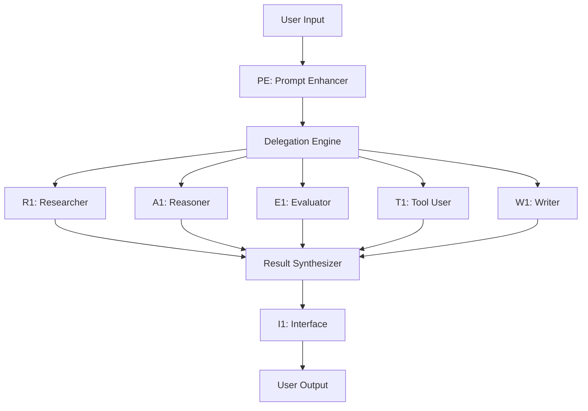

# Sub-Agent Integration Guide

## Overview
This guide details how Context Engineering sub-agents coordinate and integrate to form a cohesive intelligent system. It covers communication protocols, data flow, error handling, and optimization strategies.

## Architecture Overview



## Core Integration Principles

### 1. Separation of Concerns
Each agent has a single, well-defined responsibility:
- **PE**: Input validation and enhancement only
- **R1**: Information gathering only
- **A1**: Logical reasoning only
- **E1**: Quality assessment only
- **T1**: Tool execution only
- **W1**: Content creation only
- **I1**: User communication only

### 2. Loose Coupling
Agents communicate through standardized interfaces:
```python
class AgentMessage:
    source: str          # Agent ID
    target: str          # Target agent or 'broadcast'
    type: MessageType    # REQUEST, RESPONSE, ERROR
    payload: dict        # Structured data
    confidence: float    # 0.0 to 1.0
    timestamp: datetime
```

### 3. Data Flow Standards
All inter-agent communication uses structured JSON:
```json
{
  "message_id": "uuid",
  "source": "PE",
  "target": "R1",
  "type": "REQUEST",
  "payload": {
    "task": "research",
    "query": "GraphQL best practices",
    "constraints": ["recent sources", "production focus"]
  },
  "confidence": 0.85,
  "timestamp": "2024-01-15T10:30:00Z"
}
```

## Integration Patterns

### Pattern 1: Sequential Pipeline
For tasks requiring ordered processing:

```python
class SequentialPipeline:
    def execute(self, prompt):
        # Step 1: Enhancement
        enhanced = PE.enhance(prompt)
        if enhanced.score < 7:
            return enhanced.suggestions
        
        # Step 2: Research
        research = R1.research(enhanced.prompt)
        
        # Step 3: Reasoning
        analysis = A1.reason(research.findings)
        
        # Step 4: Evaluation
        quality = E1.evaluate(analysis)
        
        # Step 5: Presentation
        return I1.format(quality.approved_content)
```

### Pattern 2: Parallel Execution
For independent subtasks:

```python
class ParallelExecution:
    async def execute(self, tasks):
        futures = []
        
        for task in tasks:
            if task.type == "research":
                futures.append(R1.research_async(task))
            elif task.type == "reasoning":
                futures.append(A1.reason_async(task))
            elif task.type == "evaluation":
                futures.append(E1.evaluate_async(task))
        
        results = await asyncio.gather(*futures)
        return self.synthesize(results)
```

### Pattern 3: Feedback Loop
For iterative improvement:

```python
class FeedbackLoop:
    def execute(self, content, max_iterations=3):
        for i in range(max_iterations):
            evaluation = E1.evaluate(content)
            
            if evaluation.score >= 8:
                return content
            
            # Get improvement suggestions
            improvements = A1.suggest_improvements(evaluation.issues)
            
            # Apply improvements
            content = W1.revise(content, improvements)
        
        return content
```

## Communication Protocols

### 1. Request-Response Protocol
Standard synchronous communication:

```python
# Agent A requests service from Agent B
request = AgentMessage(
    source="A1",
    target="R1",
    type="REQUEST",
    payload={"query": "find similar patterns"}
)

response = R1.handle(request)

# Response structure
{
    "status": "SUCCESS",
    "data": {...},
    "confidence": 0.9,
    "processing_time": 1.23
}
```

### 2. Broadcast Protocol
For notifications and events:

```python
# T1 broadcasts completion event
broadcast = AgentMessage(
    source="T1",
    target="broadcast",
    type="EVENT",
    payload={
        "event": "deployment_complete",
        "details": {...}
    }
)

# All interested agents receive notification
for agent in subscribers["deployment_complete"]:
    agent.notify(broadcast)
```

### 3. Stream Protocol
For real-time data flow:

```python
# R1 streams research results as found
async def stream_research():
    async for finding in R1.research_stream(query):
        yield AgentMessage(
            source="R1",
            target="A1",
            type="STREAM",
            payload=finding
        )
```

## Data Transformation Between Agents

### PE → R1 Transformation
```python
# PE output
pe_output = {
    "enhanced_prompt": "Research GraphQL vs REST for microservices",
    "key_terms": ["GraphQL", "REST", "microservices"],
    "constraints": ["performance", "scalability"],
    "score": 8
}

# Transform for R1
r1_input = {
    "queries": pe_output["key_terms"],
    "focus_areas": pe_output["constraints"],
    "min_source_quality": 7.0
}
```

### R1 → A1 Transformation
```python
# R1 output
r1_output = {
    "findings": [
        {"fact": "GraphQL reduces overfetching", "confidence": 0.9},
        {"fact": "REST has better caching", "confidence": 0.85}
    ],
    "sources": [...],
    "gaps": ["real-world performance data"]
}

# Transform for A1
a1_input = {
    "premises": r1_output["findings"],
    "confidence_threshold": 0.8,
    "reasoning_type": "comparative_analysis"
}
```

### A1 → E1 Transformation
```python
# A1 output
a1_output = {
    "conclusion": "Use GraphQL for complex queries, REST for simple",
    "reasoning_chain": [...],
    "confidence": 0.85,
    "assumptions": [...]
}

# Transform for E1
e1_input = {
    "content": a1_output["conclusion"],
    "criteria": ["logical_consistency", "practical_applicability"],
    "context": a1_output["reasoning_chain"]
}
```

## Error Handling and Recovery

### 1. Agent Failure Handling
```python
class AgentCoordinator:
    def handle_agent_failure(self, agent_id, error):
        if agent_id == "R1":
            # Use cached research
            return self.fallback_to_cache()
        elif agent_id == "A1":
            # Use simpler reasoning
            return self.use_simple_heuristics()
        elif agent_id == "T1":
            # Prevent any changes
            return self.abort_with_safety()
```

### 2. Timeout Management
```python
class TimeoutManager:
    timeouts = {
        "PE": 2.0,   # seconds
        "R1": 10.0,  # research can take longer
        "A1": 5.0,
        "E1": 3.0,
        "T1": 30.0,  # tool execution varies
        "W1": 5.0,
        "I1": 2.0
    }
    
    async def execute_with_timeout(self, agent, task):
        try:
            return await asyncio.wait_for(
                agent.execute(task),
                timeout=self.timeouts[agent.id]
            )
        except asyncio.TimeoutError:
            return self.handle_timeout(agent.id)
```

### 3. Cascade Failure Prevention
```python
class CircuitBreaker:
    def __init__(self, failure_threshold=3, reset_time=60):
        self.failures = defaultdict(int)
        self.circuit_open = defaultdict(bool)
        
    def call_agent(self, agent, request):
        if self.circuit_open[agent.id]:
            return self.fallback_response(agent.id)
        
        try:
            response = agent.handle(request)
            self.failures[agent.id] = 0  # Reset on success
            return response
        except Exception as e:
            self.failures[agent.id] += 1
            if self.failures[agent.id] >= self.failure_threshold:
                self.circuit_open[agent.id] = True
                self.schedule_reset(agent.id)
            raise
```

## State Management

### 1. Shared Context Store
```python
class ContextStore:
    """Manages shared state between agents"""
    
    def __init__(self):
        self.session_context = {}
        self.agent_states = {}
        self.message_history = []
    
    def update_context(self, key, value, agent_id):
        self.session_context[key] = {
            "value": value,
            "updated_by": agent_id,
            "timestamp": datetime.now()
        }
    
    def get_context(self, key, agent_id):
        if key in self.session_context:
            self.log_access(key, agent_id)
            return self.session_context[key]["value"]
        return None
```

### 2. Transaction Management
```python
class TransactionManager:
    """Ensures consistency across multi-agent operations"""
    
    def begin_transaction(self):
        return Transaction(id=uuid4())
    
    class Transaction:
        def __init__(self, id):
            self.id = id
            self.operations = []
            self.rollback_stack = []
        
        def add_operation(self, agent, operation, rollback_fn):
            self.operations.append({
                "agent": agent,
                "operation": operation,
                "rollback": rollback_fn
            })
        
        def commit(self):
            try:
                for op in self.operations:
                    op["operation"]()
            except Exception as e:
                self.rollback()
                raise
        
        def rollback(self):
            for op in reversed(self.rollback_stack):
                op["rollback"]()
```

## Performance Optimization

### 1. Agent Pool Management
```python
class AgentPool:
    """Manages agent instances for optimal resource usage"""
    
    def __init__(self, max_instances=3):
        self.pools = {
            "PE": Queue(maxsize=max_instances),
            "R1": Queue(maxsize=max_instances),
            # ... other agents
        }
        self.initialize_pools()
    
    async def get_agent(self, agent_type):
        agent = await self.pools[agent_type].get()
        return agent
    
    async def return_agent(self, agent_type, agent):
        await self.pools[agent_type].put(agent)
```

### 2. Result Caching
```python
class ResultCache:
    """Caches agent outputs to avoid redundant processing"""
    
    def __init__(self, ttl=3600):
        self.cache = {}
        self.ttl = ttl
    
    def cache_key(self, agent_id, input_hash):
        return f"{agent_id}:{input_hash}"
    
    def get(self, agent_id, input_data):
        key = self.cache_key(agent_id, hash(str(input_data)))
        if key in self.cache:
            entry = self.cache[key]
            if time.time() - entry["timestamp"] < self.ttl:
                return entry["result"]
        return None
    
    def set(self, agent_id, input_data, result):
        key = self.cache_key(agent_id, hash(str(input_data)))
        self.cache[key] = {
            "result": result,
            "timestamp": time.time()
        }
```

### 3. Load Balancing
```python
class LoadBalancer:
    """Distributes work across agent instances"""
    
    def __init__(self):
        self.agent_loads = defaultdict(int)
        self.agent_capacities = {
            "PE": 10,  # Can handle 10 concurrent requests
            "R1": 3,   # Research is resource-intensive
            "A1": 5,
            "E1": 10,
            "T1": 2,   # Tool execution is sequential
            "W1": 5,
            "I1": 10
        }
    
    def can_accept_work(self, agent_id):
        return self.agent_loads[agent_id] < self.agent_capacities[agent_id]
    
    def assign_work(self, agent_id):
        if self.can_accept_work(agent_id):
            self.agent_loads[agent_id] += 1
            return True
        return False
```

## Monitoring and Observability

### 1. Metrics Collection
```python
class AgentMetrics:
    """Collects performance metrics for each agent"""
    
    def __init__(self):
        self.metrics = {
            "request_count": Counter("agent_requests_total"),
            "request_duration": Histogram("agent_request_duration_seconds"),
            "error_count": Counter("agent_errors_total"),
            "confidence_score": Gauge("agent_confidence_score")
        }
    
    def record_request(self, agent_id, duration, success, confidence):
        labels = {"agent": agent_id}
        self.metrics["request_count"].labels(**labels).inc()
        self.metrics["request_duration"].labels(**labels).observe(duration)
        if not success:
            self.metrics["error_count"].labels(**labels).inc()
        self.metrics["confidence_score"].labels(**labels).set(confidence)
```

### 2. Trace Context
```python
class TraceContext:
    """Maintains trace context across agent calls"""
    
    def __init__(self):
        self.trace_id = str(uuid4())
        self.span_stack = []
    
    def start_span(self, agent_id, operation):
        span = {
            "span_id": str(uuid4()),
            "agent": agent_id,
            "operation": operation,
            "start_time": time.time(),
            "parent_span": self.span_stack[-1]["span_id"] if self.span_stack else None
        }
        self.span_stack.append(span)
        return span
    
    def end_span(self, span, status="SUCCESS"):
        span["end_time"] = time.time()
        span["duration"] = span["end_time"] - span["start_time"]
        span["status"] = status
        self.log_span(span)
        self.span_stack.pop()
```

## Integration with External Systems

### 1. MCP Tool Integration
```python
class MCPIntegration:
    """Integrates with MCP ecosystem tools"""
    
    def __init__(self):
        self.tools = {
            "tavily": TavilyMCP(),
            "context7": Context7MCP(),
            "clear_thought": ClearThoughtMCP()
        }
    
    async def execute_tool(self, tool_name, operation, params):
        if tool_name not in self.tools:
            raise ValueError(f"Unknown tool: {tool_name}")
        
        tool = self.tools[tool_name]
        return await tool.execute(operation, params)
```

### 2. Memory System Integration
```python
class MemoryIntegration:
    """Integrates with 5-layer memory system"""
    
    def __init__(self):
        self.memory_layers = {
            "stm": ShortTermMemory(),  # 2 hours
            "wm": WorkingMemory(),     # 7 days
            "ltm": LongTermMemory(),    # Permanent
            "swarm": SwarmMemory(),     # Community
            "privacy": PrivacyEngine()  # User control
        }
    
    def store_interaction(self, agent_id, interaction):
        # Store in appropriate memory layer
        if interaction.importance > 0.8:
            self.memory_layers["ltm"].store(interaction)
        elif interaction.importance > 0.5:
            self.memory_layers["wm"].store(interaction)
        else:
            self.memory_layers["stm"].store(interaction)
```

### 3. Hook System Integration
```python
class HookIntegration:
    """Integrates with Claude Code hooks"""
    
    def __init__(self):
        self.hooks = {
            "pre_prompt": [],
            "post_prompt": [],
            "pre_tool": [],
            "post_tool": [],
            "on_error": []
        }
    
    def register_hook(self, event, callback):
        self.hooks[event].append(callback)
    
    async def trigger_hooks(self, event, context):
        for hook in self.hooks[event]:
            try:
                await hook(context)
            except Exception as e:
                logger.error(f"Hook failed: {e}")
```

## Configuration Management

### 1. Agent Configuration
```yaml
# config/agents.yaml
agents:
  PE:
    model: sonnet
    timeout: 2.0
    max_retries: 3
    cache_ttl: 3600
    
  R1:
    model: opus
    timeout: 10.0
    max_retries: 2
    parallel_searches: 3
    
  A1:
    model: opus
    timeout: 5.0
    max_reasoning_depth: 5
    confidence_threshold: 0.7
```

### 2. Integration Rules
```yaml
# config/integration.yaml
routing_rules:
  - pattern: "research|investigate|find"
    primary_agent: R1
    support_agents: [A1, E1]
    
  - pattern: "implement|build|create"
    primary_agent: T1
    support_agents: [A1, E1, W1]
    
  - pattern: "explain|document|describe"
    primary_agent: W1
    support_agents: [R1, I1]
```

## Testing Integration

### 1. Integration Tests
```python
class IntegrationTests:
    """Tests agent coordination"""
    
    def test_sequential_pipeline(self):
        # Test PE → R1 → A1 → E1 → W1 → I1
        prompt = "Research and explain GraphQL"
        
        enhanced = PE.enhance(prompt)
        assert enhanced.score >= 7
        
        research = R1.research(enhanced.output)
        assert len(research.findings) > 0
        
        analysis = A1.analyze(research)
        assert analysis.confidence > 0.7
        
        evaluation = E1.evaluate(analysis)
        assert evaluation.score >= 7
        
        content = W1.write(evaluation.approved)
        assert len(content) > 100
        
        output = I1.format(content)
        assert output.readability_score > 8
```

### 2. Mock Agents for Testing
```python
class MockAgent:
    """Mock agent for testing integration"""
    
    def __init__(self, agent_id, responses):
        self.id = agent_id
        self.responses = responses
        self.call_count = 0
    
    def handle(self, request):
        response = self.responses[self.call_count % len(self.responses)]
        self.call_count += 1
        return response
```

## Deployment Considerations

### 1. Agent Versioning
```python
class AgentVersionManager:
    """Manages agent version compatibility"""
    
    def __init__(self):
        self.versions = {
            "PE": "1.2.0",
            "R1": "1.1.5",
            # ... other agents
        }
        self.compatibility_matrix = {
            ("PE", "1.2.0"): ["R1:1.1.5", "A1:1.0.0"],
            # ... compatibility rules
        }
    
    def check_compatibility(self):
        for agent, version in self.versions.items():
            compatible = self.compatibility_matrix.get((agent, version), [])
            for requirement in compatible:
                req_agent, req_version = requirement.split(":")
                if self.versions[req_agent] != req_version:
                    raise ValueError(f"Incompatible versions: {agent} requires {requirement}")
```

### 2. Rollback Strategy
```python
class RollbackManager:
    """Manages agent rollback on failures"""
    
    def __init__(self):
        self.agent_snapshots = {}
    
    def snapshot_agents(self):
        for agent_id in AGENT_IDS:
            self.agent_snapshots[agent_id] = {
                "config": get_agent_config(agent_id),
                "version": get_agent_version(agent_id),
                "state": get_agent_state(agent_id)
            }
    
    def rollback(self):
        for agent_id, snapshot in self.agent_snapshots.items():
            restore_agent(agent_id, snapshot)
```

## Best Practices

### 1. Agent Communication
- Always use structured messages
- Include confidence scores
- Implement timeouts
- Handle partial failures gracefully

### 2. State Management
- Minimize shared state
- Use immutable data structures
- Implement proper locking
- Regular state cleanup

### 3. Error Handling
- Fail fast with clear errors
- Provide fallback mechanisms
- Log all errors with context
- Implement circuit breakers

### 4. Performance
- Cache expensive operations
- Use async/await for I/O
- Implement connection pooling
- Monitor resource usage

### 5. Security
- Validate all agent inputs
- Sanitize outputs
- Implement rate limiting
- Audit all tool executions

## Conclusion

Effective sub-agent integration requires careful attention to communication protocols, error handling, state management, and performance optimization. By following these patterns and best practices, the Context Engineering system achieves robust, scalable, and maintainable agent coordination.