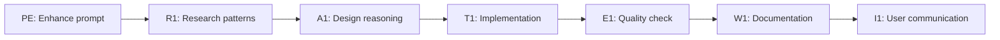
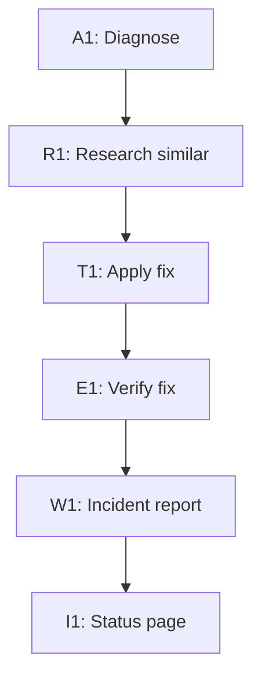
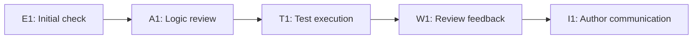

# Sub-Agent Common Usage Patterns

## Overview
This document provides concrete usage patterns and examples for the Context Engineering sub-agents, demonstrating how they work individually and together to solve common tasks.

## Individual Agent Patterns

### 🔧 PE (Prompt Enhancer) Patterns

#### Pattern 1: Vague Request Enhancement
**Input**: "Make the code better"
**PE Process**:
```
Score: 3/10
Missing: Specific code location, improvement goals, constraints

Enhanced Version:
Task: "Refactor the authentication module in src/auth.py"
Constraints: "Maintain backward compatibility, improve test coverage to 90%"
Output: "Provide refactored code with unit tests and migration guide"
```

#### Pattern 2: Technical Specification Validation
**Input**: "Implement user authentication with JWT tokens, 2FA support, and role-based access"
**PE Process**:
```
Score: 8/10
Strengths: Clear requirements, multiple features specified
Missing: Token expiration strategy, role hierarchy

Suggestions:
1. Specify JWT token lifetime and refresh strategy
2. Define role hierarchy (admin > editor > viewer)
3. Add error handling requirements
```

#### Pattern 3: Multi-Step Task Clarification
**Input**: "Setup CI/CD"
**PE Enhancement**:
```
Breaking down into atomic tasks:
1. Task: "Configure GitHub Actions for automated testing"
   Constraints: "Python 3.10+, pytest, coverage >80%"
   Output: ".github/workflows/test.yml file"

2. Task: "Setup deployment pipeline to AWS"
   Constraints: "Use existing AWS credentials, staging + production"
   Output: ".github/workflows/deploy.yml with environment configs"
```

### 🔍 R1 (Researcher) Patterns

#### Pattern 1: Technology Comparison Research
**Task**: "Research GraphQL vs REST for our API"
**R1 Process**:
```json
{
  "research_question": "GraphQL vs REST comparison for microservices API",
  "findings": [
    {"insight": "GraphQL reduces over-fetching by 60%", "confidence": 0.9},
    {"insight": "REST has 40% better caching support", "confidence": 0.85},
    {"insight": "GraphQL requires 2x initial setup time", "confidence": 0.8}
  ],
  "sources": [
    {"url": "https://graphql.org/learn/", "seiqf_score": 9.5},
    {"url": "https://www.howtographql.com/", "seiqf_score": 8.5}
  ],
  "synthesis": "GraphQL better for complex queries, REST for simple CRUD",
  "conflicts": [
    {"topic": "performance", "positions": ["GraphQL faster", "REST faster"]}
  ],
  "recommendation": "Use GraphQL for customer-facing API, REST for internal"
}
```

#### Pattern 2: Security Vulnerability Research
**Task**: "Research log4j vulnerability impact on our stack"
**R1 Process**:
```json
{
  "findings": [
    {"insight": "CVE-2021-44228 affects log4j 2.0-2.14.1", "confidence": 1.0},
    {"insight": "Our services use log4j 2.13.0 - VULNERABLE", "confidence": 1.0}
  ],
  "sources": [
    {"url": "https://nvd.nist.gov/vuln/detail/CVE-2021-44228", "seiqf_score": 10}
  ],
  "synthesis": "Critical vulnerability requiring immediate patching",
  "next_steps": ["Upgrade to log4j 2.17.0+", "Scan all Java services", "Apply WAF rules"]
}
```

### 🧠 A1 (Reasoner) Patterns

#### Pattern 1: Architecture Decision Reasoning
**Problem**: "Should we migrate from monolith to microservices?"
**A1 Process**:
```
Assumptions:
- Current monolith has 500k LOC
- Team size: 15 developers
- Monthly releases currently

Reasoning Chain:
1. Conway's Law → Team structure supports 3-4 services (confidence: 0.85)
2. Deployment complexity → 5x increase in operational overhead (confidence: 0.9)
3. Development velocity → 30% improvement after 6 months (confidence: 0.7)

SAGE Check:
- Self-Monitor: Bias toward microservices detected
- Assume-Challenge: "All modern apps need microservices" - FALSE
- Generate: Modular monolith as alternative
- Evaluate: Gradual extraction strategy most viable

Conclusion: Start with modular monolith, extract services gradually
Confidence: 0.8
```

#### Pattern 2: Bug Root Cause Analysis
**Problem**: "Random timeout errors in production"
**A1 Process**:
```
Reasoning Chain:
1. Timeouts occur every 30 minutes → Suggests periodic process (0.9)
2. Correlates with cache refresh → Cache lock contention likely (0.85)
3. Only affects read operations → Write lock blocking reads (0.9)

Edge Cases Tested:
- Network issues: Ruled out (metrics normal)
- Database load: Ruled out (CPU <30%)
- Memory pressure: Possible contributor (GC pauses observed)

Conclusion: Cache refresh write lock + GC pause causing timeouts
Confidence: 0.85
```

### 📊 E1 (Evaluator) Patterns

#### Pattern 1: Code Quality Evaluation
**Task**: Evaluate pull request #123
**E1 Process**:
```
Overall: PASS
Confidence: 0.75

Scores:
- Accuracy: 9/10 (logic correct, edge cases handled)
- Completeness: 7/10 (missing error handling)
- Clarity: 8/10 (well-commented, could improve naming)
- Consistency: 9/10 (follows project patterns)

CRITICAL (0 issues):
None

WARNING (2 issues):
1. Missing null check: line 45 → Add `if (!user) throw new Error()`
2. No retry logic: API calls → Implement exponential backoff

SUGGESTION (3 issues):
1. Extract magic number: line 23 → Create MAX_RETRIES constant
2. Improve variable name: `tmp` → `temporaryAuthToken`
3. Add performance metric: Consider adding timing logs

Priority Actions:
1. Add null check (prevents crashes)
2. Implement retry logic (improves reliability)
```

### 🛠️ T1 (Tool User) Patterns

#### Pattern 1: Safe Database Migration
**Task**: "Apply schema migration to production"
**T1 Process**:
```
Action: Database schema migration
Safety Check: ✓ Validated

Steps:
1. Backup: pg_dump production > backup_2024_01_15.sql ✓
2. Verify: 523MB backup created ✓
3. Test: Apply migration to staging first ✓
4. Monitor: No errors in staging for 1 hour ✓
5. Execute: 
   BEGIN TRANSACTION;
   ALTER TABLE users ADD COLUMN last_login TIMESTAMP;
   -- Verify: SELECT COUNT(*) FROM users; -- 45,231 rows
   COMMIT;
6. Verify: All users have new column ✓
7. Cleanup: Keep backup for 30 days

Result: SUCCESS - Migration completed
Rollback Plan: pg_restore backup_2024_01_15.sql if needed
```

#### Pattern 2: Multi-Step Deployment
**Task**: "Deploy new version to production"
**T1 Process**:
```bash
# Pre-deployment checks
git status          # ✓ Clean working tree
npm test           # ✓ 142 tests passing
npm run build      # ✓ Build successful

# Deployment sequence
1. Tag release: git tag -a v2.3.0 -m "Feature: User dashboard"
2. Push: git push origin v2.3.0
3. Deploy staging: npm run deploy:staging
4. Smoke test: curl https://staging.app.com/health # ✓ 200 OK
5. Deploy prod: npm run deploy:production
6. Verify: curl https://app.com/health # ✓ 200 OK
7. Monitor: Check error rates for 15 minutes # ✓ Normal

Status: Deployment successful
```

### 🖋️ W1 (Writer) Patterns

#### Pattern 1: Technical Documentation
**Task**: "Document the new API endpoint"
**W1 Process**:
```markdown
# User Profile API

## GET /api/v1/users/:id

### Overview
Retrieves detailed user profile information including preferences and activity.

### Authentication
Requires valid JWT token in Authorization header.

### Parameters
| Parameter | Type | Required | Description |
|-----------|------|----------|-------------|
| id | string | Yes | User UUID |
| include | string | No | Comma-separated related data (posts,comments) |

### Example Request
```bash
curl -H "Authorization: Bearer TOKEN" \
  https://api.example.com/v1/users/123?include=posts
```

### Response
```json
{
  "id": "123",
  "username": "johndoe",
  "email": "john@example.com",
  "created_at": "2024-01-15T10:00:00Z",
  "posts": [...]
}
```

### Error Codes
- 401: Invalid or expired token
- 404: User not found
- 500: Internal server error
```

#### Pattern 2: User-Facing Changelog
**Task**: "Write release notes for v2.0"
**W1 Process**:
```markdown
# Version 2.0 Release Notes

## ✨ What's New

### Dashboard Redesign
We've completely reimagined your dashboard! Find everything you need faster with our new intuitive layout. Your most-used features are now just one click away.

### 2x Faster Searches
Search results now appear instantly as you type. We've optimized our search engine to deliver results in under 100ms.

### Dark Mode
Easy on the eyes! Toggle dark mode from your profile settings to reduce eye strain during those late-night sessions.

## 🐛 Bug Fixes
- Fixed issue where exports would occasionally timeout
- Resolved notification delays on mobile devices
- Corrected timezone display in activity logs

## 💔 Breaking Changes
- API: `/users/profile` endpoint renamed to `/users/:id`
- Removed support for Internet Explorer 11

[View full technical changelog →]
```

### 🗣️ I1 (Interface) Patterns

#### Pattern 1: Technical to Non-Technical Translation
**Input**: "The API returned a 503 Service Unavailable error due to upstream dependency timeout"
**I1 Process**:
```
For Beginner:
"The service is temporarily unavailable. This usually resolves itself in a few minutes. Please try again shortly."

For Intermediate:
"The server cannot process your request right now because a connected service isn't responding. This is temporary - try again in 2-3 minutes."

For Expert:
"503 from upstream dependency timeout. Likely causes: DB connection pool exhausted or third-party API degradation. Check status.vendor.com for incidents."
```

#### Pattern 2: Clarifying Ambiguous Requests
**User**: "It's broken"
**I1 Process**:
```
I'll help you fix the issue. To better understand what's happening:

1. What were you trying to do when it broke?
   - [ ] Login
   - [ ] Upload a file
   - [ ] View a report
   - [ ] Other: ___

2. What happened instead?
   - [ ] Error message (please share it)
   - [ ] Page won't load
   - [ ] Wrong information displayed
   - [ ] Other: ___

3. When did this start?
   - [ ] Just now
   - [ ] Today
   - [ ] This week
   - [ ] Other: ___
```

## Multi-Agent Collaboration Patterns

### Pattern 1: Feature Implementation Flow
**Task**: "Add user notifications feature"



**Execution**:
1. **PE** clarifies requirements → "Real-time notifications with email fallback"
2. **R1** researches best practices → "WebSockets + Redis Pub/Sub pattern"
3. **A1** reasons through design → "Event-driven architecture with retry logic"
4. **T1** implements safely → Creates feature branch, adds tests
5. **E1** validates quality → Ensures 90% coverage, no critical issues
6. **W1** documents feature → API docs, user guide, changelog
7. **I1** announces to users → Adapted messaging per user segment

### Pattern 2: Production Incident Response
**Alert**: "Database connection errors spike"



**Execution**:
1. **A1** analyzes symptoms → "Connection pool exhaustion pattern"
2. **R1** finds similar incidents → "Same issue 3 months ago, fixed by..."
3. **T1** applies fix safely → Increases pool size, rolling restart
4. **E1** verifies resolution → Metrics normalized, no errors
5. **W1** writes postmortem → Root cause, timeline, prevention
6. **I1** updates users → Technical details for engineers, simple summary for customers

### Pattern 3: Code Review Workflow
**Trigger**: Pull request submitted



**Execution**:
1. **E1** checks quality metrics → Code coverage, linting, standards
2. **A1** reviews logic → Edge cases, performance, security
3. **T1** runs test suite → Unit, integration, smoke tests
4. **W1** writes feedback → Constructive comments with examples
5. **I1** communicates → Adapts tone based on author's experience

## Error Recovery Patterns

### Pattern 1: Cascading Failure Prevention
When one agent fails, others adapt:

```python
try:
    research_result = R1.research(topic)
except R1.Timeout:
    # Fallback to cached data
    research_result = get_cached_research(topic)
    A1.reason_with_partial_data(research_result)
```

### Pattern 2: Validation Feedback Loop
When E1 finds issues, loop back:

```
While E1.score < 7:
    issues = E1.evaluate(result)
    if issues.critical:
        T1.rollback()
        A1.revise_approach(issues)
        T1.retry_with_fixes()
    else:
        W1.document_known_issues(issues)
        break
```

### Pattern 3: Progressive Enhancement
Start simple, enhance based on feedback:

```
1. PE.quick_check() → If score > 7: proceed
2. PE.deep_analysis() → If score < 7: enhance
3. PE.interactive_clarification() → If still unclear
4. PE.template_suggestion() → If user struggling
```

## Performance Optimization Patterns

### Pattern 1: Parallel Processing
Agents work simultaneously when possible:

```python
# Parallel execution
results = parallel_execute([
    R1.research(topic_1),
    R1.research(topic_2),
    A1.analyze(existing_data),
    E1.evaluate(previous_work)
])
```

### Pattern 2: Caching Strategy
Reduce redundant processing:

```python
cache_key = hash(prompt + context)
if cache.exists(cache_key):
    return cache.get(cache_key)
else:
    result = process_with_agents(prompt)
    cache.set(cache_key, result, ttl=3600)
```

### Pattern 3: Early Termination
Stop processing when confidence is high:

```python
if PE.score >= 9 and R1.confidence >= 0.95:
    # Skip additional validation
    return fast_path_result
else:
    # Full processing pipeline
    return complete_pipeline_result
```

## Integration with External Systems

### Pattern 1: CI/CD Integration
```yaml
# .github/workflows/ai-review.yml
on: [pull_request]
jobs:
  ai-review:
    steps:
      - uses: context-engineering/evaluate@v1
        with:
          agents: [E1, A1]
          threshold: 7
          block-on-critical: true
```

### Pattern 2: Monitoring Integration
```python
# Prometheus metrics
agent_performance = Histogram(
    'agent_processing_time',
    'Time spent processing',
    ['agent', 'operation']
)

with agent_performance.labels('R1', 'research').time():
    result = R1.research(query)
```

### Pattern 3: API Gateway Integration
```python
@app.route('/api/enhance', methods=['POST'])
def enhance_prompt():
    original = request.json['prompt']
    enhanced = PE.enhance(original)
    
    if enhanced.score < 5:
        return jsonify({
            'error': 'Prompt too vague',
            'suggestions': enhanced.suggestions
        }), 400
    
    return jsonify({
        'enhanced': enhanced.result,
        'score': enhanced.score
    })
```

## Best Practices

### 1. Agent Selection
- Use PE for all user inputs
- Use R1 when external information needed
- Use A1 for complex decision-making
- Use E1 for quality gates
- Use T1 for any system modifications
- Use W1 for user-facing content
- Use I1 for all user communication

### 2. Error Handling
- Always have fallback strategies
- Log all agent interactions
- Implement circuit breakers for external calls
- Use timeouts appropriately

### 3. Performance
- Cache frequently requested research
- Parallelize independent operations
- Use appropriate models (Sonnet vs Opus)
- Implement progressive enhancement

### 4. Quality Assurance
- E1 validates all outputs before user delivery
- Implement feedback loops for continuous improvement
- Track agent performance metrics
- Regular calibration of scoring systems

## Conclusion

These patterns demonstrate how Context Engineering sub-agents work together to solve complex problems while maintaining safety, quality, and user satisfaction. The key is choosing the right combination of agents for each task and ensuring proper error handling and recovery mechanisms.